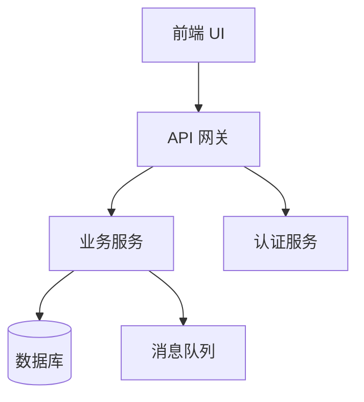
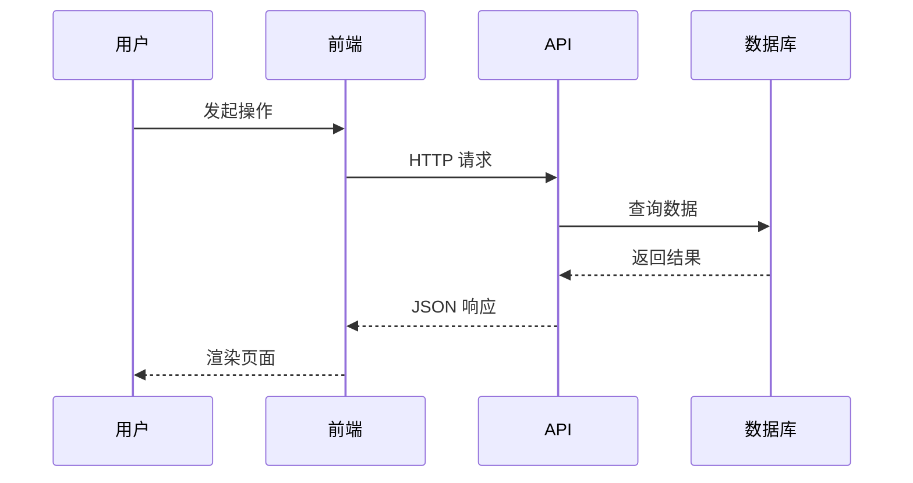
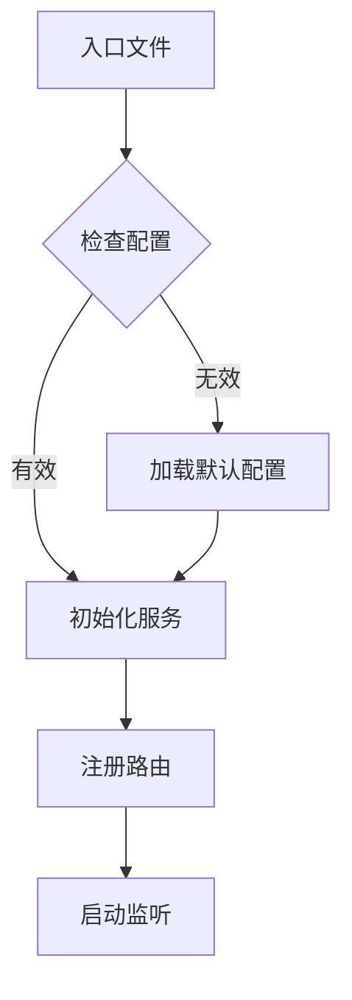
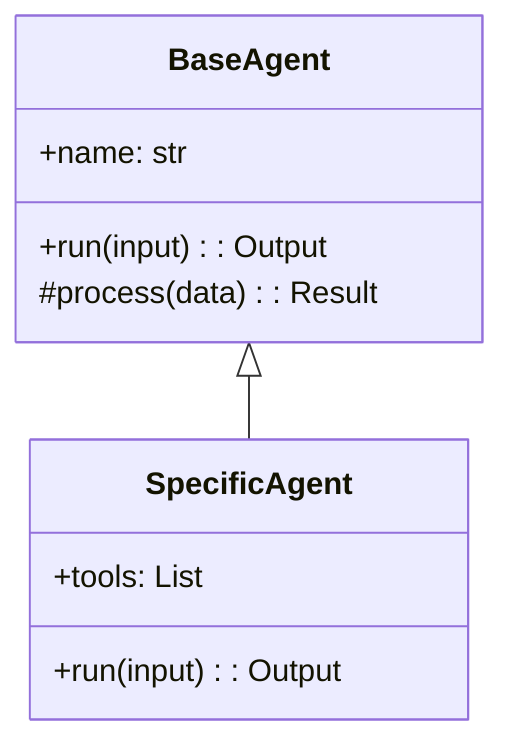
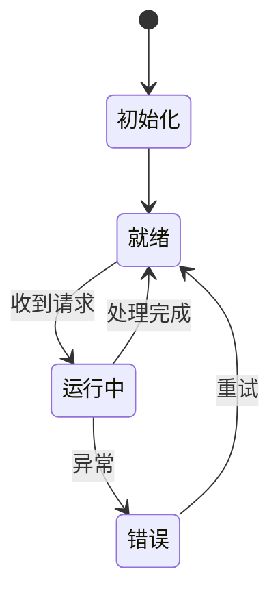

# 可视化图表指南

在学习笔记中使用图表来辅助理解项目架构和流程。

## Mermaid 图表

### 架构图（用于模块关系）



### 时序图（用于请求链路）



### 流程图（用于启动流程/业务逻辑）



### 类图（用于核心抽象）



### 状态图（用于状态管理）



## ASCII 图表

### 目录树（用于项目结构）

```
project/
├── src/
│   ├── core/           # 核心逻辑
│   │   ├── engine.py
│   │   └── config.py
│   ├── api/            # API 层
│   │   ├── routes.py
│   │   └── middleware.py
│   └── models/         # 数据模型
│       └── schema.py
├── tests/
└── package.json
```

### 数据流（用于管道/流水线）

```
输入 ──→ [解析器] ──→ [验证器] ──→ [处理器] ──→ [格式化] ──→ 输出
              │            │            │
              ▼            ▼            ▼
           日志记录     错误处理     缓存层
```

### 层级关系（用于分层架构）

```
┌─────────────────────────────────┐
│         表现层 (UI/CLI)          │
├─────────────────────────────────┤
│         业务逻辑层               │
├─────────────────────────────────┤
│         数据访问层               │
├─────────────────────────────────┤
│         基础设施层               │
└─────────────────────────────────┘
```

## 选择原则

| 场景 | 推荐图表 |
|------|---------|
| 模块依赖关系 | Mermaid graph TB/LR |
| 请求处理链路 | Mermaid sequenceDiagram |
| 启动/业务流程 | Mermaid flowchart |
| 类继承/接口 | Mermaid classDiagram |
| 状态流转 | Mermaid stateDiagram |
| 项目目录结构 | ASCII 目录树 |
| 数据管道 | ASCII 数据流 |
| 分层架构 | ASCII 层级图 |
