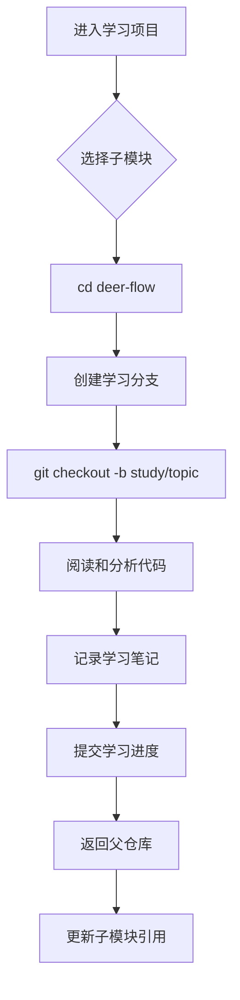
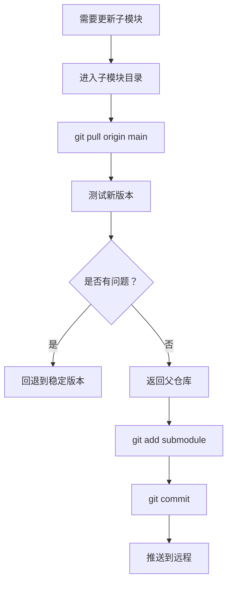

# learn-open-source 架构文档

## 🏗️ 整体架构

```
┌─────────────────────────────────────────────────────────┐
│              learn-open-source (父仓库)                  │
│                                                          │
│  定位：集中式学习管理中心                                 │
│  作用：维护子模块引用关系，提供统一的学习入口              │
│  分支：main                                              │
└─────────────────────────────────────────────────────────┘
                            │
        ┌───────────────────┼───────────────────┐
        │                   │                   │
        ▼                   ▼                   ▼
┌───────────────┐   ┌───────────────┐   ┌───────────────┐
│  deer-flow    │   │  hello-halo   │   │learn-claude-  │
│  (子模块)     │   │  (子模块)     │   │code (子模块)  │
│               │   │               │   │               │
│ 独立 Git 仓库  │   │ 独立 Git 仓库  │   │ 独立 Git 仓库  │
│ 独立版本历史  │   │ 独立版本历史  │   │ 独立版本历史  │
│ 独立分支策略  │   │ 独立分支策略  │   │ 独立分支策略  │
└───────────────┘   └───────────────┘   └───────────────┘
        │                   │                   │
        ▼                   ▼                   ▼
┌───────────────┐
│   nanobot     │
│  (子模块)     │
│               │
│ 独立 Git 仓库  │
│ 独立版本历史  │
│ 独立分支策略  │
└───────────────┘
```

## 📦 组件说明

### 1. 父仓库 (Parent Repository)

**名称**: `learn-open-source`

**职责**:
- 维护 `.gitmodules` 配置文件
- 记录每个子模块的提交哈希（commit hash）
- 提供统一的学习文档和指南
- 协调整体学习进度

**关键文件**:
```
learn-open-source/
├── .gitmodules                    # 子模块配置（核心）
├── README.md                      # 总体介绍
├── GIT_SUBMODULE_GUIDE.md         # 使用指南
├── QUICK_START.md                 # 快速开始
├── ARCHITECTURE.md                # 本文档
├── .learning-config.json          # 学习配置
└── .gitignore                     # Git 忽略规则
```

**Git 引用关系**:
```yaml
父仓库提交包含:
  .gitmodules: "定义子模块路径和 URL"
  deer-flow: "指向 deer-flow 的特定 commit SHA"
  hello-halo: "指向 hello-halo 的特定 commit SHA"
  learn-claude-code: "指向其特定 commit SHA"
  nanobot: "指向 nanobot 的特定 commit SHA"
```

### 2. 子模块 (Submodules)

每个子模块都是完全独立的 Git 仓库：

**特性**:
- ✅ 独立的 Git 历史
- ✅ 独立的远程仓库（可选）
- ✅ 独立的分支和标签
- ✅ 独立的贡献者和维护者
- ✅ 完整的源代码和文档

**目录结构** (以 deer-flow 为例):
```
deer-flow/
├── .git/                          # 指向父仓库的 .git/modules/deer-flow
├── backend/                       # 后端代码
├── frontend/                      # 前端代码
├── docs/                          # 项目文档
│   └── study-notes/               # 【建议添加】学习笔记
├── .gitignore                     # 子模块自己的忽略规则
├── README.md                      # 子模块的说明文档
└── ... (其他项目文件)
```

## 🔗 父子仓库关联机制

### Git 如何管理子模块

1. **引用存储**:
   ```
   父仓库的每次提交包含:
   - 子模块的路径信息
   - 子模块对应的具体 commit SHA
   ```

2. **工作目录检出**:
   ```bash
   # 当执行 git submodule update 时:
   1. Git 读取 .gitmodules 获取子模块列表
   2. 从父仓库提交中读取每个子模块的 commit SHA
   3. 在每个子模块目录检出对应的提交
   ```

3. **数据存储位置**:
   ```
   父仓库/.git/modules/
   ├── deer-flow/           # deer-flow 的完整 Git 数据
   ├── hello-halo/          # hello-halo 的完整 Git 数据
   ├── learn-claude-code/   # ...
   └── nanobot/             # ...
   ```

### 版本锁定机制

```yaml
场景：父仓库在时间点 T1 提交

状态:
  父仓库 commit: abc123 (T1)
  包含引用:
    deer-flow: def456 (T1 时的版本)
    hello-halo: ghi789 (T1 时的版本)

结果:
  即使 deer-flow 在 T2 有了新提交 jkl012
  父仓库仍然锁定在 def456
  确保可重现性和稳定性
```

## 🎯 学习平台设计原则

### 1. 独立性原则

- **子模块完全独立**: 每个开源项目保持原有结构和历史
- **学习分支独立**: 为每个子模块创建专门的学习分支
- **笔记管理独立**: 学习笔记存储在各自子模块中

### 2. 可追溯原则

- **版本可追溯**: 父仓库记录子模块的确切版本
- **来源可追溯**: 保持原始项目的完整 Git 历史
- **学习轨迹可追溯**: 通过学习笔记分支记录成长过程

### 3. 灵活性原则

- **可随时更新**: 可以更新子模块到最新版本
- **可回退版本**: 可以切换到历史版本进行对比学习
- **可添加项目**: 可以随时添加新的学习项目

### 4. 可扩展原则

- **添加新子模块**: 
  ```bash
  git submodule add <url> <path>
  ```
- **移除子模块**: 
  ```bash
  git submodule deinit -f <path>
  ```
- **替换子模块源**: 
  ```bash
  git config submodule.<name>.url <new-url>
  ```

## 📊 典型工作流程

### 日常学习流程



### 更新子模块流程



## 🔄 分支策略建议

### 父仓库分支

```
main                    # 主分支，稳定的学习平台配置
├── dev                 # 开发分支（可选）
└── backup/YYYY-MM-DD   # 定期备份分支（可选）
```

### 子模块分支（每个子模块内部）

```
main/master             # 原始项目的主分支
├── study/*             # 学习分支
│   ├── study/architecture
│   ├── study/core-modules
│   └── study/best-practices
├── notes/*             # 笔记分支
│   ├── notes/week-01
│   └── notes/week-02
└── experiments/*       # 实验分支
    ├── exp/feature-a
    └── exp/refactor-test
```

## 📁 文件系统结构

```
learn-open-source/
│
├── .git/                           # 父仓库的 Git 数据
│   └── modules/                    # 子模块的 Git 数据存储
│       ├── deer-flow/
│       ├── hello-halo/
│       ├── learn-claude-code/
│       └── nanobot/
│
├── .gitmodules                     # ⭐ 子模块配置文件
│
├── deer-flow/                      # 子模块 1 工作目录
│   ├── .git                        # 指向 ../.git/modules/deer-flow
│   └── [项目文件]
│
├── hello-halo/                     # 子模块 2 工作目录
│   ├── .git                        # 指向 ../.git/modules/hello-halo
│   └── [项目文件]
│
├── learn-claude-code/              # 子模块 3 工作目录
│   ├── .git                        # 指向 ../.git/modules/learn-claude-code
│   └── [项目文件]
│
├── nanobot/                        # 子模块 4 工作目录
│   ├── .git                        # 指向 ../.git/modules/nanobot
│   └── [项目文件]
│
└── [配置文件和文档]
```

## 🛡️ 数据安全保障

### 多层保护机制

1. **Git 版本控制**: 所有更改都有历史记录
2. **子模块隔离**: 一个子模块的问题不会影响其他模块
3. **版本锁定**: 父仓库锁定子模块的稳定版本
4. **远程备份**: 可推送到 GitHub/GitLab 等远程仓库

### 恢复策略

```bash
# 误删子模块工作目录
rm -rf deer-flow/
# 恢复:
git submodule update deer-flow

# 子模块 Git 数据损坏
rm -rf .git/modules/deer-flow
# 恢复:
git submodule sync
git submodule update --force

# 回到已知良好状态
git checkout <known-good-commit>
git submodule update --recursive
```

## 📈 扩展计划

### 短期扩展

- 添加更多开源项目作为子模块
- 为每个子模块建立详细的学习路径
- 创建学习笔记模板和示例

### 长期扩展

- 建立学习成果展示页面
- 整理成系统化的教程
- 与其他学习者分享交流

## 🎓 总结

这个架构提供了：

✅ **清晰的层次结构**: 父仓库统筹，子模块独立  
✅ **灵活的扩展性**: 随时添加/移除学习项目  
✅ **可靠的版本管理**: Git 子模块保证可重现性  
✅ **独立的学习空间**: 每个项目有自己的学习分支  
✅ **完整的知识沉淀**: 学习笔记与代码并存  

这是一个为系统性学习而设计的理想架构！🚀
