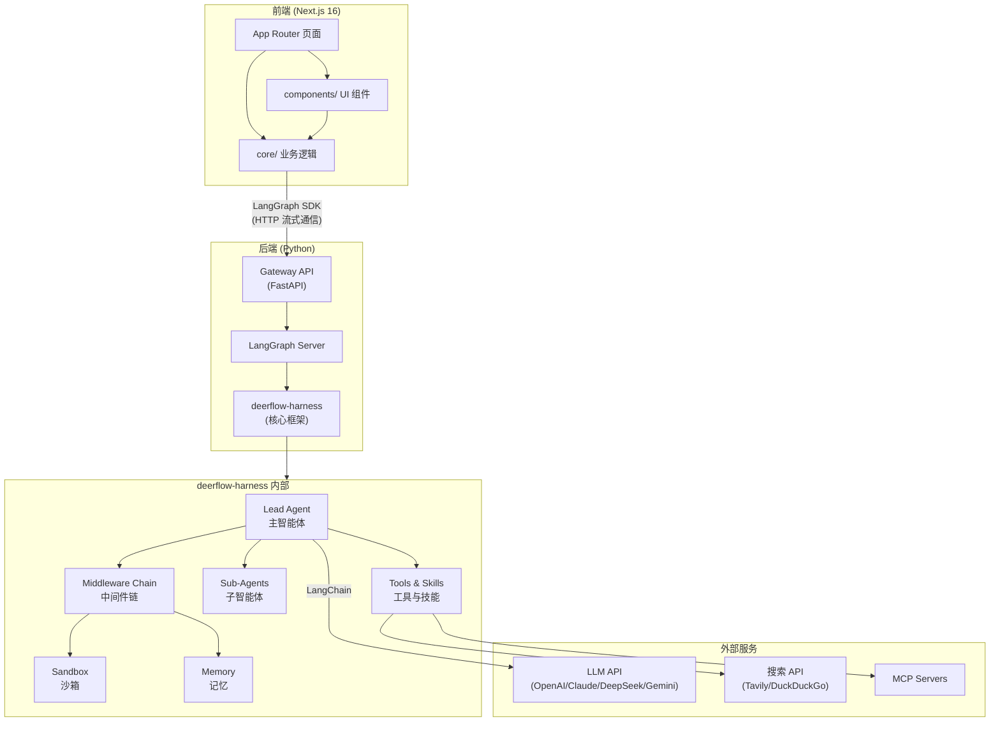

# 第一章：项目全景

## 学习目标

搞清楚 DeerFlow 是什么、解决什么问题、用了哪些技术、代码怎么组织的，以及如何在本地跑起来。读完本章后，你应该能在脑中建立起对整个项目的"鸟瞰图"。

## 1.1 项目定位

DeerFlow 全称 **Deep Exploration and Efficient Research Flow**，是字节跳动开源的一个**超级智能体编排框架（Super Agent Harness）**。

简单来说，它做的事情是：

> 让一个"主智能体"（Lead Agent）像项目经理一样，调度多个"子智能体"（Sub-Agent），利用沙箱环境执行代码，借助长期记忆记住上下文，通过可扩展的"技能"（Skills）完成各种复杂任务。

**关键词解读：**

| 概念 | 含义 |
|------|------|
| Super Agent Harness | 不是一个具体的 AI 应用，而是一个"框架/底座"——你可以在上面构建各种 AI 应用 |
| Sub-Agent | 可以委派任务给专门的子智能体，比如"研究员"、"代码执行者" |
| Sandbox | 隔离的代码执行环境（本地文件系统或 Docker 容器），防止 AI 生成的代码破坏宿主机 |
| Memory | 跨对话的长期记忆，让 AI 记住用户偏好和历史上下文 |
| Skills | 可插拔的能力包，类似"插件"，比如深度研究、PPT 生成、数据分析等 |

**v2.0 vs v1.0：** 当前版本是完全重写的 2.0，与 1.0 没有任何共享代码。1.0 是一个深度研究框架，2.0 则升级为通用的超级智能体编排系统。

## 1.2 技术栈总览

DeerFlow 是一个前后端分离的全栈项目，下面是完整的技术栈拆解：

### 后端（Python）

```
核心框架层
├── Python 3.12+              — 语言基础，使用类型提示
├── LangGraph 1.0.6~1.0.9    — 智能体编排引擎（状态图 + 检查点）
├── LangChain 1.2.3+          — LLM 抽象层（模型调用、工具绑定）
├── FastAPI 0.115+             — Gateway API 网关
└── uvicorn 0.34+              — ASGI 服务器

模型适配层
├── langchain-openai           — OpenAI / OpenRouter / 兼容 API
├── langchain-anthropic        — Claude 系列
├── langchain-deepseek         — DeepSeek 系列
├── langchain-google-genai     — Gemini 系列
└── 自定义 Provider            — Codex CLI、Claude Code OAuth

工具与能力层
├── tavily-python              — Web 搜索
├── firecrawl-py               — 网页抓取
├── ddgs                       — DuckDuckGo 搜索
├── markitdown                 — 文档转换（PDF/PPT/Excel/Word → Markdown）
├── agent-sandbox              — 沙箱执行环境
├── langchain-mcp-adapters     — MCP 协议适配
└── agent-client-protocol      — ACP 智能体间通信

数据与存储层
├── langgraph-checkpoint-sqlite — 检查点持久化
├── duckdb                      — 嵌入式分析数据库
├── pydantic 2.12+              — 数据校验与序列化
└── tiktoken                    — Token 计数

开发工具
├── uv                          — 包管理器（替代 pip/poetry）
├── ruff                        — 代码检查与格式化
└── pytest                      — 测试框架
```

### 前端（TypeScript）

```
核心框架层
├── Next.js 16                 — React 全栈框架（App Router + Turbopack）
├── React 19                   — UI 库
├── TypeScript 5.8             — 类型系统
└── pnpm 10.26.2               — 包管理器

UI 组件层
├── Tailwind CSS 4             — 原子化 CSS
├── Shadcn UI + Radix UI       — 组件库（无头组件 + 样式封装）
├── Lucide React               — 图标库
├── CodeMirror 6               — 代码编辑器
├── Shiki 3.15                 — 代码语法高亮
├── KaTeX                      — 数学公式渲染
└── @xyflow/react              — 流程图可视化

状态与通信层
├── @langchain/langgraph-sdk   — 与后端 LangGraph 通信
├── @tanstack/react-query      — 服务端状态管理
├── Vercel AI SDK (ai)         — AI 元素组件
└── Zod + @t3-oss/env-nextjs   — 环境变量校验

动画与体验层
├── GSAP                       — 高性能动画
├── Motion (Framer Motion)     — 声明式动画
└── Sonner                     — Toast 通知

认证层
└── better-auth                — 认证框架（GitHub OAuth）
```

## 1.3 目录结构

下面是项目的完整目录树，带有每个目录/文件的职责说明：

```
deer-flow/
│
├── Makefile                          # 顶层命令入口（make dev/install/stop 等）
├── config.example.yaml               # 配置模板（模型、沙箱、技能、IM 频道等）
├── extensions_config.example.json    # MCP 服务器配置模板
├── .env.example                      # 环境变量模板（API Key 等）
├── Install.md                        # 给编码智能体看的安装指南
├── CONTRIBUTING.md                   # 贡献指南
├── deer-flow.code-workspace          # VS Code 多根工作区配置
│
├── scripts/                          # 自动化脚本
│   ├── configure.py                  # make config 的实现
│   ├── check.py                      # 环境检查
│   ├── serve.sh                      # 启动前后端服务
│   ├── start-daemon.sh               # 后台守护模式启动
│   ├── deploy.sh                     # Docker 生产部署
│   ├── docker.sh                     # Docker 开发环境管理
│   └── cleanup-containers.sh         # 清理沙箱容器
│
├── docker/                           # Docker 相关配置
│   ├── nginx/                        # Nginx 反向代理配置
│   └── provisioner/                  # 沙箱容器供应器
│
├── skills/                           # 技能包目录
│   └── public/                       # 内置公开技能
│       ├── deep-research/            # 深度研究
│       ├── data-analysis/            # 数据分析
│       ├── chart-visualization/      # 图表可视化
│       ├── ppt-generation/           # PPT 生成
│       ├── frontend-design/          # 前端设计
│       ├── image-generation/         # 图片生成
│       ├── video-generation/         # 视频生成
│       ├── podcast-generation/       # 播客生成
│       ├── consulting-analysis/      # 咨询分析
│       ├── github-deep-research/     # GitHub 深度研究
│       ├── skill-creator/            # 技能创建器（元技能）
│       ├── find-skills/              # 技能搜索
│       ├── bootstrap/                # 引导技能
│       ├── claude-to-deerflow/       # Claude → DeerFlow 迁移
│       ├── surprise-me/              # 惊喜技能
│       ├── vercel-deploy-claimable/  # Vercel 部署
│       └── web-design-guidelines/    # Web 设计规范
│
├── backend/                          # ===== Python 后端 =====
│   ├── Makefile                      # 后端专用命令
│   ├── pyproject.toml                # 项目元数据与依赖
│   ├── uv.lock                       # 依赖锁文件
│   ├── langgraph.json                # LangGraph 服务器配置
│   ├── ruff.toml                     # 代码风格配置
│   ├── Dockerfile                    # 后端容器镜像
│   ├── debug.py                      # 调试入口
│   │
│   ├── app/                          # 应用层
│   │   ├── gateway/                  # FastAPI 网关
│   │   │   ├── app.py                # FastAPI 应用主文件
│   │   │   ├── config.py             # 网关配置
│   │   │   ├── deps.py               # 依赖注入
│   │   │   ├── services.py           # 业务逻辑服务
│   │   │   └── routers/              # API 路由模块
│   │   │       ├── threads.py        # 线程管理
│   │   │       ├── thread_runs.py    # 线程运行
│   │   │       ├── runs.py           # 运行管理
│   │   │       ├── agents.py         # 智能体管理
│   │   │       ├── models.py         # 模型管理
│   │   │       ├── skills.py         # 技能管理
│   │   │       ├── artifacts.py      # 工件管理
│   │   │       ├── memory.py         # 记忆管理
│   │   │       ├── mcp.py            # MCP 工具
│   │   │       ├── uploads.py        # 文件上传
│   │   │       ├── suggestions.py    # 建议系统
│   │   │       └── channels.py       # IM 频道集成
│   │   │
│   │   └── channels/                 # IM 平台集成（Telegram/Slack/飞书）
│   │
│   └── packages/
│       └── harness/                  # ===== deerflow-harness 核心包 =====
│           ├── pyproject.toml        # 核心包依赖声明
│           └── deerflow/             # 核心模块根目录
│               ├── agents/           # 智能体系统
│               │   ├── factory.py    # 智能体工厂（构建入口）
│               │   ├── features.py   # 功能标志
│               │   ├── lead_agent/   # 主智能体
│               │   │   ├── agent.py  # 主智能体构建逻辑
│               │   │   └── prompt.py # 系统提示词
│               │   ├── memory/       # 记忆系统
│               │   ├── middlewares/  # 中间件链（9 个）
│               │   └── checkpointer/ # 检查点管理
│               │
│               ├── subagents/        # 子智能体系统
│               │   ├── executor.py   # 后台执行引擎
│               │   ├── registry.py   # 智能体注册表
│               │   └── builtins/     # 内置子智能体
│               │
│               ├── sandbox/          # 沙箱执行系统
│               │   ├── sandbox.py    # 抽象接口
│               │   ├── tools.py      # 沙箱工具（bash/ls/read/write）
│               │   ├── middleware.py  # 沙箱生命周期中间件
│               │   └── local/        # 本地文件系统提供者
│               │
│               ├── tools/            # 工具系统
│               │   ├── tools.py      # 工具管理
│               │   └── builtins/     # 内置工具
│               │
│               ├── skills/           # 技能系统
│               ├── mcp/              # MCP 协议集成
│               ├── models/           # 模型适配器
│               ├── config/           # 配置加载
│               ├── guardrails/       # 安全护栏
│               ├── reflection/       # 反思机制
│               ├── runtime/          # 运行时
│               ├── uploads/          # 文件上传处理
│               ├── community/        # 社区工具（搜索/抓取）
│               └── utils/            # 通用工具函数
│
├── frontend/                         # ===== Next.js 前端 =====
│   ├── package.json                  # 前端依赖
│   ├── next.config.js                # Next.js 配置
│   ├── src/
│   │   ├── app/                      # App Router 页面
│   │   │   ├── page.tsx              # 落地页
│   │   │   ├── layout.tsx            # 根布局
│   │   │   ├── workspace/            # 工作区
│   │   │   │   ├── chats/[thread_id] # 聊天页面
│   │   │   │   └── agents/           # 智能体管理页
│   │   │   ├── api/                  # API 路由（认证/记忆）
│   │   │   └── mock/                 # 开发模拟数据
│   │   │
│   │   ├── components/               # React 组件
│   │   │   ├── ui/                   # Shadcn UI 基础组件
│   │   │   ├── ai-elements/          # AI 元素组件
│   │   │   ├── workspace/            # 工作区组件
│   │   │   └── landing/              # 落地页组件
│   │   │
│   │   ├── core/                     # 业务逻辑核心
│   │   │   ├── api/                  # LangGraph 客户端
│   │   │   ├── threads/              # 线程管理（最核心）
│   │   │   ├── messages/             # 消息处理
│   │   │   ├── artifacts/            # 工件管理
│   │   │   ├── skills/               # 技能管理
│   │   │   ├── memory/               # 记忆系统
│   │   │   ├── models/               # 模型管理
│   │   │   ├── settings/             # 用户设置
│   │   │   ├── i18n/                 # 国际化
│   │   │   ├── todos/                # 待办事项
│   │   │   ├── uploads/              # 文件上传
│   │   │   └── mcp/                  # MCP 集成
│   │   │
│   │   ├── hooks/                    # 共享 React Hooks
│   │   ├── lib/                      # 工具函数
│   │   ├── styles/                   # 全局样式
│   │   └── server/                   # 服务端代码（认证）
│   │
│   └── public/                       # 静态资源
│
└── docs/                             # 项目文档
    ├── ARCHITECTURE.md
    ├── CONFIGURATION.md
    ├── API.md
    ├── SETUP.md
    ├── FILE_UPLOAD.md
    └── ...
```

### 目录结构的设计哲学

从目录结构中可以看出几个重要的设计决策：

1. **Monorepo 但不用 Monorepo 工具**：前后端在同一个仓库，但用 Makefile 统一管理，而不是 Turborepo/Nx 这类工具
2. **后端双层架构**：`app/` 是应用层（网关 + IM 频道），`packages/harness/` 是核心框架层——这意味着核心框架可以独立发布为 Python 包
3. **uv workspace**：后端使用 uv 的 workspace 功能，让 `deerflow-harness` 作为本地包被主项目引用
4. **技能外置**：`skills/` 目录在项目根目录而非后端内部，每个技能是一个独立的 `SKILL.md` 文件，这是一种"约定优于配置"的插件机制

## 1.4 核心依赖关系

下面这张图展示了项目中最重要的依赖关系：



**关键依赖链路：**

- 前端 → LangGraph SDK → Gateway API → LangGraph Server → deerflow-harness → Lead Agent
- Lead Agent 是整个系统的"大脑"，通过中间件链增强能力，通过工具系统与外部世界交互

## 1.5 核心概念速查

在深入源码之前，先建立对核心概念的直觉理解：

| 概念 | 类比 | 在 DeerFlow 中的含义 |
|------|------|---------------------|
| **Thread（线程）** | 聊天会话 | 一次完整的对话，包含所有消息、工件、待办事项 |
| **Run（运行）** | 一次请求-响应 | 用户发送一条消息后，智能体处理并回复的完整过程 |
| **Lead Agent（主智能体）** | 项目经理 | 接收用户输入，决定调用哪些工具、委派哪些子智能体 |
| **Sub-Agent（子智能体）** | 专业员工 | 被主智能体委派执行特定任务的独立智能体 |
| **Middleware（中间件）** | 过滤器链 | 在主智能体处理前后执行的增强逻辑（记忆注入、沙箱准备等） |
| **Sandbox（沙箱）** | 虚拟机 | 隔离的代码执行环境，有自己的文件系统 |
| **Skill（技能）** | 插件 | 一个 SKILL.md 文件，定义了智能体的特定能力（如深度研究） |
| **Tool（工具）** | 函数 | 智能体可以调用的具体操作（如 bash、web_search） |
| **Artifact（工件）** | 输出文件 | 智能体生成的代码、文档等文件产物 |
| **Checkpoint（检查点）** | 存档点 | LangGraph 保存的图状态快照，支持回溯和恢复 |
| **MCP** | 标准接口 | Model Context Protocol，连接外部工具服务器的标准协议 |
| **ACP** | 智能体间通信 | Agent Client Protocol，智能体之间的通信协议 |

## 1.6 快速上手

### 环境要求

- Python 3.12+
- Node.js 22+
- pnpm 10.26.2+
- uv（Python 包管理器）
- Docker（可选，用于沙箱模式）

### 第一步：克隆与配置

```bash
# 克隆仓库
git clone https://github.com/bytedance/deer-flow.git
cd deer-flow

# 生成本地配置文件（从 example 模板复制）
make config
```

`make config` 会执行 `scripts/configure.py`，将 `config.example.yaml` 复制为 `config.yaml`，将 `.env.example` 复制为 `.env`。

### 第二步：配置模型

编辑 `config.yaml`，至少配置一个 LLM 模型：

> 文件：`deer-flow/config.example.yaml`

```yaml
models:
  - name: gpt-4                       # 内部标识符
    display_name: GPT-4               # 前端显示名称
    use: langchain_openai:ChatOpenAI  # LangChain 类路径
    model: gpt-4                      # API 模型标识
    api_key: $OPENAI_API_KEY          # API Key（推荐用环境变量）
    max_tokens: 4096
    temperature: 0.7
```

然后在 `.env` 中设置 API Key：

```bash
OPENAI_API_KEY=your-openai-api-key
TAVILY_API_KEY=your-tavily-api-key    # 用于 Web 搜索
```

### 第三步：安装依赖

```bash
# 一键安装前后端所有依赖
make install
```

这个命令实际执行了两步：
1. `cd backend && uv sync` — 安装 Python 后端依赖
2. `cd frontend && pnpm install` — 安装 Node.js 前端依赖

### 第四步：启动服务

```bash
# 开发模式（带热重载）
make dev
```

`make dev` 会通过 `scripts/serve.sh --dev` 启动三个服务：

```
┌─────────────────────────────────────────────────────────┐
│                    Nginx 反向代理                         │
│                   (localhost:2026)                        │
│                                                          │
│    /api/*  ──→  Gateway API (localhost:8001)             │
│    /lgs/*  ──→  LangGraph Server (localhost:2024)       │
│    /*      ──→  Next.js Frontend (localhost:3000)        │
└─────────────────────────────────────────────────────────┘
```

| 服务 | 端口 | 说明 |
|------|------|------|
| Next.js 前端 | 3000 | 开发模式使用 Turbopack 加速 |
| Gateway API | 8001 | FastAPI 网关，处理业务逻辑 |
| LangGraph Server | 2024 | 智能体编排引擎 |
| Nginx | 2026 | 统一入口，反向代理 |

访问 `http://localhost:2026` 即可使用。

### Docker 方式（推荐生产环境）

```bash
# 开发模式
make docker-init     # 首次：拉取沙箱镜像
make docker-start    # 启动服务

# 生产模式
make up              # 构建镜像并启动
make down            # 停止并清理
```

### 常用命令速查

| 命令 | 作用 |
|------|------|
| `make config` | 生成本地配置文件 |
| `make config-upgrade` | 合并新配置字段到已有 config.yaml |
| `make check` | 检查环境依赖是否就绪 |
| `make install` | 安装所有依赖 |
| `make dev` | 开发模式启动（热重载） |
| `make start` | 生产模式启动 |
| `make stop` | 停止所有服务 |
| `make clean` | 停止服务并清理临时文件 |
| `make setup-sandbox` | 预拉取沙箱 Docker 镜像 |

## 1.7 项目的核心能力一览

通过 README 和源码，可以总结出 DeerFlow 的六大核心能力：

```
┌──────────────────────────────────────────────────────────────┐
│                    DeerFlow 核心能力                          │
├──────────────┬──────────────┬──────────────┬────────────────┤
│  🔧 工具系统  │  🤖 子智能体  │  📦 沙箱执行  │  🧠 长期记忆   │
│  内置工具     │  内置智能体   │  本地模式     │  自动提取      │
│  社区工具     │  自定义智能体 │  Docker 模式  │  跨会话持久化  │
│  MCP 工具     │  ACP 协议    │  虚拟文件系统 │  异步更新      │
│  技能包       │  后台执行    │  安全隔离     │  记忆检索      │
├──────────────┴──────────────┴──────────────┴────────────────┤
│  🎯 技能系统                │  🛡️ 上下文工程                  │
│  SKILL.md 声明式定义        │  9 层中间件链                   │
│  在线安装/启用/禁用         │  自动摘要压缩                   │
│  19 个内置公开技能          │  计划模式（TodoList）            │
│  自定义技能开发             │  澄清请求拦截                   │
└──────────────────────────────────────────────────────────────┘
```

## 1.8 与同类项目的对比

为了更好地理解 DeerFlow 的定位，将它与几个知名的同类项目做个对比：

| 特性 | DeerFlow 2.0 | LangGraph (原生) | AutoGen | CrewAI |
|------|-------------|-----------------|---------|--------|
| 定位 | 超级智能体编排框架 | 图编排引擎 | 多智能体对话 | 多智能体协作 |
| 编排方式 | 主智能体 + 中间件链 | 状态图 | 对话驱动 | 角色驱动 |
| 沙箱执行 | 内置（本地/Docker） | 无 | 需自行集成 | 无 |
| 长期记忆 | 内置 | 需自行实现 | 需自行实现 | 需自行实现 |
| 技能/插件 | SKILL.md 声明式 | 无 | 无 | 工具集 |
| MCP 支持 | 内置 | 需适配 | 无 | 无 |
| 前端 UI | 内置 Next.js | 无 | 无 | 无 |
| IM 集成 | Telegram/Slack/飞书 | 无 | 无 | 无 |

DeerFlow 的独特之处在于：它不只是一个编排引擎，而是一个**开箱即用的完整系统**——从 LLM 调用到前端 UI，从沙箱执行到 IM 集成，全部内置。

## 检查点

读完本章后，试着回答以下问题来验证理解：

1. DeerFlow 的全称是什么？它的核心定位是什么？与 v1.0 有什么关系？
2. 后端的 `app/` 目录和 `packages/harness/` 目录分别承担什么职责？为什么要这样分层？
3. `make dev` 启动后，一共有几个服务在运行？它们各自的端口和职责是什么？
4. Thread、Run、Lead Agent、Sub-Agent、Middleware、Sandbox、Skill、Tool 这些概念之间是什么关系？
5. DeerFlow 的技能（Skill）和工具（Tool）有什么区别？
