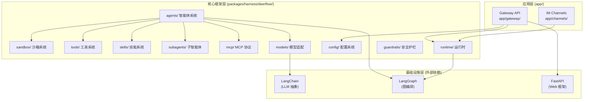
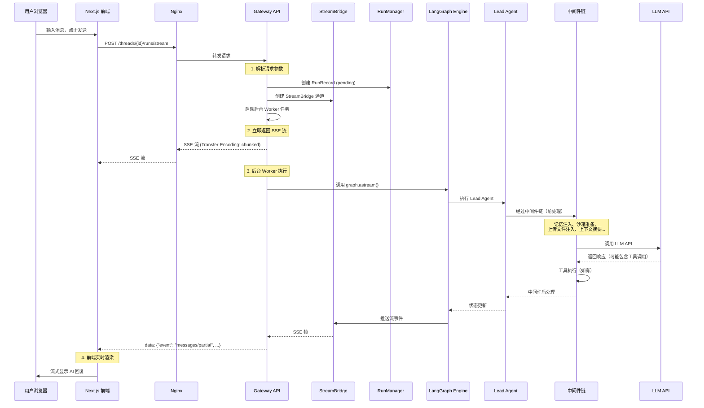

# 第二章：整体架构

## 学习目标

理解 DeerFlow 的整体架构设计：前后端如何分工、后端内部如何分层、数据如何从用户输入流转到 AI 响应再回到前端。读完本章后，你应该能画出完整的请求链路图，并理解每个组件在其中扮演的角色。

## 2.1 架构全景

DeerFlow 采用经典的前后端分离架构，但后端内部有一个精巧的三层设计：

```
┌─────────────────────────────────────────────────────────────────┐
│                        用户浏览器                                │
│                   http://localhost:2026                          │
└──────────────────────────┬──────────────────────────────────────┘
                           │
                           ▼
┌─────────────────────────────────────────────────────────────────┐
│                     Nginx 反向代理                               │
│                                                                  │
│   /api/*          → Gateway API    (localhost:8001)              │
│   /lgs/*          → LangGraph Server (localhost:2024)           │
│   /*              → Next.js Frontend (localhost:3000)            │
└───────┬──────────────────┬──────────────────┬───────────────────┘
        │                  │                  │
        ▼                  ▼                  ▼
┌──────────────┐  ┌────────────────┐  ┌──────────────────┐
│   Gateway    │  │   LangGraph    │  │    Next.js       │
│   API        │  │   Server       │  │    Frontend      │
│  (FastAPI)   │  │  (langgraph    │  │   (App Router)   │
│              │  │   dev CLI)     │  │                  │
│  业务逻辑层   │  │  智能体编排层   │  │    展示层         │
└──────┬───────┘  └───────┬────────┘  └──────────────────┘
       │                  │
       │                  ▼
       │          ┌────────────────┐
       └─────────→│  deerflow-     │
                  │  harness       │
                  │  (核心框架)     │
                  └────────────────┘
```

### 四个运行时进程

启动 `make dev` 后，实际运行着四个进程：

| 进程 | 端口 | 技术 | 职责 |
|------|------|------|------|
| Nginx | 2026 | Nginx | 统一入口，反向代理，CORS 处理 |
| Frontend | 3000 | Next.js + Turbopack | 用户界面，SSR/CSR |
| Gateway API | 8001 | FastAPI + Uvicorn | 业务 API（模型/技能/记忆/上传等） |
| LangGraph Server | 2024 | langgraph dev CLI | 智能体编排、状态管理、检查点 |

### 为什么需要两个后端服务？

这是一个关键的架构决策。Gateway API 和 LangGraph Server 各有分工：

| 维度 | Gateway API (FastAPI) | LangGraph Server |
|------|----------------------|------------------|
| 定位 | 业务逻辑网关 | 智能体编排引擎 |
| 协议 | REST + SSE | LangGraph Protocol |
| 状态 | 无状态 | 有状态（检查点） |
| 职责 | 模型管理、技能管理、文件上传、记忆 CRUD、IM 频道 | 图执行、状态转换、工具调用、中间件链 |
| 可替换性 | 可以换成任何 Web 框架 | 绑定 LangGraph 生态 |

这种分离的好处是：
1. **关注点分离**：业务逻辑不污染智能体编排逻辑
2. **独立扩展**：Gateway 可以水平扩展，LangGraph Server 可以独立升级
3. **协议兼容**：Gateway 实现了 LangGraph Platform 兼容的 API，前端可以用标准 SDK 通信

## 2.2 后端三层架构

后端代码分为三个清晰的层次：



### 第一层：应用层 (`app/`)

> 文件：`deer-flow/backend/app/gateway/app.py`

```python
def create_app() -> FastAPI:
    app = FastAPI(
        title="DeerFlow API Gateway",
        version="0.1.0",
        lifespan=lifespan,
    )
    # 注册所有路由
    app.include_router(models.router)      # /api/models
    app.include_router(mcp.router)         # /api/mcp
    app.include_router(memory.router)      # /api/memory
    app.include_router(skills.router)      # /api/skills
    app.include_router(artifacts.router)   # /api/threads/{id}/artifacts
    app.include_router(uploads.router)     # /api/threads/{id}/uploads
    app.include_router(threads.router)     # /api/threads/{id}
    app.include_router(agents.router)      # /api/agents
    app.include_router(suggestions.router) # /api/threads/{id}/suggestions
    app.include_router(channels.router)    # /api/channels
    app.include_router(assistants_compat.router)  # /assistants (LangGraph 兼容)
    app.include_router(thread_runs.router) # /threads/{id}/runs
    app.include_router(runs.router)        # /runs (无状态运行)
    return app
```

应用层的职责很明确：
- **路由分发**：将 HTTP 请求路由到对应的处理器
- **生命周期管理**：启动时初始化运行时组件，关闭时清理资源
- **IM 集成**：Telegram、Slack、飞书的 Bot 接入

### 第二层：核心框架层 (`packages/harness/deerflow/`)

这是整个项目最重要的部分，作为独立的 Python 包 `deerflow-harness` 发布。它包含：

| 模块 | 职责 | 关键文件 |
|------|------|---------|
| `agents/` | 智能体构建、中间件链、状态定义 | `factory.py`, `lead_agent/agent.py` |
| `sandbox/` | 沙箱抽象接口和实现 | `sandbox.py`, `tools.py` |
| `tools/` | 工具注册和管理 | `tools.py`, `builtins/` |
| `skills/` | 技能包加载和管理 | — |
| `subagents/` | 子智能体注册和执行 | `executor.py`, `registry.py` |
| `mcp/` | MCP 协议适配 | — |
| `models/` | 多模型适配器 | 各厂商 Provider |
| `config/` | 配置加载和校验 | `app_config.py`, 20+ 配置类 |
| `runtime/` | 运行时组件（RunManager、StreamBridge、Store） | `runs/`, `store/`, `stream_bridge/` |
| `guardrails/` | 工具调用安全护栏 | — |
| `community/` | 社区工具（搜索、抓取） | — |

核心框架层的设计原则是**配置驱动**——几乎所有行为都可以通过 `config.yaml` 控制，不需要修改代码。

### 第三层：基础设施层（外部依赖）

DeerFlow 站在三个巨人的肩膀上：

- **LangChain**：提供 LLM 调用的统一抽象（`BaseChatModel`、`BaseTool`），让 DeerFlow 可以无缝切换不同的模型提供商
- **LangGraph**：提供状态图编排引擎（`StateGraph`、`CompiledStateGraph`），以及检查点、中间件等基础设施
- **FastAPI**：提供高性能的异步 Web 框架

## 2.3 运行时组件

Gateway API 启动时，会初始化四个核心运行时单例：

> 文件：`deer-flow/backend/app/gateway/deps.py`

```python
@asynccontextmanager
async def langgraph_runtime(app: FastAPI) -> AsyncGenerator[None, None]:
    async with AsyncExitStack() as stack:
        app.state.stream_bridge = await stack.enter_async_context(make_stream_bridge())
        app.state.checkpointer = await stack.enter_async_context(make_checkpointer())
        app.state.store = await stack.enter_async_context(make_store())
        app.state.run_manager = RunManager()
        yield
```

这四个组件的职责：

```
┌─────────────────────────────────────────────────────────────┐
│                    运行时单例组件                              │
├──────────────────┬──────────────────────────────────────────┤
│  StreamBridge    │ 解耦智能体执行和 SSE 推送                  │
│                  │ 支持 memory / Redis 两种后端               │
│                  │ 基于 asyncio.Queue 实现                    │
├──────────────────┼──────────────────────────────────────────┤
│  Checkpointer    │ LangGraph 状态检查点持久化                 │
│                  │ 支持 memory / sqlite / postgres            │
│                  │ 实现对话回溯和恢复                          │
├──────────────────┼──────────────────────────────────────────┤
│  Store           │ 键值存储（线程元数据、标题等）               │
│                  │ 支持 memory / sqlite / postgres            │
│                  │ 用于 /threads/search 等查询                │
├──────────────────┼──────────────────────────────────────────┤
│  RunManager      │ 运行生命周期管理                           │
│                  │ 状态机：pending → running → success/error  │
│                  │ 内存注册表，跟踪所有活跃运行                │
└──────────────────┴──────────────────────────────────────────┘
```

## 2.4 数据流全景

下面用一个完整的序列图展示"用户发送一条消息"后，数据如何在各组件间流转：



### 数据流的关键设计

1. **异步解耦**：Gateway 不直接执行智能体，而是启动后台 Worker，通过 StreamBridge 传递事件。这样即使客户端断开连接，智能体也能继续执行完毕。

2. **SSE 流式传输**：前端通过 Server-Sent Events 接收实时更新，不需要 WebSocket。SSE 更简单，且天然支持 HTTP/2 多路复用。

3. **断开连接策略**：当客户端断开时，支持两种模式：
   - `cancel`：取消正在执行的运行
   - `continue`：让运行在后台继续完成（下次连接可获取结果）

## 2.5 核心抽象

DeerFlow 的架构建立在几个关键抽象之上：

### ThreadState — 图状态定义

> 文件：`deer-flow/backend/packages/harness/deerflow/agents/thread_state.py`

```python
class ThreadState(AgentState):
    sandbox: NotRequired[SandboxState | None]        # 沙箱状态
    thread_data: NotRequired[ThreadDataState | None]  # 线程数据（路径）
    title: NotRequired[str | None]                    # 自动生成的标题
    artifacts: Annotated[list[str], merge_artifacts]  # 工件列表（去重合并）
    todos: NotRequired[list | None]                   # 待办事项
    uploaded_files: NotRequired[list[dict] | None]    # 上传的文件
    viewed_images: Annotated[dict[str, ViewedImageData], merge_viewed_images]  # 已查看的图片
```

`ThreadState` 继承自 LangGraph 的 `AgentState`（包含 `messages` 列表），扩展了 DeerFlow 特有的状态字段。注意 `artifacts` 和 `viewed_images` 使用了自定义 reducer 函数来处理状态合并。

### create_agent — 智能体创建原语

LangGraph 提供的 `create_agent` 是最底层的智能体创建函数，DeerFlow 在其上构建了两层封装：

```
create_agent()                    ← LangGraph 原语
    ↑
create_deerflow_agent()           ← SDK 级工厂（纯参数，无配置文件）
    ↑                               文件：factory.py
make_lead_agent()                 ← 应用级工厂（读取 config.yaml）
                                    文件：lead_agent/agent.py
```

### make_lead_agent — 应用级工厂

> 文件：`deer-flow/backend/packages/harness/deerflow/agents/lead_agent/agent.py`

这是 LangGraph Server 调用的入口函数（在 `langgraph.json` 中注册）：

```python
def make_lead_agent(config: RunnableConfig):
    cfg = config.get("configurable", {})

    # 1. 解析运行时参数
    thinking_enabled = cfg.get("thinking_enabled", True)
    reasoning_effort = cfg.get("reasoning_effort", None)
    model_name = cfg.get("model_name") or cfg.get("model")
    is_plan_mode = cfg.get("is_plan_mode", False)
    subagent_enabled = cfg.get("subagent_enabled", False)
    agent_name = cfg.get("agent_name")

    # 2. 解析模型（支持自定义智能体的模型覆盖）
    agent_config = load_agent_config(agent_name)
    model_name = model_name or agent_config.model or _resolve_model_name()

    # 3. 组装并返回编译后的图
    return create_agent(
        model=create_chat_model(name=model_name, ...),
        tools=get_available_tools(model_name=model_name, ...),
        middleware=_build_middlewares(config, model_name=model_name, ...),
        system_prompt=apply_prompt_template(...),
        state_schema=ThreadState,
    )
```

关键点：`make_lead_agent` 每次被调用时都会根据 `RunnableConfig` 中的参数**动态创建**一个新的智能体实例。这意味着同一个 LangGraph Server 可以根据不同的请求参数（不同模型、是否开启思考模式等）创建不同配置的智能体。

### RuntimeFeatures — 特性标志

> 文件：`deer-flow/backend/packages/harness/deerflow/agents/features.py`

`RuntimeFeatures` 是一个声明式的特性标志集合，控制哪些中间件被激活：

```python
@dataclass
class RuntimeFeatures:
    sandbox: bool | AgentMiddleware = True       # 沙箱（含 ThreadData + Uploads）
    guardrail: bool | AgentMiddleware = False     # 安全护栏
    summarization: bool | AgentMiddleware = False  # 上下文摘要
    auto_title: bool | AgentMiddleware = True     # 自动标题
    memory: bool | AgentMiddleware = True         # 长期记忆
    vision: bool | AgentMiddleware = False        # 视觉能力
    subagent: bool | AgentMiddleware = False      # 子智能体
```

每个特性可以是：
- `False`：禁用
- `True`：使用内置默认实现
- `AgentMiddleware` 实例：使用自定义实现（替换内置的）

## 2.6 前端架构概览

前端采用 Next.js App Router 架构，核心分为三层：

```
┌─────────────────────────────────────────────────────────┐
│                    页面层 (app/)                          │
│  /                    → 落地页                           │
│  /workspace/chats/new → 新建聊天                         │
│  /workspace/chats/[thread_id] → 聊天页面                 │
│  /workspace/agents    → 智能体管理                       │
├─────────────────────────────────────────────────────────┤
│                    组件层 (components/)                   │
│  ui/          → Shadcn UI 基础组件（按钮、对话框等）       │
│  ai-elements/ → AI 元素组件（消息、代码块、工件等）        │
│  workspace/   → 工作区组件（聊天框、侧边栏、设置等）       │
│  landing/     → 落地页组件                               │
├─────────────────────────────────────────────────────────┤
│                    核心层 (core/)                         │
│  api/         → LangGraph SDK 客户端单例                 │
│  threads/     → 线程管理（创建、流式、状态）— 最核心       │
│  messages/    → 消息处理和转换                            │
│  artifacts/   → 工件加载和缓存                           │
│  settings/    → 用户偏好（localStorage）                  │
│  i18n/        → 国际化（en-US, zh-CN）                   │
│  skills/      → 技能安装和管理                           │
│  memory/      → 记忆系统                                 │
│  todos/       → 待办事项                                 │
│  uploads/     → 文件上传                                 │
└─────────────────────────────────────────────────────────┘
```

前端的数据流模式：

```
用户输入 → useThreadStream Hook → LangGraph SDK → SSE 流
                                                     ↓
                                              流事件解析
                                                     ↓
                                         TanStack Query 缓存更新
                                                     ↓
                                            React 组件重新渲染
```

前端架构的详细分析将在第 12-14 章展开。

## 2.7 模块依赖关系

下面这张图展示了后端核心框架内部各模块之间的依赖关系：

```mermaid
graph LR
    subgraph 入口["入口点"]
        LGJ["langgraph.json"]
        GW_APP["gateway/app.py"]
    end

    subgraph 智能体["agents/"]
        FACTORY["factory.py\n(SDK 工厂)"]
        LEAD["lead_agent/\n(应用工厂)"]
        MW["middlewares/\n(14 个中间件)"]
        STATE["thread_state.py"]
        FEAT["features.py"]
    end

    subgraph 能力["能力模块"]
        TOOLS["tools/"]
        SKILLS["skills/"]
        SANDBOX["sandbox/"]
        SUBAGENTS["subagents/"]
        MCP_M["mcp/"]
        MEMORY["agents/memory/"]
    end

    subgraph 基础["基础模块"]
        CONFIG["config/"]
        RUNTIME["runtime/"]
        MODELS["models/"]
        COMMUNITY["community/"]
    end

    LGJ -->|"graphs.lead_agent"| LEAD
    GW_APP --> RUNTIME
    GW_APP --> CONFIG

    LEAD --> FACTORY
    LEAD --> CONFIG
    LEAD --> MODELS
    FACTORY --> MW
    FACTORY --> FEAT
    FACTORY --> STATE

    MW --> SANDBOX
    MW --> MEMORY
    MW --> SUBAGENTS
    MW --> TOOLS

    TOOLS --> SKILLS
    TOOLS --> MCP_M
    TOOLS --> COMMUNITY
    MODELS --> CONFIG
    SANDBOX --> CONFIG
    RUNTIME --> CONFIG
end
```

### 依赖方向的设计原则

1. **单向依赖**：应用层 → 核心框架层 → 基础设施层，不允许反向依赖
2. **配置中心化**：几乎所有模块都依赖 `config/`，但 `config/` 不依赖任何业务模块
3. **中间件是粘合剂**：中间件链是连接各能力模块的桥梁，Lead Agent 本身不直接操作沙箱或记忆

## 2.8 部署架构

DeerFlow 支持两种部署模式：

### 本地开发模式

```
┌──────────────────────────────────────────────┐
│              开发者机器                        │
│                                               │
│  ┌─────────┐  ┌──────────┐  ┌─────────────┐ │
│  │ Next.js  │  │ Gateway  │  │ LangGraph   │ │
│  │ :3000    │  │ :8001    │  │ Server :2024│ │
│  └────┬─────┘  └────┬─────┘  └──────┬──────┘ │
│       │              │               │        │
│       └──────────────┼───────────────┘        │
│                      │                        │
│              ┌───────┴───────┐                │
│              │  Nginx :2026  │                │
│              └───────────────┘                │
│                                               │
│  ┌─────────────────────────────────────────┐ │
│  │  沙箱（本地模式）                         │ │
│  │  ~/.deer-flow/threads/{id}/workspace/   │ │
│  └─────────────────────────────────────────┘ │
└──────────────────────────────────────────────┘
```

### Docker 生产模式

```
┌──────────────────────────────────────────────────────┐
│                Docker Compose                         │
│                                                       │
│  ┌──────────┐  ┌──────────┐  ┌───────────────────┐  │
│  │ frontend │  │ gateway  │  │ langgraph         │  │
│  │ :3000    │  │ :8001    │  │ :2024             │  │
│  └────┬─────┘  └────┬─────┘  └──────┬────────────┘  │
│       │              │               │               │
│       └──────────────┼───────────────┘               │
│                      │                               │
│              ┌───────┴───────┐                       │
│              │  nginx :2026  │                       │
│              └───────────────┘                       │
│                                                       │
│  ┌─────────────────┐  ┌──────────────────────────┐  │
│  │  provisioner    │  │  sandbox containers      │  │
│  │  (沙箱供应器)    │  │  (按需创建/销毁)          │  │
│  └─────────────────┘  └──────────────────────────┘  │
└──────────────────────────────────────────────────────┘
```

Docker 模式的关键区别：
- 沙箱使用独立的 Docker 容器而非本地文件系统
- 有一个 `provisioner` 服务负责按需创建和销毁沙箱容器
- 所有服务通过 Docker 网络通信，不暴露到宿主机

## 检查点

1. DeerFlow 后端为什么要分成 Gateway API 和 LangGraph Server 两个服务？各自的职责是什么？
2. `deerflow-harness` 核心框架包含哪些模块？它们之间的依赖关系是怎样的？
3. 用户发送一条消息后，数据经过了哪些组件？StreamBridge 在其中起什么作用？
4. `make_lead_agent` 和 `create_deerflow_agent` 有什么区别？为什么需要两层工厂？
5. `ThreadState` 相比 LangGraph 原生的 `AgentState` 扩展了哪些字段？为什么需要自定义 reducer？
