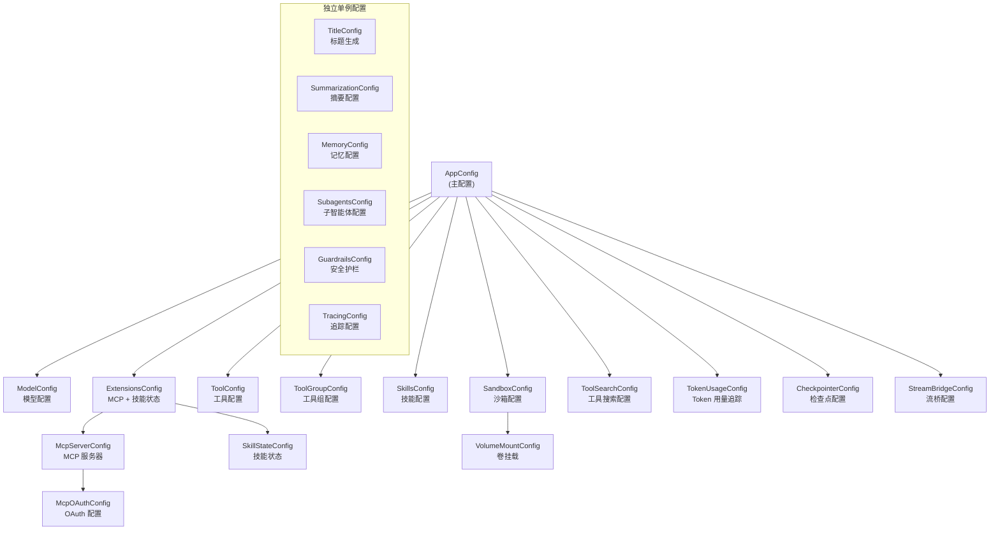

# 第三章：配置体系

## 学习目标

理解 DeerFlow 的配置系统是如何设计的：有哪些配置文件、配置如何加载和解析、各配置项的含义和作用。读完本章后，你应该能自信地修改 `config.yaml` 来定制 DeerFlow 的行为。

## 3.1 配置文件全景

DeerFlow 有三个主要的配置文件，各司其职：

```
deer-flow/
├── config.yaml                    # 主配置文件（模型、工具、沙箱、记忆等）
├── extensions_config.json         # MCP 服务器 + 技能状态配置
├── .env                           # 环境变量（API Key 等敏感信息）
│
├── config.example.yaml            # 主配置模板
├── extensions_config.example.json # MCP 配置模板
└── .env.example                   # 环境变量模板
```

| 配置文件 | 格式 | 职责 | 敏感信息 |
|---------|------|------|---------|
| `config.yaml` | YAML | 核心配置：模型、工具、沙箱、记忆、摘要、子智能体等 | 不含（通过 `$ENV_VAR` 引用） |
| `extensions_config.json` | JSON | MCP 服务器连接配置 + 技能启用/禁用状态 | 可能含（MCP 服务器凭证） |
| `.env` | Key=Value | API Key、OAuth Token 等敏感凭证 | 是 |

三者的关系：

```
.env  ──加载到环境变量──→  config.yaml 中的 $VAR 被替换
                          extensions_config.json 中的 $VAR 被替换
```

## 3.2 配置加载机制

### 加载入口

> 文件：`deer-flow/backend/packages/harness/deerflow/config/app_config.py`

配置加载的核心是 `AppConfig.from_file()` 方法：

```python
@classmethod
def from_file(cls, config_path: str | None = None) -> Self:
    resolved_path = cls.resolve_config_path(config_path)
    with open(resolved_path, encoding="utf-8") as f:
        config_data = yaml.safe_load(f) or {}

    # 检查配置版本
    cls._check_config_version(config_data, resolved_path)
    # 解析环境变量引用
    config_data = cls.resolve_env_variables(config_data)

    # 逐个加载子配置
    if "title" in config_data:
        load_title_config_from_dict(config_data["title"])
    if "summarization" in config_data:
        load_summarization_config_from_dict(config_data["summarization"])
    if "memory" in config_data:
        load_memory_config_from_dict(config_data["memory"])
    # ... 更多子配置
    return cls(**config_data)
```

### 配置路径解析优先级

`config.yaml` 的查找顺序：

1. 函数参数 `config_path`（代码中显式指定）
2. 环境变量 `DEER_FLOW_CONFIG_PATH`
3. 当前工作目录下的 `config.yaml`
4. 当前工作目录的父目录下的 `config.yaml`

`extensions_config.json` 的查找顺序类似，使用 `DEER_FLOW_EXTENSIONS_CONFIG_PATH` 环境变量，并向后兼容旧名 `mcp_config.json`。

### 环境变量解析

配置文件中所有以 `$` 开头的字符串值都会被替换为对应的环境变量值：

```yaml
# config.yaml 中这样写
models:
  - name: gpt-4
    api_key: $OPENAI_API_KEY    # ← 会被替换为环境变量的值

# .env 中这样写
OPENAI_API_KEY=sk-xxxxxxxxxxxx
```

解析逻辑递归遍历整个配置字典，对每个字符串值做替换：

```python
@classmethod
def resolve_env_variables(cls, config_data: dict) -> dict:
    """递归解析配置中的环境变量引用（$VAR_NAME）"""
    # 对字典中每个值递归处理
    # 如果值是字符串且以 $ 开头，从 os.environ 中获取
```

### 单例模式与热重载

配置使用全局单例缓存，通过 `get_app_config()` 获取：

```python
_app_config: AppConfig | None = None

def get_app_config(config_path: str | None = None) -> AppConfig:
    global _app_config
    # 检查文件修改时间（mtime），如果文件被修改则自动重载
    if _app_config_mtime != current_mtime:
        _load_and_cache_app_config(str(resolved_path))
    return _app_config
```

这意味着：
- 首次调用时从文件加载并缓存
- 后续调用直接返回缓存
- 如果 `config.yaml` 被修改（mtime 变化），自动重新加载
- 开发时修改配置不需要重启服务

## 3.3 配置类体系

DeerFlow 使用 Pydantic BaseModel 定义了 20+ 个配置类，形成一个层次化的配置体系：



注意：部分配置（Title、Summarization、Memory 等）使用独立的单例，不嵌套在 `AppConfig` 中。它们在 `AppConfig.from_file()` 加载时被初始化到各自的全局变量中。

## 3.4 config.yaml 各配置段详解

### 模型配置 (models)

> 文件：`deer-flow/backend/packages/harness/deerflow/config/model_config.py`

```yaml
models:
  - name: gpt-4                          # 唯一标识符（内部引用用）
    display_name: GPT-4                  # 前端显示名称
    use: langchain_openai:ChatOpenAI     # LangChain 类路径（包名:类名）
    model: gpt-4                         # 传给 API 的模型标识
    api_key: $OPENAI_API_KEY             # API Key（支持环境变量）
    max_tokens: 4096                     # 最大输出 Token 数
    temperature: 0.7                     # 采样温度
    supports_thinking: false             # 是否支持扩展思考
    supports_reasoning_effort: false     # 是否支持推理努力级别
    supports_vision: true                # 是否支持图片输入
    when_thinking_enabled:               # 开启思考时的额外参数
      extra_body:
        thinking:
          type: enabled
```

`use` 字段的格式是 `包名:类名`，DeerFlow 会动态导入这个类来创建模型实例。支持的模型提供商：

| use 路径 | 提供商 |
|---------|--------|
| `langchain_openai:ChatOpenAI` | OpenAI / OpenRouter / 任何 OpenAI 兼容 API |
| `langchain_anthropic:ChatAnthropic` | Anthropic Claude |
| `langchain_google_genai:ChatGoogleGenerativeAI` | Google Gemini（原生 SDK） |
| `deerflow.models.patched_deepseek:PatchedChatDeepSeek` | DeepSeek（带补丁） |
| `deerflow.models.patched_openai:PatchedChatOpenAI` | Gemini via OpenAI 兼容网关（保留 thought_signature） |
| `deerflow.models.claude_provider:ClaudeChatModel` | Claude Code OAuth |
| `deerflow.models.openai_codex_provider:CodexChatModel` | Codex CLI |

**列表中第一个模型是默认模型**——当请求未指定模型时使用。

### 工具配置 (tools + tool_groups)

```yaml
tool_groups:                    # 工具分组（用于权限控制）
  - name: web                   # Web 相关工具
  - name: file:read             # 文件读取
  - name: file:write            # 文件写入
  - name: bash                  # Shell 执行

tools:
  - name: web_search            # 工具名称
    group: web                  # 所属分组
    use: deerflow.community.ddg_search.tools:web_search_tool  # 实现类路径
    max_results: 5              # 工具特定参数

  - name: bash
    group: bash
    use: deerflow.sandbox.tools:bash_tool
```

工具也使用 `use` 字段指定实现类，额外的键值对作为工具的配置参数传入。

### 沙箱配置 (sandbox)

> 文件：`deer-flow/backend/packages/harness/deerflow/config/sandbox_config.py`

```yaml
# 方案一：本地沙箱（默认）
sandbox:
  use: deerflow.sandbox.local:LocalSandboxProvider
  allow_host_bash: false        # 是否允许在宿主机执行 bash（危险！）

# 方案二：Docker 容器沙箱
sandbox:
  use: deerflow.community.aio_sandbox:AioSandboxProvider
  image: enterprise-public-cn-beijing.cr.volces.com/vefaas-public/all-in-one-sandbox:latest
  port: 8080                    # 容器基础端口
  replicas: 3                   # 最大并发容器数（LRU 淘汰）
  idle_timeout: 600             # 空闲超时（秒）
  mounts:                       # 额外卷挂载
    - host_path: /path/on/host
      container_path: /home/user/shared
      read_only: false
  environment:                  # 注入容器的环境变量
    API_KEY: $MY_API_KEY

# 方案三：Provisioner 管理的沙箱（生产环境）
sandbox:
  use: deerflow.community.aio_sandbox:AioSandboxProvider
  provisioner_url: http://provisioner:8002
```

### 记忆配置 (memory)

```yaml
memory:
  enabled: true                  # 是否启用长期记忆
  storage_path: memory.json      # 存储路径（相对于 backend 目录）
  debounce_seconds: 30           # 队列更新的防抖等待时间
  model_name: null               # 用于记忆提取的模型（null = 默认模型）
  max_facts: 100                 # 最大存储事实数
  fact_confidence_threshold: 0.7 # 事实置信度阈值
  injection_enabled: true        # 是否将记忆注入系统提示
  max_injection_tokens: 2000     # 注入的最大 Token 数
```

### 摘要配置 (summarization)

```yaml
summarization:
  enabled: true
  trigger:                       # 触发条件（可配多个，任一满足即触发）
    - type: tokens               # 按 Token 数触发
      value: 10000
    # - type: messages           # 按消息数触发
    #   value: 50
    # - type: fraction           # 按模型最大输入的百分比触发
    #   value: 0.8
  keep:                          # 摘要后保留多少近期历史
    type: messages
    value: 10                    # 保留最近 10 条消息
  trim_tokens_to_summarize: 15564  # 准备摘要时的最大 Token 数
  summary_prompt: null           # 自定义摘要提示词（null = 使用默认）
```

### 技能配置 (skills)

```yaml
skills:
  path: ../skills                # 技能目录路径（相对于 backend）
  container_path: /mnt/skills    # 沙箱内的技能挂载路径
```

### 工具搜索配置 (tool_search)

```yaml
tool_search:
  enabled: false                 # 是否启用延迟工具加载
```

启用后，MCP 工具不会直接加载到智能体上下文中，而是通过 `tool_search` 工具按需发现。这在 MCP 服务器暴露大量工具时可以减少上下文占用。

### 子智能体配置 (subagents)

```yaml
subagents:
  timeout_seconds: 900           # 默认超时（15 分钟）
  agents:                        # 按智能体名称覆盖超时
    general-purpose:
      timeout_seconds: 1800      # 30 分钟
    bash:
      timeout_seconds: 300       # 5 分钟
```

### 安全护栏配置 (guardrails)

```yaml
guardrails:
  enabled: true
  provider:
    # 方案一：内置白名单
    use: deerflow.guardrails.builtin:AllowlistProvider
    config:
      denied_tools: ["bash", "write_file"]

    # 方案二：OAP 标准协议
    # use: aport_guardrails.providers.generic:OAPGuardrailProvider

    # 方案三：自定义提供者
    # use: my_package:MyGuardrailProvider
```

## 3.5 路径系统

> 文件：`deer-flow/backend/packages/harness/deerflow/config/paths.py`

DeerFlow 有一套集中化的路径管理系统，处理宿主机路径和沙箱虚拟路径之间的映射：

```
宿主机路径                                    沙箱虚拟路径
─────────────────────────────────────────    ──────────────────────
{base_dir}/
├── memory.json
├── USER.md
├── agents/{agent_name}/
│   ├── config.yaml
│   ├── SOUL.md
│   └── memory.json
└── threads/{thread_id}/
    └── user-data/                           /mnt/user-data/
        ├── workspace/                       /mnt/user-data/workspace/
        ├── uploads/                         /mnt/user-data/uploads/
        └── outputs/                         /mnt/user-data/outputs/
```

`base_dir` 的解析优先级：
1. 构造函数参数
2. `DEER_FLOW_HOME` 环境变量
3. 如果当前目录是 `backend/`，使用 `./deer-flow`
4. 默认：`$HOME/.deer-flow`

路径系统还包含安全防护——`thread_id` 只允许字母数字、连字符和下划线，防止路径遍历攻击：

```python
_SAFE_THREAD_ID_RE = re.compile(r"^[A-Za-z0-9_\-]+$")
```

## 3.6 MCP 配置 (extensions_config.json)

> 文件：`deer-flow/backend/packages/harness/deerflow/config/extensions_config.py`

MCP（Model Context Protocol）服务器的配置独立于 `config.yaml`，使用 JSON 格式：

```json
{
  "mcpServers": {
    "my-mcp-server": {
      "enabled": true,
      "type": "stdio",
      "command": "npx",
      "args": ["-y", "@some/mcp-server"],
      "env": {
        "API_KEY": "$MY_API_KEY"
      }
    },
    "remote-server": {
      "enabled": true,
      "type": "http",
      "url": "https://mcp.example.com/api",
      "headers": {
        "Authorization": "Bearer $TOKEN"
      },
      "oauth": {
        "enabled": true,
        "token_url": "https://auth.example.com/token",
        "grant_type": "client_credentials",
        "client_id": "$CLIENT_ID",
        "client_secret": "$CLIENT_SECRET"
      }
    }
  },
  "skills": {
    "deep-research": { "enabled": true },
    "data-analysis": { "enabled": false }
  }
}
```

MCP 服务器支持三种传输类型：

| 类型 | 说明 | 关键配置 |
|------|------|---------|
| `stdio` | 本地进程（标准输入/输出通信） | `command`, `args`, `env` |
| `sse` | Server-Sent Events 远程服务 | `url`, `headers`, `oauth` |
| `http` | HTTP 远程服务 | `url`, `headers`, `oauth` |

`skills` 部分控制技能的启用/禁用状态，与 `skills/public/` 目录下的技能包对应。

## 3.7 LangGraph 服务器配置

> 文件：`deer-flow/backend/langgraph.json`

```json
{
  "$schema": "https://langgra.ph/schema.json",
  "python_version": "3.12",
  "dependencies": ["."],
  "env": ".env",
  "graphs": {
    "lead_agent": "deerflow.agents:make_lead_agent"
  },
  "checkpointer": {
    "path": "./packages/harness/deerflow/agents/checkpointer/async_provider.py:make_checkpointer"
  }
}
```

这个文件告诉 LangGraph Server：
- 使用 Python 3.12
- 依赖当前目录（即 `backend/`）
- 从 `.env` 加载环境变量
- 注册一个名为 `lead_agent` 的图，入口函数是 `deerflow.agents:make_lead_agent`
- 使用自定义的异步检查点保存器

## 3.8 `use` 字段的统一设计模式

你可能已经注意到，`config.yaml` 中大量使用了 `use` 字段。这是 DeerFlow 配置体系中最重要的设计模式——**类路径动态加载**：

```
use: "包名.模块名:类名"
```

这个模式贯穿了整个配置系统：

| 配置段 | use 示例 | 加载的对象 |
|--------|---------|-----------|
| models | `langchain_openai:ChatOpenAI` | LLM 模型类 |
| sandbox | `deerflow.sandbox.local:LocalSandboxProvider` | 沙箱提供者类 |
| tools | `deerflow.community.ddg_search.tools:web_search_tool` | 工具实例 |
| guardrails | `deerflow.guardrails.builtin:AllowlistProvider` | 护栏提供者类 |

这种设计的好处：
1. **零代码扩展**：添加新模型/工具/沙箱只需修改配置文件
2. **第三方集成**：任何符合接口的 Python 类都可以通过 `use` 字段接入
3. **运行时可配**：不需要重新编译或修改源码

## 3.9 配置版本管理

`config.yaml` 有一个 `config_version` 字段：

```yaml
config_version: 4
```

当配置 schema 发生变化时，版本号会递增。如果你的本地 `config.yaml` 版本低于模板版本，启动时会收到警告。可以运行：

```bash
make config-upgrade
```

这会将 `config.example.yaml` 中的新字段合并到你的 `config.yaml` 中，同时保留你的自定义配置。

## 检查点

1. DeerFlow 有哪三个主要配置文件？它们各自的职责是什么？
2. `config.yaml` 中的 `$VAR_NAME` 是如何被解析的？为什么推荐用环境变量而不是直接写 API Key？
3. `use` 字段的格式是什么？它实现了什么设计模式？有什么好处？
4. 沙箱有哪三种配置方案？各自适用什么场景？
5. 配置的热重载是如何实现的？修改 `config.yaml` 后需要重启服务吗？
