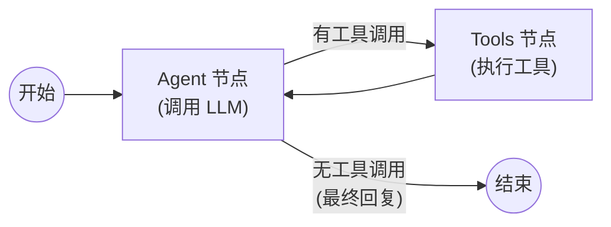
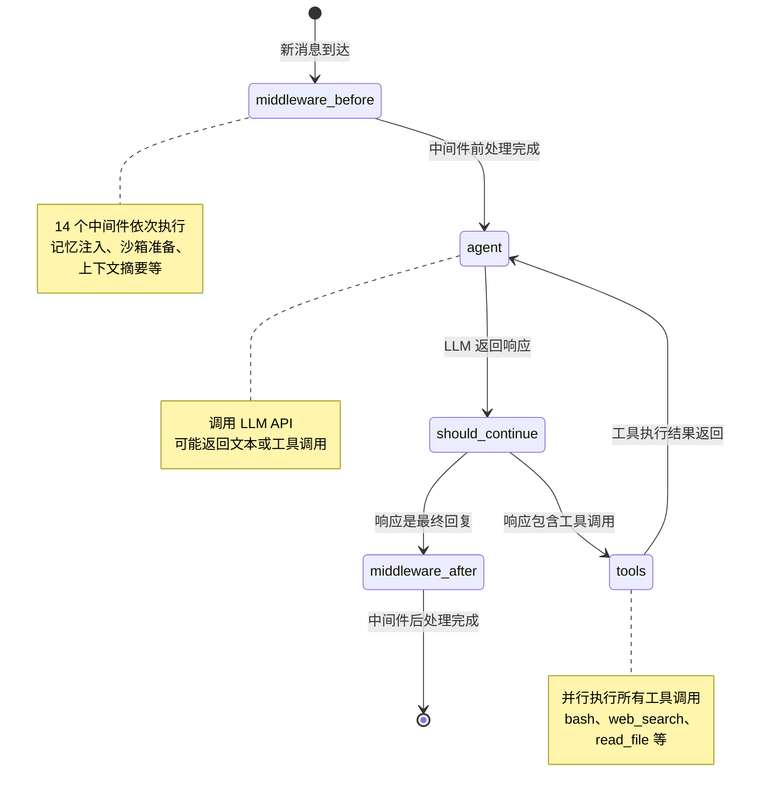
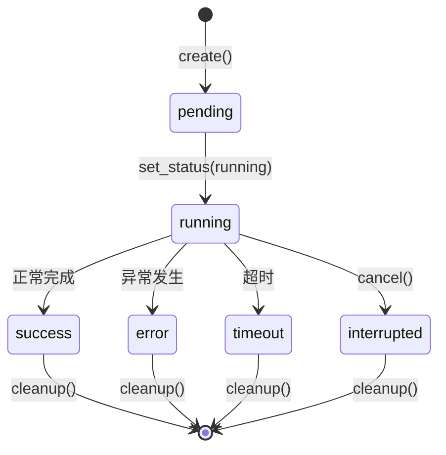
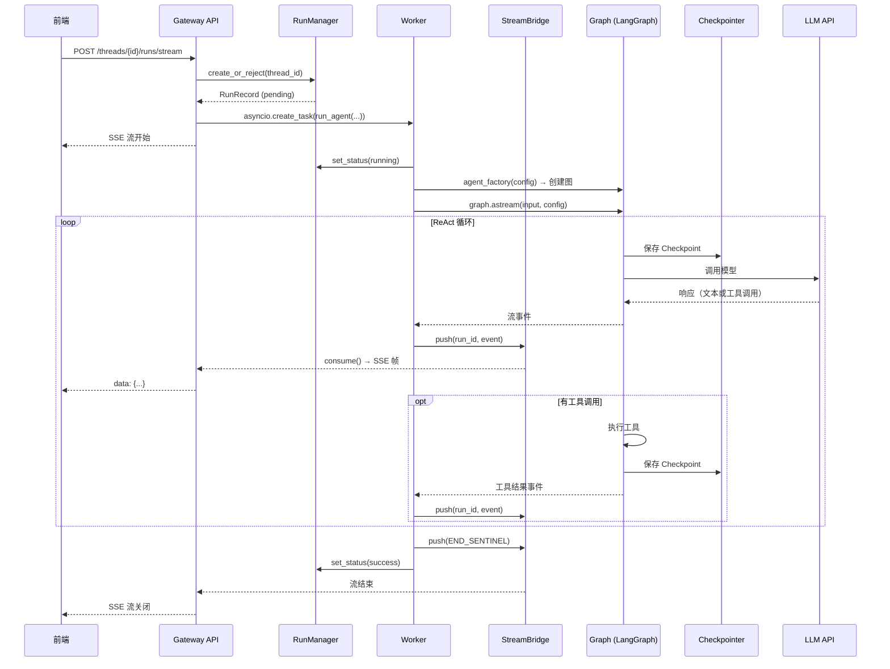

# 第四章：LangGraph 图引擎

## 学习目标

理解 DeerFlow 如何使用 LangGraph 作为智能体编排引擎：图是如何构建的、状态如何流转、检查点如何持久化、运行如何管理。读完本章后，你应该能理解从"用户发送消息"到"智能体返回响应"的完整执行链路。

## 4.1 LangGraph 基础概念

在深入 DeerFlow 的实现之前，先快速回顾 LangGraph 的核心概念：

```
┌─────────────────────────────────────────────────────────┐
│                    LangGraph 核心概念                     │
├──────────────┬──────────────────────────────────────────┤
│  StateGraph  │ 状态图——定义节点、边和状态 schema          │
│  Node        │ 图中的一个处理步骤（函数）                 │
│  Edge        │ 节点之间的连接（可以是条件边）              │
│  State       │ 在节点之间传递的数据（TypedDict）          │
│  Checkpoint  │ 状态快照，支持回溯和恢复                   │
│  Middleware   │ 在图执行前后插入的增强逻辑                 │
│  Compiled    │ 编译后的图，可以直接执行                   │
│  Graph       │                                          │
└──────────────┴──────────────────────────────────────────┘
```

LangGraph 的 `create_agent` 函数会构建一个标准的 ReAct 循环图：



这就是 DeerFlow 智能体的核心执行循环——LLM 决定是否调用工具，如果调用则执行工具并将结果反馈给 LLM，直到 LLM 给出最终回复。

## 4.2 DeerFlow 的图构建

### 入口点

> 文件：`deer-flow/backend/langgraph.json`

```json
{
  "graphs": {
    "lead_agent": "deerflow.agents:make_lead_agent"
  },
  "checkpointer": {
    "path": "./packages/harness/deerflow/agents/checkpointer/async_provider.py:make_checkpointer"
  }
}
```

LangGraph Server 启动时，会根据这个配置：
1. 注册一个名为 `lead_agent` 的图
2. 每次请求到来时，调用 `make_lead_agent(config)` 创建图实例
3. 使用 `make_checkpointer` 创建的检查点保存器持久化状态

### 图的创建流程

> 文件：`deer-flow/backend/packages/harness/deerflow/agents/lead_agent/agent.py`

`make_lead_agent` 是一个**动态工厂函数**——每次被调用时根据运行时配置创建不同的图：

```python
def make_lead_agent(config: RunnableConfig):
    cfg = config.get("configurable", {})

    # 1. 提取运行时参数
    thinking_enabled = cfg.get("thinking_enabled", True)
    model_name = cfg.get("model_name") or cfg.get("model")
    is_plan_mode = cfg.get("is_plan_mode", False)
    subagent_enabled = cfg.get("subagent_enabled", False)

    # 2. 解析模型名称（支持自定义智能体覆盖）
    model_name = _resolve_model_name(model_name)

    # 3. 调用 LangGraph 的 create_agent 构建图
    return create_agent(
        model=create_chat_model(name=model_name, thinking_enabled=thinking_enabled),
        tools=get_available_tools(model_name=model_name, subagent_enabled=subagent_enabled),
        middleware=_build_middlewares(config, model_name=model_name),
        system_prompt=apply_prompt_template(subagent_enabled=subagent_enabled),
        state_schema=ThreadState,
    )
```

`create_agent` 是 LangGraph 提供的原语，它接收模型、工具、中间件和系统提示，返回一个 `CompiledStateGraph`。

### 图的内部结构

`create_agent` 构建的图结构如下：



关键点：
- **中间件在图的外层**：中间件不是图的节点，而是包裹在图执行前后的增强逻辑
- **工具调用是循环的**：LLM 可以多次调用工具，直到它决定给出最终回复
- **状态在每一步都更新**：每次节点执行后，状态（包括消息列表）都会被更新

## 4.3 ThreadState — 图的状态定义

> 文件：`deer-flow/backend/packages/harness/deerflow/agents/thread_state.py`

`ThreadState` 定义了在图的各节点之间传递的数据结构：

```python
class ThreadState(AgentState):
    # 继承自 AgentState 的字段：
    # messages: Annotated[list[AnyMessage], add_messages]  ← 消息列表（自动追加）

    # DeerFlow 扩展字段：
    sandbox: NotRequired[SandboxState | None]              # 沙箱 ID
    thread_data: NotRequired[ThreadDataState | None]       # 线程路径信息
    title: NotRequired[str | None]                         # 自动生成的标题
    artifacts: Annotated[list[str], merge_artifacts]       # 工件列表
    todos: NotRequired[list | None]                        # 待办事项
    uploaded_files: NotRequired[list[dict] | None]         # 上传的文件
    viewed_images: Annotated[dict[str, ViewedImageData], merge_viewed_images]  # 已查看图片
```

### 状态 Reducer 机制

LangGraph 使用 `Annotated` 类型注解来定义状态字段的合并策略：

```python
# messages 字段使用 add_messages reducer（LangGraph 内置）
# → 新消息追加到列表末尾，相同 ID 的消息会被更新

# artifacts 字段使用自定义 merge_artifacts reducer
def merge_artifacts(existing: list[str] | None, new: list[str] | None) -> list[str]:
    """合并并去重工件列表，保持顺序"""
    if existing is None: return new or []
    if new is None: return existing
    return list(dict.fromkeys(existing + new))

# viewed_images 字段使用自定义 merge_viewed_images reducer
def merge_viewed_images(existing, new):
    """合并图片字典，空字典 {} 表示清空"""
    if new is not None and len(new) == 0:
        return {}  # 特殊语义：空字典 = 清空所有
    return {**existing, **new}
```

Reducer 的作用是：当多个节点同时更新同一个状态字段时，定义如何合并这些更新。

## 4.4 检查点机制

检查点（Checkpoint）是 LangGraph 的核心能力之一——它在图的每一步执行后保存完整的状态快照，使得对话可以被暂停、恢复、回溯。

### 检查点保存器

> 文件：`deer-flow/backend/packages/harness/deerflow/agents/checkpointer/`

DeerFlow 支持三种检查点后端：

| 后端 | 类 | 适用场景 |
|------|---|---------|
| `memory` | `InMemorySaver` | 开发/测试（重启丢失） |
| `sqlite` | `SqliteSaver` / `AsyncSqliteSaver` | 单机部署（默认） |
| `postgres` | `PostgresSaver` / `AsyncPostgresSaver` | 生产环境（多实例共享） |

配置方式：

```yaml
# config.yaml
checkpointer:
  type: sqlite
  connection_string: "checkpoints.db"
```

### 同步 vs 异步

DeerFlow 提供了两套检查点工厂：

```
同步版本（provider.py）
├── get_checkpointer()      → 全局单例，用于 LangGraph CLI 和图编译
├── reset_checkpointer()    → 重置单例
└── checkpointer_context()  → 上下文管理器，每次创建新连接

异步版本（async_provider.py）
└── make_checkpointer()     → 异步上下文管理器，用于 FastAPI lifespan
```

异步版本在 Gateway API 启动时初始化：

```python
# deps.py
async with AsyncExitStack() as stack:
    app.state.checkpointer = await stack.enter_async_context(make_checkpointer())
```

### 检查点的工作原理

```
用户发送消息 "帮我搜索 Python 教程"
    │
    ▼
┌─ Checkpoint #1 ─────────────────────────────┐
│ messages: [HumanMessage("帮我搜索...")]      │
│ sandbox: null                                │
│ artifacts: []                                │
└──────────────────────────────────────────────┘
    │  Agent 节点执行 → LLM 决定调用 web_search
    ▼
┌─ Checkpoint #2 ─────────────────────────────┐
│ messages: [Human, AIMessage(tool_calls=[..])]│
│ sandbox: {sandbox_id: "abc123"}              │
│ artifacts: []                                │
└──────────────────────────────────────────────┘
    │  Tools 节点执行 → web_search 返回结果
    ▼
┌─ Checkpoint #3 ─────────────────────────────┐
│ messages: [Human, AI, ToolMessage(results)]  │
│ sandbox: {sandbox_id: "abc123"}              │
│ artifacts: []                                │
└──────────────────────────────────────────────┘
    │  Agent 节点执行 → LLM 生成最终回复
    ▼
┌─ Checkpoint #4 ─────────────────────────────┐
│ messages: [Human, AI, Tool, AIMessage(回复)] │
│ sandbox: {sandbox_id: "abc123"}              │
│ artifacts: ["search_results.md"]             │
│ title: "Python 教程搜索"                     │
└──────────────────────────────────────────────┘
```

每个检查点都是完整的状态快照，可以从任意检查点恢复执行。

## 4.5 运行管理

### RunManager — 运行生命周期

> 文件：`deer-flow/backend/packages/harness/deerflow/runtime/runs/manager.py`

`RunManager` 是一个内存中的运行注册表，管理所有活跃运行的生命周期：



每个运行用 `RunRecord` 表示：

```python
@dataclass
class RunRecord:
    run_id: str                          # 运行唯一 ID
    thread_id: str                       # 所属线程
    assistant_id: str | None             # 使用的智能体
    status: RunStatus                    # 当前状态
    on_disconnect: DisconnectMode        # 断开连接时的行为
    multitask_strategy: str = "reject"   # 多任务策略
    task: asyncio.Task | None = None     # 关联的异步任务
    abort_event: asyncio.Event           # 中止信号
```

### 多任务策略

当同一个线程已有运行在执行时，新的运行请求如何处理？

| 策略 | 行为 |
|------|------|
| `reject` | 拒绝新请求（返回 409 Conflict） |
| `interrupt` | 中断现有运行，启动新运行 |
| `rollback` | 回滚现有运行的状态，启动新运行 |

### Worker — 后台执行引擎

> 文件：`deer-flow/backend/packages/harness/deerflow/runtime/runs/worker.py`

`run_agent` 函数是实际执行智能体的地方，它在一个 `asyncio.Task` 中运行：

```python
async def run_agent(
    bridge: StreamBridge,
    run_manager: RunManager,
    record: RunRecord,
    *,
    checkpointer, store, agent_factory,
    graph_input: dict,
    config: dict,
    stream_modes: list[str] | None = None,
):
    # 1. 标记运行为 running
    await run_manager.set_status(record.run_id, RunStatus.running)

    # 2. 创建智能体图实例
    graph = agent_factory(config)

    # 3. 编译图（注入 checkpointer 和 store）
    compiled = graph  # 已经是 CompiledStateGraph

    # 4. 流式执行图
    async for event in compiled.astream(graph_input, config, stream_mode=stream_modes):
        # 5. 将事件推送到 StreamBridge
        await bridge.push(record.run_id, event)

        # 6. 检查中止信号
        if record.abort_event.is_set():
            break

    # 7. 推送结束标记
    await bridge.push(record.run_id, END_SENTINEL)

    # 8. 标记运行为 success
    await run_manager.set_status(record.run_id, RunStatus.success)
```

关键设计：
- **异步流式执行**：使用 `graph.astream()` 逐步产出事件，而不是等待全部完成
- **中止支持**：每次循环检查 `abort_event`，支持优雅中断
- **错误处理**：异常被捕获并标记为 `RunStatus.error`
- **超时保护**：通过 `asyncio.timeout` 防止无限执行

## 4.6 StreamBridge — 事件流桥接

> 文件：`deer-flow/backend/packages/harness/deerflow/runtime/stream_bridge/`

StreamBridge 是连接"智能体执行"和"SSE 推送"的桥梁：

```
┌──────────────┐     push()     ┌──────────────┐     consume()    ┌──────────────┐
│   Worker     │ ──────────────→│ StreamBridge  │ ──────────────→ │ SSE Consumer │
│  (run_agent) │                │  (Queue)      │                 │  (HTTP 响应)  │
└──────────────┘                └──────────────┘                 └──────────────┘
```

### 抽象接口

```python
class StreamBridge(Protocol):
    async def push(self, run_id: str, event: Any) -> None:
        """生产者：推送事件"""
        ...

    async def consume(self, run_id: str) -> AsyncIterator[Any]:
        """消费者：消费事件流"""
        ...

    async def close(self, run_id: str) -> None:
        """关闭通道"""
        ...
```

### 内存实现

```python
class MemoryStreamBridge:
    """基于 asyncio.Queue 的内存实现"""

    def __init__(self):
        self._channels: dict[str, asyncio.Queue] = {}

    async def push(self, run_id: str, event: Any) -> None:
        queue = self._channels.setdefault(run_id, asyncio.Queue())
        await queue.put(event)

    async def consume(self, run_id: str) -> AsyncIterator[Any]:
        queue = self._channels.setdefault(run_id, asyncio.Queue())
        while True:
            event = await queue.get()
            if event is END_SENTINEL:
                break
            yield event
```

这种设计的好处：
1. **解耦**：Worker 不需要知道 SSE 连接的存在
2. **断开重连**：客户端断开后，Worker 继续执行，事件暂存在 Queue 中
3. **可替换**：生产环境可以换成 Redis 实现，支持多实例部署

## 4.7 Store — 键值存储

> 文件：`deer-flow/backend/packages/harness/deerflow/runtime/store/`

Store 是 LangGraph 的键值存储抽象，DeerFlow 用它来存储线程元数据（标题、创建时间等）：

```python
# 支持三种后端
store:
  type: memory    # 内存（开发用）
  type: sqlite    # SQLite（默认）
  type: postgres  # PostgreSQL（生产）
```

Store 与 Checkpointer 的区别：

| 维度 | Checkpointer | Store |
|------|-------------|-------|
| 存储内容 | 图的完整状态快照 | 任意键值数据 |
| 粒度 | 每个图执行步骤一个 | 自由读写 |
| 用途 | 对话回溯、状态恢复 | 线程元数据、标题、搜索索引 |
| 访问方式 | LangGraph 自动管理 | 业务代码显式调用 |

## 4.8 完整执行链路

把所有组件串起来，一次完整的请求执行链路如下：



## 检查点

1. LangGraph 的 `create_agent` 构建了什么样的图结构？ReAct 循环是如何工作的？
2. `make_lead_agent` 为什么是动态工厂？每次请求都创建新图有什么好处？
3. 检查点保存器支持哪三种后端？各自适用什么场景？
4. `RunManager` 的状态机有哪些状态？多任务策略 `reject`/`interrupt`/`rollback` 分别是什么行为？
5. `StreamBridge` 解决了什么问题？如果没有它，Worker 和 SSE 推送之间会有什么耦合？
