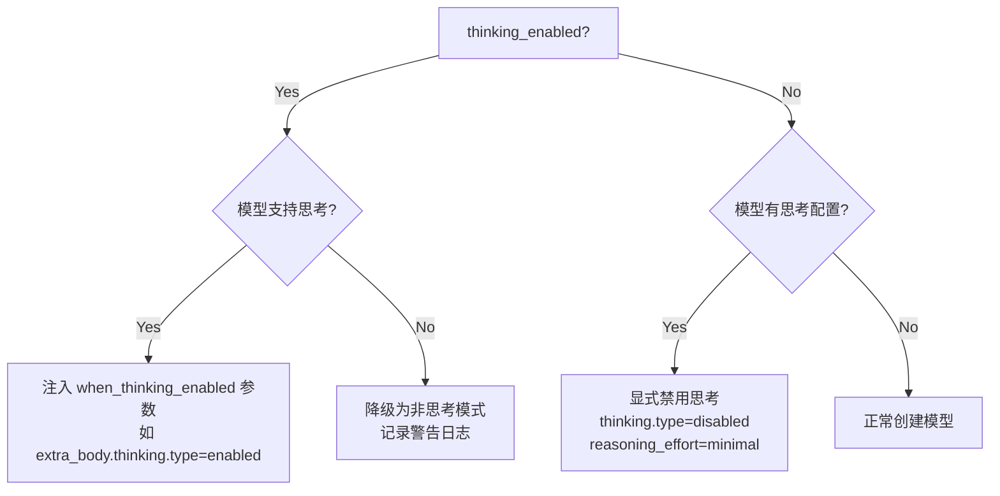
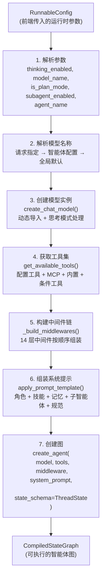

# 第五章：Lead Agent 主智能体

## 学习目标

深入理解 DeerFlow 的"大脑"——Lead Agent 主智能体是如何构建的：模型如何选择和创建、系统提示如何组装、工具如何绑定、中间件如何注入。读完本章后，你应该能理解一个完整的 Lead Agent 实例是由哪些部分组成的。

## 5.1 Lead Agent 的角色

Lead Agent 是 DeerFlow 的核心智能体，类似于一个"项目经理"：

```
┌─────────────────────────────────────────────────────────┐
│                    Lead Agent 主智能体                    │
│                                                          │
│  ┌──────────┐  ┌──────────┐  ┌──────────┐              │
│  │ 系统提示  │  │ LLM 模型  │  │ 工具集合  │              │
│  │          │  │          │  │          │              │
│  │ 角色定义  │  │ GPT-4    │  │ bash     │              │
│  │ 技能注入  │  │ Claude   │  │ 搜索     │              │
│  │ 记忆注入  │  │ DeepSeek │  │ 文件操作  │              │
│  │ 子智能体  │  │ Gemini   │  │ MCP 工具  │              │
│  │ 工作规范  │  │ ...      │  │ 子智能体  │              │
│  └──────────┘  └──────────┘  └──────────┘              │
│                                                          │
│  ┌──────────────────────────────────────────────────┐   │
│  │              中间件链（14 层）                      │   │
│  │  ThreadData → Uploads → Sandbox → Dangling →     │   │
│  │  Guardrail → ToolError → Summarization → Todo →  │   │
│  │  Title → Memory → ViewImage → SubagentLimit →    │   │
│  │  LoopDetection → Clarification                   │   │
│  └──────────────────────────────────────────────────┘   │
└─────────────────────────────────────────────────────────┘
```

## 5.2 模型创建

### create_chat_model — 模型工厂

> 文件：`deer-flow/backend/packages/harness/deerflow/models/factory.py`

```python
def create_chat_model(name: str | None = None, thinking_enabled: bool = False, **kwargs) -> BaseChatModel:
    config = get_app_config()
    if name is None:
        name = config.models[0].name  # 默认使用第一个模型

    model_config = config.get_model_config(name)
    model_class = resolve_class(model_config.use, BaseChatModel)  # 动态导入类

    # 从配置中提取模型参数
    model_settings = model_config.model_dump(
        exclude_none=True,
        exclude={"use", "name", "display_name", "supports_thinking", ...}
    )

    # 处理思考模式
    if thinking_enabled and model_config.supports_thinking:
        model_settings.update(effective_when_thinking_enabled)
    elif not thinking_enabled:
        # 显式禁用思考
        kwargs.update({"thinking": {"type": "disabled"}})

    return model_class(**kwargs, **model_settings)
```

### 动态类加载机制

`resolve_class` 是 DeerFlow 的反射工具，将 `"包名:类名"` 字符串解析为实际的 Python 类：

```python
# 输入: "langchain_openai:ChatOpenAI"
# 过程: import langchain_openai → getattr(module, "ChatOpenAI")
# 输出: ChatOpenAI 类对象
```

这使得 `config.yaml` 中的 `use` 字段可以指向任何 Python 类，实现了零代码扩展。

### 思考模式处理

模型创建时对"思考模式"（Extended Thinking）有精细的处理逻辑：



不同模型提供商的思考模式参数格式不同：
- **OpenAI 兼容**：`extra_body: { thinking: { type: "enabled" } }`
- **Anthropic 原生**：`thinking: { type: "enabled" }`
- **Codex CLI**：`reasoning_effort: "medium"` (low/medium/high/xhigh)

### LangSmith 追踪

如果启用了 LangSmith 追踪，模型创建后会自动注入 `LangChainTracer` 回调：

```python
if is_tracing_enabled():
    tracer = LangChainTracer(project_name=tracing_config.project)
    model_instance.callbacks = [*existing_callbacks, tracer]
```

## 5.3 系统提示组装

> 文件：`deer-flow/backend/packages/harness/deerflow/agents/lead_agent/prompt.py`

系统提示是 Lead Agent 的"灵魂"——它定义了智能体的角色、能力、行为规范。DeerFlow 的系统提示是**动态组装**的，由多个部分拼接而成：

```python
def apply_prompt_template(
    subagent_enabled: bool = False,
    max_concurrent_subagents: int = 3,
    agent_name: str | None = None,
    available_skills: set[str] | None = None,
) -> str:
    prompt = SYSTEM_PROMPT_TEMPLATE.format(
        agent_name=agent_name or "DeerFlow 2.0",
        soul=get_agent_soul(agent_name),
        skills_section=get_skills_prompt_section(available_skills),
        deferred_tools_section=get_deferred_tools_prompt_section(),
        memory_context=memory_context,
        subagent_section=subagent_section,
        subagent_reminder=subagent_reminder,
        subagent_thinking=subagent_thinking,
        acp_section=acp_section,
    )
    return prompt + f"\n<current_date>{datetime.now()}</current_date>"
```

### 系统提示的结构

完整的系统提示由以下部分组成：

```
┌─────────────────────────────────────────────────────┐
│ <role>                                               │
│   角色定义：You are {agent_name}, an open-source     │
│   super agent.                                       │
│ </role>                                              │
├─────────────────────────────────────────────────────┤
│ {soul}                                               │
│   智能体个性（SOUL.md，自定义智能体专用）              │
├─────────────────────────────────────────────────────┤
│ {memory_context}                                     │
│   长期记忆注入（用户偏好、历史上下文）                 │
├─────────────────────────────────────────────────────┤
│ <thinking_style>                                     │
│   思考规范：先思考再行动、分解任务、                   │
│   不确定时先澄清                                     │
│ </thinking_style>                                    │
├─────────────────────────────────────────────────────┤
│ <clarification_system>                               │
│   澄清系统：CLARIFY → PLAN → ACT 工作流              │
│   5 种必须澄清的场景                                 │
│ </clarification_system>                              │
├─────────────────────────────────────────────────────┤
│ {subagent_section}                                   │
│   子智能体系统（如果启用）：                           │
│   分解、委派、综合的工作模式                           │
│   并发限制和批次执行规则                              │
├─────────────────────────────────────────────────────┤
│ {skills_section}                                     │
│   可用技能列表和使用说明                              │
├─────────────────────────────────────────────────────┤
│ {deferred_tools_section}                             │
│   延迟加载工具列表（tool_search 启用时）              │
├─────────────────────────────────────────────────────┤
│ {acp_section}                                        │
│   ACP 智能体配置（如 Claude Code、Codex）             │
├─────────────────────────────────────────────────────┤
│ <working_directory>                                  │
│   工作目录规范：                                      │
│   /mnt/user-data/workspace — 工作区                  │
│   /mnt/user-data/uploads — 上传文件                  │
│   /mnt/user-data/outputs — 输出文件                  │
│ </working_directory>                                 │
├─────────────────────────────────────────────────────┤
│ <response_style>                                     │
│   回复风格：简洁、自然、行动导向                      │
│ </response_style>                                    │
├─────────────────────────────────────────────────────┤
│ <citations>                                          │
│   引用规范：使用 web 搜索结果时必须标注来源            │
│ </citations>                                         │
├─────────────────────────────────────────────────────┤
│ <critical_reminders>                                 │
│   关键提醒：present_file 使用规范、                   │
│   子智能体并发限制等                                  │
│ </critical_reminders>                                │
├─────────────────────────────────────────────────────┤
│ <current_date>2026-03-31, Monday</current_date>     │
└─────────────────────────────────────────────────────┘
```

### 关键提示设计分析

**澄清系统（Clarification System）**

DeerFlow 的提示中定义了严格的 "CLARIFY → PLAN → ACT" 工作流，要求智能体在以下 5 种场景下必须先澄清再行动：

| 场景 | 类型标识 | 示例 |
|------|---------|------|
| 缺少必要信息 | `missing_info` | "创建爬虫"但没指定目标网站 |
| 需求模糊 | `ambiguous_requirement` | "优化代码"但不知道优化什么方面 |
| 多种方案可选 | `approach_choice` | "添加认证"但不知道用 JWT 还是 OAuth |
| 危险操作 | `risk_confirmation` | 删除文件、修改生产配置 |
| 建议确认 | `suggestion` | "我建议重构这段代码，是否继续？" |

**子智能体编排规则**

当子智能体模式启用时，提示中注入了详细的编排规则：
- 硬性并发限制：每次响应最多 N 个 `task` 调用（超出的会被静默丢弃）
- 批次执行策略：超过 N 个子任务时，分多轮批次执行
- 明确的使用/不使用判断标准

**SOUL.md — 自定义智能体个性**

自定义智能体可以通过 `SOUL.md` 文件定义个性：

```
~/.deer-flow/agents/{agent_name}/SOUL.md
```

SOUL.md 的内容会被注入到系统提示的 `{soul}` 位置，让每个自定义智能体有独特的"人格"。

## 5.4 工具绑定

> 文件：`deer-flow/backend/packages/harness/deerflow/tools/tools.py`

Lead Agent 的工具集由 `get_available_tools()` 函数组装：

```python
def get_available_tools(model_name=None, groups=None, subagent_enabled=False):
    tools = []

    # 1. 从 config.yaml 加载配置的工具
    for tool_config in app_config.tools:
        tool = resolve_tool(tool_config)  # 动态加载
        tools.append(tool)

    # 2. 加载 MCP 工具
    mcp_tools = load_mcp_tools()
    tools.extend(mcp_tools)

    # 3. 添加内置工具
    tools.append(ask_clarification_tool)   # 澄清工具
    tools.append(present_file_tool)        # 文件展示工具

    # 4. 如果启用子智能体，添加 task 工具
    if subagent_enabled:
        tools.append(task_tool)

    # 5. 如果模型支持视觉，添加 view_image 工具
    if model_supports_vision:
        tools.append(view_image_tool)

    # 6. 按工具组过滤（自定义智能体可限制工具范围）
    if groups:
        tools = filter_by_groups(tools, groups)

    return tools
```

工具的来源和分类：

```
┌─────────────────────────────────────────────────────────┐
│                    Lead Agent 工具集                      │
├─────────────────────────────────────────────────────────┤
│ 配置工具（config.yaml tools 段）                         │
│  ├── web_search    — Web 搜索（DuckDuckGo/Tavily）      │
│  ├── web_fetch     — 网页抓取（Jina AI）                 │
│  ├── image_search  — 图片搜索                            │
│  ├── ls            — 列出目录                            │
│  ├── read_file     — 读取文件                            │
│  ├── write_file    — 写入文件                            │
│  ├── str_replace   — 字符串替换                          │
│  └── bash          — Shell 执行                          │
├─────────────────────────────────────────────────────────┤
│ MCP 工具（extensions_config.json）                       │
│  └── 从 MCP 服务器动态加载的工具                         │
├─────────────────────────────────────────────────────────┤
│ 内置工具（始终可用）                                     │
│  ├── ask_clarification — 向用户请求澄清                  │
│  └── present_file      — 展示生成的文件给用户            │
├─────────────────────────────────────────────────────────┤
│ 条件工具（按功能开关）                                   │
│  ├── task          — 委派子智能体（subagent_enabled）    │
│  ├── view_image    — 查看图片（supports_vision）         │
│  ├── write_todos   — 任务管理（is_plan_mode）            │
│  ├── tool_search   — 搜索延迟工具（tool_search.enabled） │
│  └── setup_agent   — 创建自定义智能体（is_bootstrap）    │
└─────────────────────────────────────────────────────────┘
```

## 5.5 完整构建流程

把前面的所有部分串起来，`make_lead_agent` 的完整构建流程如下：



### 模型名称解析的优先级

```
前端请求指定的 model_name
    ↓ (如果为空)
自定义智能体配置的 model
    ↓ (如果为空)
config.yaml 中第一个模型（全局默认）
    ↓ (如果没有配置任何模型)
抛出 ValueError
```

### Bootstrap 模式

当 `is_bootstrap=True` 时，Lead Agent 进入特殊的"引导模式"，用于创建自定义智能体：

```python
if is_bootstrap:
    return create_agent(
        model=create_chat_model(name=model_name, thinking_enabled=thinking_enabled),
        tools=get_available_tools(...) + [setup_agent],  # 额外添加 setup_agent 工具
        middleware=_build_middlewares(config, model_name=model_name),
        system_prompt=apply_prompt_template(available_skills=set(["bootstrap"])),
        state_schema=ThreadState,
    )
```

Bootstrap 模式的特点：
- 额外提供 `setup_agent` 工具，允许智能体创建新的自定义智能体
- 系统提示中只注入 `bootstrap` 技能
- 不加载自定义智能体配置（因为正在创建新的）

## 5.6 两层工厂对比

DeerFlow 提供了两个层次的智能体工厂，面向不同的使用场景：

| 维度 | `make_lead_agent` | `create_deerflow_agent` |
|------|-------------------|------------------------|
| 文件 | `lead_agent/agent.py` | `factory.py` |
| 定位 | 应用级工厂 | SDK 级工厂 |
| 配置来源 | 读取 `config.yaml` | 纯参数传入 |
| 模型 | 从配置创建 | 外部传入实例 |
| 工具 | 从配置加载 | 外部传入列表 |
| 中间件 | 根据配置动态构建 | 通过 `features` 或直接传入 |
| 使用场景 | LangGraph Server 调用 | SDK 用户编程使用 |

SDK 级工厂的使用示例：

```python
from deerflow.agents import create_deerflow_agent, RuntimeFeatures

agent = create_deerflow_agent(
    model=my_model,
    tools=[my_tool_1, my_tool_2],
    system_prompt="You are a helpful assistant.",
    features=RuntimeFeatures(
        sandbox=True,
        memory=True,
        subagent=False,
    ),
    plan_mode=True,
)
```

## 检查点

1. `create_chat_model` 如何根据 `config.yaml` 中的 `use` 字段动态创建不同厂商的模型实例？
2. 系统提示由哪些部分组成？哪些部分是动态注入的？
3. Lead Agent 的工具集有哪些来源？哪些工具是始终可用的，哪些是条件启用的？
4. 模型名称的解析优先级是什么？为什么需要多层回退？
5. `make_lead_agent` 和 `create_deerflow_agent` 的区别是什么？各自面向什么使用场景？
