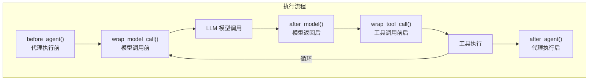

# 第六章：中间件链

## 学习目标

深入理解 DeerFlow 的中间件链机制：14 个中间件各自的职责、执行顺序、实现原理，以及如何扩展自定义中间件。读完本章后，你应该能清楚地知道每个中间件在什么时机做了什么事情。

## 6.1 中间件概述

中间件是 DeerFlow 架构中最精巧的设计之一。它们像"洋葱层"一样包裹在 LLM 调用的外围，在智能体执行的不同阶段注入增强逻辑：

```
请求进入
    │
    ▼
┌─ ThreadDataMiddleware ──────────────────────────────┐
│ ┌─ UploadsMiddleware ─────────────────────────────┐ │
│ │ ┌─ SandboxMiddleware ─────────────────────────┐ │ │
│ │ │ ┌─ DanglingToolCallMiddleware ────────────┐  │ │ │
│ │ │ │ ┌─ GuardrailMiddleware ──────────────┐  │  │ │ │
│ │ │ │ │ ┌─ ToolErrorHandlingMiddleware ──┐ │  │  │ │ │
│ │ │ │ │ │ ┌─ SummarizationMiddleware ──┐ │ │  │  │ │ │
│ │ │ │ │ │ │ ┌─ TodoMiddleware ───────┐ │ │ │  │  │ │ │
│ │ │ │ │ │ │ │ ┌─ TitleMiddleware ──┐ │ │ │ │  │  │ │ │
│ │ │ │ │ │ │ │ │ ┌─ MemoryMW ────┐ │ │ │ │ │  │  │ │ │
│ │ │ │ │ │ │ │ │ │ ┌─ ViewImg ─┐ │ │ │ │ │ │  │  │ │ │
│ │ │ │ │ │ │ │ │ │ │ ┌SubLim┐  │ │ │ │ │ │ │  │  │ │ │
│ │ │ │ │ │ │ │ │ │ │ │ Loop │  │ │ │ │ │ │ │  │  │ │ │
│ │ │ │ │ │ │ │ │ │ │ │ Clar │  │ │ │ │ │ │ │  │  │ │ │
│ │ │ │ │ │ │ │ │ │ │ │ LLM  │  │ │ │ │ │ │ │  │  │ │ │
│ │ │ │ │ │ │ │ │ │ │ └──────┘  │ │ │ │ │ │ │  │  │ │ │
│ │ │ │ │ │ │ │ │ │ └───────────┘ │ │ │ │ │ │  │  │ │ │
│ │ │ │ │ │ │ │ │ └───────────────┘ │ │ │ │ │  │  │ │ │
│ │ │ │ │ │ │ │ └───────────────────┘ │ │ │ │  │  │ │ │
│ │ │ │ │ │ │ └───────────────────────┘ │ │ │  │  │ │ │
│ │ │ │ │ │ └─────────────────────────┘  │ │ │  │  │ │ │
│ │ │ │ │ └──────────────────────────────┘ │ │  │  │ │ │
│ │ │ │ └──────────────────────────────────┘ │  │  │ │ │
│ │ │ └──────────────────────────────────────┘  │  │ │ │
│ │ └───────────────────────────────────────────┘  │ │
│ └─────────────────────────────────────────────────┘ │
└─────────────────────────────────────────────────────┘
    │
    ▼
响应返回
```

## 6.2 执行顺序与分类

> 文件：`deer-flow/backend/packages/harness/deerflow/agents/factory.py`

14 个中间件按固定顺序排列，分为四大类：

```
序号  中间件                          类别        是否必须   触发条件
────  ──────────────────────────────  ──────────  ────────  ──────────────────
 0    ThreadDataMiddleware            基础设施     条件      sandbox 特性开启
 1    UploadsMiddleware               基础设施     条件      sandbox 特性开启
 2    SandboxMiddleware               基础设施     条件      sandbox 特性开启
 3    DanglingToolCallMiddleware      安全防护     始终      —
 4    GuardrailMiddleware             安全防护     条件      guardrail 特性开启
 5    ToolErrorHandlingMiddleware     安全防护     始终      —
 6    SummarizationMiddleware         上下文工程   条件      summarization 配置
 7    TodoMiddleware                  上下文工程   条件      is_plan_mode=true
 8    TitleMiddleware                 用户体验     条件      auto_title 特性开启
 9    MemoryMiddleware                上下文工程   条件      memory 特性开启
10    ViewImageMiddleware             用户体验     条件      模型 supports_vision
11    SubagentLimitMiddleware         安全防护     条件      subagent_enabled
12    LoopDetectionMiddleware         安全防护     始终      —
13    ClarificationMiddleware         用户体验     始终      始终最后
```

### 排序原则

这个顺序不是随意的，背后有明确的设计逻辑：

1. **基础设施先行**（0-2）：沙箱和文件系统必须在任何业务逻辑之前准备好
2. **安全防护紧随**（3-5）：修复消息格式、安全检查、错误处理要在业务逻辑之前
3. **上下文工程居中**（6-9）：摘要、计划、记忆等增强逻辑
4. **澄清始终最后**（13）：ClarificationMiddleware 必须是最后一个，因为它可能中断整个执行流程

## 6.3 逐个中间件详解

### [0] ThreadDataMiddleware — 线程数据目录

> 文件：`deer-flow/backend/packages/harness/deerflow/agents/middlewares/thread_data_middleware.py`

**职责**：为每个线程创建隔离的数据目录结构。

```python
class ThreadDataMiddleware(AgentMiddleware[ThreadDataMiddlewareState]):
    def __init__(self, base_dir=None, lazy_init=True):
        self.base_dir = base_dir
        self.lazy_init = lazy_init

    def before_agent(self, state, config):
        thread_id = config["configurable"]["thread_id"]
        # 创建目录结构：
        # {base_dir}/threads/{thread_id}/user-data/
        #   ├── workspace/    ← 工作区
        #   ├── uploads/      ← 上传文件
        #   └── outputs/      ← 输出文件
        paths = get_paths()
        workspace = paths.sandbox_work_dir(thread_id)
        uploads = paths.sandbox_uploads_dir(thread_id)
        outputs = paths.sandbox_outputs_dir(thread_id)

        if not self.lazy_init:
            workspace.mkdir(parents=True, exist_ok=True)
            # ...

        # 将路径信息写入状态
        return {"thread_data": {
            "workspace_path": str(workspace),
            "uploads_path": str(uploads),
            "outputs_path": str(outputs),
        }}
```

### [1] UploadsMiddleware — 文件上传注入

> 文件：`deer-flow/backend/packages/harness/deerflow/agents/middlewares/uploads_middleware.py`

**职责**：将用户上传的文件信息注入到消息中，让 LLM 知道有哪些文件可用。

```python
class UploadsMiddleware(AgentMiddleware[UploadsMiddlewareState]):
    def before_agent(self, state, config):
        # 1. 从最后一条 HumanMessage 的 additional_kwargs.files 提取新上传
        # 2. 扫描线程上传目录获取历史文件
        # 3. 构建 <uploaded_files> 块
        uploaded_files_block = "<uploaded_files>\n"
        for f in files:
            uploaded_files_block += f"- {f['path']} ({f['type']})\n"
        uploaded_files_block += "</uploaded_files>\n"

        # 4. 前置到最后一条 HumanMessage 的内容中
        last_human_msg.content = uploaded_files_block + last_human_msg.content
```

### [2] SandboxMiddleware — 沙箱生命周期

> 文件：`deer-flow/backend/packages/harness/deerflow/sandbox/middleware.py`

**职责**：管理沙箱的初始化和清理。

```
before_agent:  获取或创建沙箱实例 → 将 sandbox_id 写入状态
after_agent:   （可选）释放沙箱资源
```

沙箱的详细实现将在第 07 章展开。

### [3] DanglingToolCallMiddleware — 悬空工具调用修复

> 文件：`deer-flow/backend/packages/harness/deerflow/agents/middlewares/dangling_tool_call_middleware.py`

**职责**：修复消息历史中"有工具调用但没有对应工具结果"的情况。

**为什么需要它？** 当用户中途取消请求或网络断开时，可能留下不完整的消息历史——AIMessage 包含 `tool_calls`，但没有对应的 ToolMessage。这会导致 LLM 在下一轮调用时报错。

```python
class DanglingToolCallMiddleware(AgentMiddleware[AgentState]):
    def wrap_model_call(self, state, config, request):
        # 遍历消息历史
        for msg in state["messages"]:
            if isinstance(msg, AIMessage) and msg.tool_calls:
                for tc in msg.tool_calls:
                    if not has_matching_tool_message(tc["id"], state["messages"]):
                        # 插入合成的错误 ToolMessage
                        synthetic = ToolMessage(
                            content="Tool call was interrupted",
                            tool_call_id=tc["id"],
                            status="error",
                        )
                        state["messages"].append(synthetic)
```

### [4] GuardrailMiddleware — 安全护栏（可选）

**职责**：在工具执行前进行安全检查，根据配置的护栏提供者决定是否允许执行。

支持三种护栏提供者（见第 03 章配置体系）：
- 内置白名单（AllowlistProvider）
- OAP 标准协议
- 自定义提供者

### [5] ToolErrorHandlingMiddleware — 工具错误处理

> 文件：`deer-flow/backend/packages/harness/deerflow/agents/middlewares/tool_error_handling_middleware.py`

**职责**：捕获工具执行异常，转换为错误 ToolMessage，防止整个运行崩溃。

```python
class ToolErrorHandlingMiddleware(AgentMiddleware[AgentState]):
    def wrap_tool_call(self, state, config, tool_call, next_fn):
        try:
            return next_fn(tool_call)
        except GraphBubbleUp:
            raise  # 控制流信号不拦截
        except Exception as e:
            # 将异常转换为错误 ToolMessage
            return ToolMessage(
                content=f"Error in {tool_call['name']}: {type(e).__name__}: {str(e)[:500]}",
                tool_call_id=tool_call["id"],
                status="error",
            )
```

这个中间件确保了：即使某个工具执行失败，LLM 也能看到错误信息并决定下一步行动，而不是整个运行直接崩溃。

### [6] SummarizationMiddleware — 上下文摘要

**职责**：当对话历史接近 Token 上限时，自动压缩旧消息为摘要。

这是 LangGraph 内置的中间件（`langchain.agents.middleware.SummarizationMiddleware`），DeerFlow 通过配置来定制它的行为：

```python
SummarizationMiddleware(
    model=summarization_model,       # 用于生成摘要的模型
    trigger=[("tokens", 10000)],     # 触发条件
    keep=("messages", 10),           # 保留最近 10 条消息
    trim_tokens_to_summarize=15564,  # 准备摘要时的最大 Token 数
)
```

工作原理：
```
对话历史（20 条消息，15000 tokens）
    │
    ▼ 触发条件满足（tokens > 10000）
    │
┌───┴───────────────────────────────────┐
│ 旧消息（前 10 条）→ 调用 LLM 生成摘要  │
│ 新消息（后 10 条）→ 保留原样            │
└───┬───────────────────────────────────┘
    │
    ▼
压缩后的历史：[SystemMessage(摘要), 最近 10 条消息]
```

### [7] TodoMiddleware — 计划模式

> 文件：`deer-flow/backend/packages/harness/deerflow/agents/middlewares/todo_middleware.py`

**职责**：为复杂任务提供结构化的任务追踪能力。

当 `is_plan_mode=True` 时激活，向智能体注入 `write_todos` 工具和相关的系统提示：

```python
class TodoMiddleware(AgentMiddleware):
    def __init__(self, system_prompt, tool_description):
        self.system_prompt = system_prompt
        self.tool_description = tool_description

    def before_agent(self, state, config):
        # 注入 TodoList 系统提示
        # 提供 write_todos 工具
```

TodoList 的规则：
- 仅用于 3 步以上的复杂任务
- 同一时间只能有一个任务处于 `in_progress` 状态
- 完成一步立即标记，不要批量标记
- 实时更新，让用户看到进度

### [8] TitleMiddleware — 自动标题生成

> 文件：`deer-flow/backend/packages/harness/deerflow/agents/middlewares/title_middleware.py`

**职责**：在第一轮对话后自动为线程生成标题。

```python
class TitleMiddleware(AgentMiddleware):
    def after_agent(self, state, config):
        # 仅在第一轮对话后执行（检查消息数量）
        if len(state["messages"]) <= 3:  # Human + AI（可能含工具调用）
            title = generate_title(state["messages"])
            return {"title": title}
```

标题会被写入 `ThreadState.title`，然后由 Gateway 的后台任务持久化到 Store 中。

### [9] MemoryMiddleware — 长期记忆

> 文件：`deer-flow/backend/packages/harness/deerflow/agents/middlewares/memory_middleware.py`

**职责**：异步提取对话中的关键信息，更新长期记忆。

```python
class MemoryMiddleware(AgentMiddleware):
    def __init__(self, agent_name=None):
        self.agent_name = agent_name  # 支持按智能体隔离记忆

    def after_agent(self, state, config):
        # 将当前对话加入记忆更新队列
        # 使用防抖机制（debounce_seconds）避免频繁更新
        memory_queue.enqueue(state["messages"], agent_name=self.agent_name)
```

记忆系统的详细实现将在第 10 章展开。

### [10] ViewImageMiddleware — 图片查看

> 文件：`deer-flow/backend/packages/harness/deerflow/agents/middlewares/view_image_middleware.py`

**职责**：将图片文件转换为 base64 并注入到状态中，让支持视觉的模型能"看到"图片。

```python
class ViewImageMiddleware(AgentMiddleware):
    def before_agent(self, state, config):
        # 检查 state["viewed_images"] 中是否有待处理的图片
        for path, data in state.get("viewed_images", {}).items():
            # 将图片转为 base64
            # 注入到消息中作为 image_url 类型的内容
```

工作流程：
```
用户上传图片 → view_image 工具被调用 → 图片路径写入 viewed_images 状态
    → ViewImageMiddleware 读取图片 → 转为 base64 → 注入到下一轮消息中
    → LLM 看到图片内容 → 生成基于图片的回复
    → 清空 viewed_images（使用空字典 {} 触发 reducer 清空）
```

### [11] SubagentLimitMiddleware — 子智能体并发限制

> 文件：`deer-flow/backend/packages/harness/deerflow/agents/middlewares/subagent_limit_middleware.py`

**职责**：截断超出并发限制的 `task` 工具调用。

```python
class SubagentLimitMiddleware(AgentMiddleware):
    def __init__(self, max_concurrent=3):
        self.max_concurrent = max_concurrent

    def after_model(self, state, config, response):
        # 统计响应中的 task 工具调用数量
        task_calls = [tc for tc in response.tool_calls if tc["name"] == "task"]
        if len(task_calls) > self.max_concurrent:
            # 截断多余的 task 调用
            response.tool_calls = (
                non_task_calls + task_calls[:self.max_concurrent]
            )
```

这是系统提示中"硬性并发限制"的实际执行者——即使 LLM 忽略了提示中的限制，中间件也会强制截断。

### [12] LoopDetectionMiddleware — 循环检测

> 文件：`deer-flow/backend/packages/harness/deerflow/agents/middlewares/loop_detection_middleware.py`

**职责**：检测并打破重复的工具调用循环。

```python
class LoopDetectionMiddleware(AgentMiddleware):
    def __init__(self, warn_threshold=3, hard_limit=5, window_size=20):
        self.warn_threshold = warn_threshold
        self.hard_limit = hard_limit
        self.window_size = window_size
        self._thread_history = {}  # LRU 缓存

    def after_model(self, state, config, response):
        # 对工具调用进行哈希（名称 + 参数）
        call_hash = hash(tool_name + str(tool_args))

        # 在滑动窗口中检查重复
        if consecutive_count >= self.hard_limit:
            # 强制移除所有 tool_calls，迫使 LLM 输出文本
            response.tool_calls = []
        elif consecutive_count >= self.warn_threshold:
            # 注入警告消息
            inject_warning("Detected repeated tool calls, try a different approach")
```

两级防护：
- **warn_threshold（默认 3）**：注入警告，提示 LLM 换个方法
- **hard_limit（默认 5）**：强制清空工具调用，迫使 LLM 给出文本回复

### [13] ClarificationMiddleware — 澄清请求拦截

> 文件：`deer-flow/backend/packages/harness/deerflow/agents/middlewares/clarification_middleware.py`

**职责**：拦截 `ask_clarification` 工具调用，中断图执行，将问题返回给用户。

```python
class ClarificationMiddleware(AgentMiddleware):
    def after_model(self, state, config, response):
        # 检查响应中是否有 ask_clarification 工具调用
        for tc in response.tool_calls:
            if tc["name"] == "ask_clarification":
                # 触发 GraphBubbleUp 异常
                # 这会中断图的执行，将控制权返回给调用者
                raise GraphBubbleUp(...)
```

**为什么必须是最后一个？** 因为 ClarificationMiddleware 可能中断整个执行流程（通过 `GraphBubbleUp`）。如果它在其他中间件之前执行，那些中间件的 `after_agent` 钩子就不会被调用，可能导致资源泄漏。放在最后确保所有其他中间件都有机会完成清理。

## 6.4 中间件的钩子类型

LangGraph 的中间件系统提供了多种钩子，DeerFlow 的中间件使用了以下几种：



| 钩子 | 时机 | 使用的中间件 |
|------|------|-------------|
| `before_agent` | 图执行前 | ThreadData, Uploads, Sandbox, Memory |
| `wrap_model_call` | LLM 调用前 | DanglingToolCall, DeferredToolFilter |
| `after_model` | LLM 返回后 | LoopDetection, SubagentLimit, Clarification |
| `wrap_tool_call` | 工具调用前后 | ToolErrorHandling, SandboxAudit, Guardrail |
| `after_agent` | 图执行后 | Title, Memory |

## 6.5 自定义中间件扩展

> 文件：`deer-flow/backend/packages/harness/deerflow/agents/factory.py`

DeerFlow 支持两种方式注入自定义中间件：

### 方式一：通过 `extra_middleware` 参数

```python
from deerflow.agents import create_deerflow_agent, Next, Prev

class MyMiddleware(AgentMiddleware):
    def before_agent(self, state, config):
        print("My middleware running!")
        return {}

# 使用 @Next/@Prev 装饰器指定位置
@Next(MemoryMiddleware)  # 插入到 MemoryMiddleware 之后
class MyMiddleware(AgentMiddleware):
    ...

agent = create_deerflow_agent(
    model=my_model,
    tools=my_tools,
    extra_middleware=[MyMiddleware()],
)
```

### 方式二：通过 `middleware` 参数完全接管

```python
agent = create_deerflow_agent(
    model=my_model,
    tools=my_tools,
    middleware=[  # 完全自定义中间件链
        ThreadDataMiddleware(),
        MyCustomMiddleware(),
        ClarificationMiddleware(),
    ],
)
```

### @Next/@Prev 定位机制

`extra_middleware` 中的中间件可以使用 `@Next` 和 `@Prev` 装饰器指定插入位置：

```python
@Next(MemoryMiddleware)     # 插入到 MemoryMiddleware 之后
@Prev(ClarificationMiddleware)  # 插入到 ClarificationMiddleware 之前
```

如果没有指定位置，默认插入到 ClarificationMiddleware 之前（因为 Clarification 必须是最后一个）。

定位算法支持：
- 锚定到内置中间件
- 锚定到其他 extra 中间件（支持链式定位）
- 冲突检测（同一位置的 @Next 和 @Prev 冲突）
- 循环依赖检测

## 检查点

1. 14 个中间件的执行顺序是什么？为什么 ClarificationMiddleware 必须是最后一个？
2. DanglingToolCallMiddleware 解决了什么问题？什么情况下会出现"悬空工具调用"？
3. LoopDetectionMiddleware 的两级防护（warn_threshold 和 hard_limit）分别做了什么？
4. SummarizationMiddleware 的触发条件和保留策略是如何配置的？
5. 如何使用 `@Next`/`@Prev` 装饰器将自定义中间件插入到指定位置？
