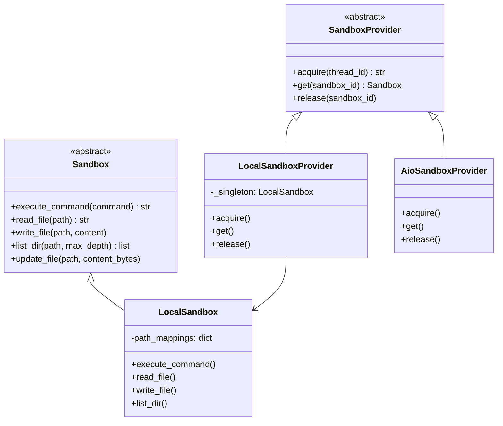
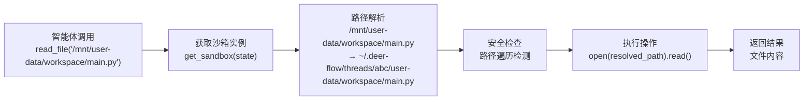

# 第七章：沙箱系统

## 学习目标

理解 DeerFlow 的沙箱系统如何为 AI 智能体提供安全隔离的代码执行环境：抽象接口设计、本地/Docker 两种实现、虚拟路径映射机制、沙箱工具集。读完本章后，你应该能理解智能体执行 `bash`、`read_file` 等操作时背后发生了什么。

## 7.1 为什么需要沙箱

AI 智能体可以生成并执行代码，这带来了安全风险：

```
用户: "帮我分析这个数据集"
智能体: 好的，我来写个 Python 脚本...
    → bash("rm -rf /")  ← 如果没有沙箱，这会毁掉整个系统！
```

沙箱的作用就是提供一个**隔离的执行环境**，让智能体的代码只能在受限的范围内运行，不会影响宿主机。

## 7.2 架构设计

DeerFlow 的沙箱系统采用经典的**提供者模式（Provider Pattern）**：



两层抽象：
- **Sandbox**：沙箱实例，提供具体的执行能力（命令执行、文件读写）
- **SandboxProvider**：沙箱工厂，负责创建、获取、释放沙箱实例

## 7.3 抽象接口

> 文件：`deer-flow/backend/packages/harness/deerflow/sandbox/sandbox.py`

```python
class Sandbox(ABC):
    @abstractmethod
    def execute_command(self, command: str) -> str:
        """在沙箱中执行 bash 命令"""

    @abstractmethod
    def read_file(self, path: str) -> str:
        """读取文件内容"""

    @abstractmethod
    def list_dir(self, path: str, max_depth=2) -> list[str]:
        """列出目录内容"""

    @abstractmethod
    def write_file(self, path: str, content: str, append: bool = False) -> None:
        """写入文件（支持追加模式）"""

    @abstractmethod
    def update_file(self, path: str, content: bytes) -> None:
        """二进制写入文件"""
```

5 个方法覆盖了智能体需要的所有文件系统操作。任何沙箱实现只需实现这 5 个方法即可接入 DeerFlow。

> 文件：`deer-flow/backend/packages/harness/deerflow/sandbox/sandbox_provider.py`

```python
class SandboxProvider(ABC):
    @abstractmethod
    def acquire(self, thread_id: str | None = None) -> str:
        """获取一个沙箱实例，返回 sandbox_id"""

    @abstractmethod
    def get(self, sandbox_id: str) -> Sandbox | None:
        """根据 ID 获取沙箱实例"""

    @abstractmethod
    def release(self, sandbox_id: str) -> None:
        """释放沙箱实例"""
```

SandboxProvider 使用全局单例模式，通过 `get_sandbox_provider()` 获取：

```python
def get_sandbox_provider() -> SandboxProvider:
    global _provider
    if _provider is None:
        config = get_app_config()
        provider_class = resolve_class(config.sandbox.use, SandboxProvider)
        _provider = provider_class()
    return _provider
```

## 7.4 虚拟路径映射

这是沙箱系统最核心的设计——智能体看到的是**虚拟路径**，实际操作的是**宿主机路径**：

```
智能体视角（虚拟路径）              宿主机实际路径
──────────────────────            ──────────────────────────────────────
/mnt/user-data/workspace/    →    ~/.deer-flow/threads/{id}/user-data/workspace/
/mnt/user-data/uploads/      →    ~/.deer-flow/threads/{id}/user-data/uploads/
/mnt/user-data/outputs/      →    ~/.deer-flow/threads/{id}/user-data/outputs/
/mnt/skills/                 →    {project_root}/skills/
/mnt/acp-workspace/          →    ~/.deer-flow/threads/{id}/acp-workspace/
```

### 为什么需要虚拟路径？

1. **安全隔离**：智能体不知道宿主机的真实路径，无法访问沙箱外的文件
2. **一致性**：无论是本地沙箱还是 Docker 沙箱，智能体看到的路径都一样
3. **可移植性**：不同操作系统（Linux/macOS/Windows）的路径差异被屏蔽

### 路径解析流程

> 文件：`deer-flow/backend/packages/harness/deerflow/sandbox/local/local_sandbox.py`

```python
def _resolve_path(self, virtual_path: str) -> str:
    """虚拟路径 → 宿主机路径"""
    for container_prefix, host_prefix in self.path_mappings.items():
        if virtual_path.startswith(container_prefix):
            relative = virtual_path[len(container_prefix):]
            return os.path.join(host_prefix, relative.lstrip("/"))
    return virtual_path  # 无匹配则原样返回

def _reverse_resolve_path(self, host_path: str) -> str:
    """宿主机路径 → 虚拟路径（用于隐藏真实路径）"""
    for container_prefix, host_prefix in self.path_mappings.items():
        if host_path.startswith(host_prefix):
            relative = host_path[len(host_prefix):]
            return container_prefix + relative
    return host_path
```

命令执行时，输出中的宿主机路径也会被反向替换为虚拟路径，防止泄露真实路径信息。

## 7.5 本地沙箱实现

> 文件：`deer-flow/backend/packages/harness/deerflow/sandbox/local/`

本地沙箱是默认的沙箱实现，直接在宿主机文件系统上操作（通过路径映射限制范围）。

### LocalSandboxProvider

```python
class LocalSandboxProvider(SandboxProvider):
    def __init__(self):
        self._singleton = None
        self._path_mappings = self._setup_path_mappings()

    def _setup_path_mappings(self):
        """构建虚拟路径 → 宿主机路径的映射表"""
        mappings = {}
        # 技能目录映射
        skills_config = get_app_config().skills
        mappings[skills_config.container_path] = skills_config.get_skills_path()
        return mappings

    def acquire(self, thread_id=None) -> str:
        if self._singleton is None:
            self._singleton = LocalSandbox(path_mappings=self._path_mappings)
        return "local"  # 本地沙箱只有一个实例

    def get(self, sandbox_id) -> Sandbox:
        return self._singleton

    def release(self, sandbox_id) -> None:
        pass  # 本地沙箱使用单例，不需要释放
```

### LocalSandbox 命令执行

```python
class LocalSandbox(Sandbox):
    def execute_command(self, command: str) -> str:
        # 1. 解析命令中的虚拟路径 → 宿主机路径
        resolved_command = self._resolve_paths_in_command(command)

        # 2. 选择 Shell
        shell = self._find_first_available_shell()
        # Linux/macOS: bash > sh
        # Windows: bash (Git Bash) > powershell > cmd

        # 3. 执行命令
        result = subprocess.run(
            [shell, "-c", resolved_command],
            capture_output=True, text=True, timeout=300
        )

        # 4. 反向替换输出中的宿主机路径
        output = self._reverse_resolve_paths_in_output(result.stdout + result.stderr)
        return output
```

### 目录列表的智能过滤

> 文件：`deer-flow/backend/packages/harness/deerflow/sandbox/local/list_dir.py`

列出目录时会自动过滤无关文件：

```python
IGNORE_PATTERNS = [
    # 版本控制
    ".git", ".svn", ".hg",
    # 依赖目录
    "node_modules", "__pycache__", ".venv", "venv",
    # 构建输出
    "dist", "build", ".next", ".nuxt",
    # IDE 配置
    ".idea", ".vscode",
    # 系统文件
    ".DS_Store", "Thumbs.db",
    # 日志
    "*.log", "*.tmp",
]
```

## 7.6 Docker 沙箱（AioSandboxProvider）

Docker 沙箱提供真正的隔离环境，每个线程可以有独立的容器：

```
┌─────────────────────────────────────────────────────┐
│                    宿主机                             │
│                                                      │
│  ┌──────────────┐  ┌──────────────┐                 │
│  │ 沙箱容器 #1   │  │ 沙箱容器 #2   │                 │
│  │ thread-abc   │  │ thread-def   │                 │
│  │              │  │              │                 │
│  │ /mnt/user-data/ │ /mnt/user-data/ │              │
│  │   ↕ 卷挂载    │  │   ↕ 卷挂载    │                 │
│  └──────┬───────┘  └──────┬───────┘                 │
│         │                  │                         │
│  threads/abc/user-data/  threads/def/user-data/     │
└─────────────────────────────────────────────────────┘
```

配置方式：

```yaml
sandbox:
  use: deerflow.community.aio_sandbox:AioSandboxProvider
  image: enterprise-public-cn-beijing.cr.volces.com/vefaas-public/all-in-one-sandbox:latest
  replicas: 3           # 最大并发容器数
  idle_timeout: 600     # 空闲 10 分钟后回收
  container_prefix: deer-flow-sandbox
```

Docker 沙箱的特点：
- **真正隔离**：每个容器有独立的文件系统和进程空间
- **LRU 淘汰**：达到 `replicas` 上限时，最久未使用的容器被回收
- **卷挂载**：线程数据目录通过 Docker Volume 挂载到容器内
- **自动清理**：空闲超时后自动销毁容器

## 7.7 沙箱工具集

> 文件：`deer-flow/backend/packages/harness/deerflow/sandbox/tools.py`

沙箱系统提供了 5 个工具给智能体使用：

| 工具 | 功能 | 工具组 |
|------|------|--------|
| `bash` | 执行 Shell 命令 | bash |
| `ls` | 列出目录内容 | file:read |
| `read_file` | 读取文件 | file:read |
| `write_file` | 写入文件 | file:write |
| `str_replace` | 字符串替换编辑 | file:write |

### 工具执行流程

以 `read_file` 为例：



### bash 工具的安全控制

`bash` 工具有特殊的安全限制：

```python
# 本地沙箱默认禁用 bash
sandbox:
  use: deerflow.sandbox.local:LocalSandboxProvider
  allow_host_bash: false  # ← 默认 false

# 只有 Docker 沙箱或显式开启 allow_host_bash 时才能使用 bash
```

即使 bash 可用，还有 SandboxAuditMiddleware（第 06 章）作为第二道防线，拦截高风险命令。

### str_replace 工具

`str_replace` 是一个精确编辑工具，类似于 `sed` 但更安全：

```python
def str_replace(path: str, old_str: str, new_str: str) -> str:
    """在文件中精确替换字符串"""
    content = sandbox.read_file(path)
    if old_str not in content:
        raise ValueError(f"old_str not found in {path}")
    if content.count(old_str) > 1:
        raise ValueError(f"old_str appears multiple times in {path}")
    new_content = content.replace(old_str, new_str, 1)
    sandbox.write_file(path, new_content)
```

要求 `old_str` 在文件中唯一出现，防止意外的批量替换。

## 7.8 沙箱中间件的生命周期

> 文件：`deer-flow/backend/packages/harness/deerflow/sandbox/middleware.py`

```python
class SandboxMiddleware(AgentMiddleware):
    def __init__(self, lazy_init=True):
        self.lazy_init = lazy_init

    def before_agent(self, state, config):
        if not self.lazy_init:
            # 急切模式：立即获取沙箱
            provider = get_sandbox_provider()
            sandbox_id = provider.acquire(thread_id)
            return {"sandbox": {"sandbox_id": sandbox_id}}

    # lazy_init=True 时，沙箱在首次工具调用时按需获取
```

沙箱的生命周期：

```
线程创建 → 首次工具调用 → acquire() 获取沙箱
    → 多轮对话中重用同一个沙箱
    → 线程结束或空闲超时 → release() 释放沙箱
```

## 检查点

1. `Sandbox` 和 `SandboxProvider` 两层抽象各自的职责是什么？
2. 虚拟路径映射解决了什么问题？`/mnt/user-data/workspace/` 在宿主机上对应什么路径？
3. 本地沙箱和 Docker 沙箱的主要区别是什么？各自适用什么场景？
4. `bash` 工具为什么默认禁用？有哪些安全防护措施？
5. `str_replace` 工具为什么要求 `old_str` 唯一出现？
