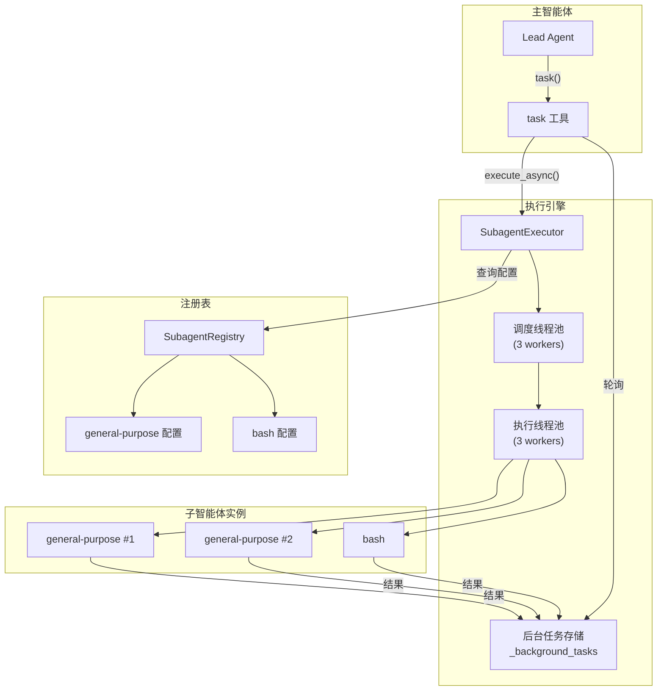
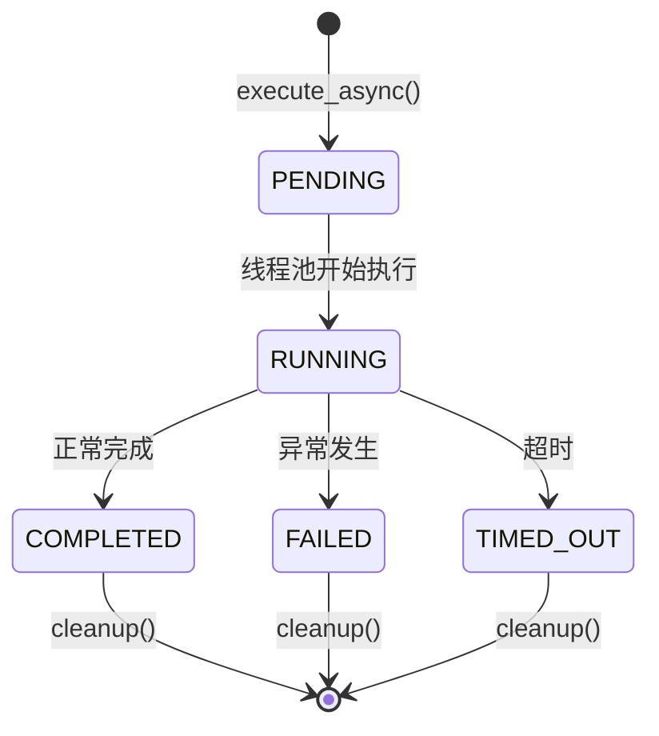
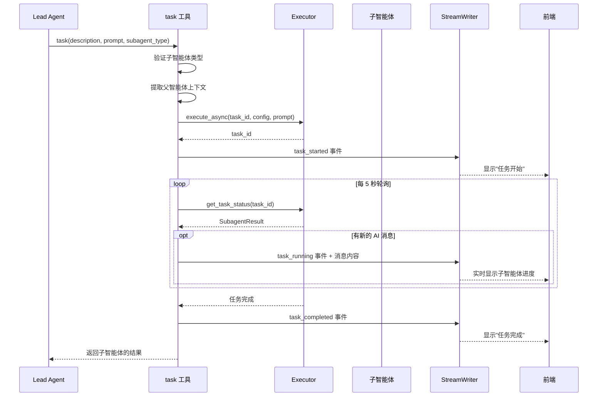

# 第八章：子智能体系统

## 学习目标

理解 DeerFlow 的子智能体委派机制：主智能体如何将任务分解并委派给子智能体、子智能体如何在后台执行、结果如何回传。读完本章后，你应该能理解"任务编排"的完整链路。

## 8.1 子智能体的角色

子智能体系统让 Lead Agent 从"单兵作战"升级为"团队协作"：

```
┌─────────────────────────────────────────────────────────┐
│                    Lead Agent（项目经理）                  │
│                                                          │
│  "比较 AWS、Azure 和 GCP 的优劣"                         │
│                                                          │
│  思考：这个任务可以分解为 3 个独立的子任务                  │
│        → 并行委派给 3 个子智能体                          │
│                                                          │
│  task("AWS 分析", ...)  ──→  ┌──────────────────┐       │
│  task("Azure 分析", ...) ──→ │  general-purpose │×3     │
│  task("GCP 分析", ...)  ──→  │  子智能体         │       │
│                               └──────┬───────────┘       │
│                                      │                   │
│  ← 收集 3 个结果，综合成最终报告 ←────┘                   │
└─────────────────────────────────────────────────────────┘
```

关键设计原则：
- **并行分解**：复杂任务拆分为多个独立子任务并行执行
- **后台执行**：子智能体在独立线程中运行，不阻塞主智能体
- **上下文继承**：子智能体继承父智能体的沙箱、模型、线程数据
- **防递归**：子智能体默认禁用 `task` 工具，防止无限嵌套

## 8.2 系统架构



## 8.3 子智能体配置

> 文件：`deer-flow/backend/packages/harness/deerflow/subagents/config.py`

每个子智能体由 `SubagentConfig` 定义：

```python
@dataclass
class SubagentConfig:
    name: str                          # 唯一标识符
    description: str                   # 使用场景描述（注入到主智能体提示中）
    system_prompt: str                 # 子智能体的系统提示词
    tools: list[str] | None = None     # 允许的工具列表（None = 继承父智能体所有工具）
    disallowed_tools: list[str] = ["task"]  # 禁用的工具列表
    model: str = "inherit"             # 模型选择（"inherit" = 使用父智能体的模型）
    max_turns: int = 50                # 最大对话轮次
    timeout_seconds: int = 900         # 执行超时（默认 15 分钟）
```

### 工具过滤机制

子智能体的工具集由两个列表控制：

```
父智能体的所有工具
    │
    ▼
tools（允许列表）──→ 如果指定，只保留列表中的工具
    │                  如果为 None，保留所有工具
    ▼
disallowed_tools（禁用列表）──→ 从结果中移除这些工具
    │
    ▼
子智能体最终可用的工具集
```

默认禁用 `task` 工具是为了防止子智能体再委派子智能体，造成无限递归。

## 8.4 内置子智能体

> 文件：`deer-flow/backend/packages/harness/deerflow/subagents/builtins/`

DeerFlow 内置了两个子智能体：

### general-purpose（通用智能体）

```python
GENERAL_PURPOSE_CONFIG = SubagentConfig(
    name="general-purpose",
    description="复杂多步任务的能力智能体",
    system_prompt="""
    - 专注于完成委派的任务
    - 按需使用工具
    - 思考清晰但行动果断
    - 提供全面但简洁的结果
    """,
    disallowed_tools=["task"],  # 禁止再委派
    max_turns=50,
    timeout_seconds=900,        # 15 分钟
)
```

适用场景：Web 研究、代码分析、文件操作、数据分析等几乎所有非 bash 任务。

### bash（命令执行智能体）

```python
BASH_AGENT_CONFIG = SubagentConfig(
    name="bash",
    description="命令执行专家",
    system_prompt="""
    - 专注于 bash 命令执行
    - 适合 git、构建、测试、部署操作
    """,
    tools=["bash", "read_file", "write_file", "ls"],  # 只允许文件和命令工具
    disallowed_tools=["task"],
    max_turns=30,
    timeout_seconds=300,  # 5 分钟（命令执行通常较快）
)
```

bash 智能体的可见性取决于沙箱配置——只有当 `allow_host_bash=true` 或使用 Docker 沙箱时才可用。

## 8.5 注册表系统

> 文件：`deer-flow/backend/packages/harness/deerflow/subagents/registry.py`

注册表负责管理所有可用的子智能体配置：

```python
def get_subagent_config(name: str) -> SubagentConfig | None:
    """获取子智能体配置，应用 config.yaml 中的覆盖"""
    config = BUILTIN_CONFIGS.get(name)
    if config is None:
        return None

    # 从 config.yaml 的 subagents 段读取覆盖配置
    overrides = get_subagents_config()
    if name in overrides.agents:
        agent_override = overrides.agents[name]
        config.timeout_seconds = agent_override.timeout_seconds
    else:
        config.timeout_seconds = overrides.timeout_seconds  # 使用全局默认

    return config

def get_available_subagent_names() -> list[str]:
    """获取当前环境可用的子智能体名称"""
    names = list(BUILTIN_CONFIGS.keys())
    # 如果 bash 不可用（本地沙箱且 allow_host_bash=false），移除 bash
    if not is_host_bash_allowed():
        names = [n for n in names if n != "bash"]
    return names
```

## 8.6 执行引擎

> 文件：`deer-flow/backend/packages/harness/deerflow/subagents/executor.py`

`SubagentExecutor` 是子智能体的后台执行引擎，使用双层线程池架构：

```
┌─────────────────────────────────────────────────────────┐
│                    SubagentExecutor                       │
│                                                          │
│  ┌──────────────────┐    ┌──────────────────────────┐   │
│  │ 调度线程池         │    │ 执行线程池                 │   │
│  │ (3 workers)       │    │ (3 workers)               │   │
│  │                   │    │                           │   │
│  │ 管理任务生命周期   │───→│ 实际运行子智能体           │   │
│  │ 超时控制          │    │ 创建事件循环               │   │
│  │ 状态更新          │    │ 流式收集消息               │   │
│  └──────────────────┘    └──────────────────────────┘   │
│                                                          │
│  ┌──────────────────────────────────────────────────┐   │
│  │ _background_tasks: dict[str, SubagentResult]      │   │
│  │ 全局任务存储（内存中）                              │   │
│  └──────────────────────────────────────────────────┘   │
└─────────────────────────────────────────────────────────┘
```

### 执行状态机



### 核心执行流程

```python
class SubagentExecutor:
    def execute_async(self, task_id, config, prompt, ...) -> str:
        """异步启动子智能体，立即返回 task_id"""
        # 1. 创建 SubagentResult（PENDING 状态）
        result = SubagentResult(task_id=task_id, status=PENDING)
        _background_tasks[task_id] = result

        # 2. 提交到调度线程池
        _scheduler_pool.submit(self._schedule, task_id, config, prompt, ...)
        return task_id

    def _schedule(self, task_id, config, prompt, ...):
        """在调度线程中管理执行"""
        result = _background_tasks[task_id]
        result.status = RUNNING

        # 提交到执行线程池（带超时）
        future = _execution_pool.submit(self.execute, config, prompt, ...)
        try:
            result.result = future.result(timeout=config.timeout_seconds)
            result.status = COMPLETED
        except TimeoutError:
            result.status = TIMED_OUT
        except Exception as e:
            result.status = FAILED
            result.error = str(e)

    def execute(self, config, prompt, ...):
        """在执行线程中实际运行子智能体"""
        # 创建新的事件循环（因为在独立线程中）
        loop = asyncio.new_event_loop()
        return loop.run_until_complete(self._aexecute(config, prompt, ...))

    async def _aexecute(self, config, prompt, ...):
        """异步执行子智能体"""
        # 1. 创建模型实例
        model = create_chat_model(name=model_name, thinking_enabled=thinking_enabled)

        # 2. 过滤工具集
        tools = filter_tools(parent_tools, config.tools, config.disallowed_tools)

        # 3. 创建子智能体图
        agent = create_agent(
            model=model,
            tools=tools,
            system_prompt=config.system_prompt,
            middleware=build_subagent_middlewares(),
            state_schema=ThreadState,
        )

        # 4. 构建初始状态（继承父智能体的沙箱和线程数据）
        initial_state = {
            "messages": [HumanMessage(content=prompt)],
            "sandbox": parent_sandbox_state,
            "thread_data": parent_thread_data,
        }

        # 5. 流式执行并收集消息
        ai_messages = []
        async for event in agent.astream(initial_state, config):
            if is_ai_message(event):
                ai_messages.append(event)

        # 6. 提取最终结果
        return extract_final_result(ai_messages[-1])
```

### 上下文继承

子智能体从父智能体继承以下上下文：

| 继承项 | 说明 |
|--------|------|
| 沙箱状态 | 共享同一个沙箱实例（sandbox_id） |
| 线程数据 | 共享工作目录、上传目录、输出目录 |
| 模型 | 默认使用父智能体的模型（`model: "inherit"`） |
| Trace ID | 分布式追踪 ID 传播 |

不继承的：
- 消息历史（子智能体从空白开始，只有委派的 prompt）
- 中间件链（子智能体使用简化的中间件链）
- 记忆（子智能体不访问长期记忆）

## 8.7 task 工具 — 委派入口

> 文件：`deer-flow/backend/packages/harness/deerflow/tools/builtins/task_tool.py`

`task` 工具是主智能体委派子智能体的唯一入口：

```python
@tool("task")
async def task_tool(
    runtime: ToolRuntime,
    description: str,        # 任务简短描述（用于前端显示）
    prompt: str,             # 详细任务提示（传给子智能体）
    subagent_type: str,      # 子智能体类型（"general-purpose" 或 "bash"）
    tool_call_id: str,       # 工具调用 ID（复用为 task_id）
    max_turns: int | None = None,
) -> str:
```

### task 工具的完整执行流程



### 事件流

task 工具通过 `get_stream_writer()` 向前端发送实时事件：

| 事件 | 时机 | 内容 |
|------|------|------|
| `task_started` | 任务启动 | task_id, description |
| `task_running` | 轮询中（有新消息） | AI 消息内容 |
| `task_completed` | 成功完成 | 最终结果 |
| `task_failed` | 执行失败 | 错误信息 |
| `task_timed_out` | 超时 | 超时信息 |

## 8.8 并发控制

子智能体的并发由两层机制控制：

### 第一层：系统提示中的软限制

```
⛔ HARD CONCURRENCY LIMIT: MAXIMUM {n} `task` CALLS PER RESPONSE.
```

通过提示词告诉 LLM 每次响应最多发起 N 个 task 调用。

### 第二层：SubagentLimitMiddleware 的硬限制

```python
class SubagentLimitMiddleware(AgentMiddleware):
    def after_model(self, state, config, response):
        task_calls = [tc for tc in response.tool_calls if tc["name"] == "task"]
        if len(task_calls) > self.max_concurrent:
            # 静默截断多余的 task 调用
            response.tool_calls = non_task_calls + task_calls[:self.max_concurrent]
```

即使 LLM 忽略了提示中的限制，中间件也会强制截断。

### 第三层：线程池的物理限制

```python
_scheduler_pool = ThreadPoolExecutor(max_workers=3)
_execution_pool = ThreadPoolExecutor(max_workers=3)
```

线程池最多同时运行 3 个子智能体，超出的会排队等待。

## 检查点

1. 子智能体和主智能体的关系是什么？子智能体继承了父智能体的哪些上下文？
2. `SubagentConfig` 中的 `tools` 和 `disallowed_tools` 如何协作过滤工具集？
3. 为什么子智能体默认禁用 `task` 工具？
4. 执行引擎为什么使用双层线程池（调度 + 执行）？
5. 子智能体的并发控制有哪三层机制？各自的作用是什么？
