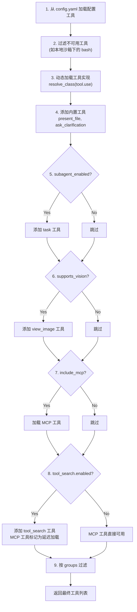

# 第九章：工具与技能系统

## 学习目标

理解 DeerFlow 的工具和技能系统：工具如何加载和管理、内置工具有哪些、MCP 工具如何集成、技能包的声明式机制。读完本章后，你应该能自己添加新工具或创建新技能。

## 9.1 工具 vs 技能

这两个概念容易混淆，先厘清：

| 维度 | 工具（Tool） | 技能（Skill） |
|------|-------------|--------------|
| 本质 | Python 函数 | SKILL.md 文本文件 |
| 作用 | 智能体可以调用的具体操作 | 注入到系统提示中的能力描述 |
| 执行方式 | LLM 发起工具调用 → 代码执行 | LLM 阅读技能描述 → 指导行为 |
| 类比 | 手中的工具（锤子、螺丝刀） | 脑中的知识（如何装修的教程） |
| 示例 | `bash`、`web_search`、`read_file` | `deep-research`、`data-analysis` |

简单说：**工具是"能做什么"，技能是"知道怎么做"**。

## 9.2 工具加载流程

> 文件：`deer-flow/backend/packages/harness/deerflow/tools/tools.py`

```python
def get_available_tools(
    groups: list[str] | None = None,
    include_mcp: bool = True,
    model_name: str | None = None,
    subagent_enabled: bool = False,
) -> list[BaseTool]:
```

工具加载的完整流程：



## 9.3 工具分类详解

### 配置工具（config.yaml 中定义）

```yaml
tools:
  - name: web_search
    group: web
    use: deerflow.community.ddg_search.tools:web_search_tool
    max_results: 5
```

| 工具 | 组 | 实现 | 功能 |
|------|---|------|------|
| `web_search` | web | DuckDuckGo / Tavily / InfoQuest | Web 搜索 |
| `web_fetch` | web | Jina AI / InfoQuest | 网页内容抓取 |
| `image_search` | web | DuckDuckGo / InfoQuest | 图片搜索 |
| `ls` | file:read | sandbox.tools | 列出目录 |
| `read_file` | file:read | sandbox.tools | 读取文件 |
| `write_file` | file:write | sandbox.tools | 写入文件 |
| `str_replace` | file:write | sandbox.tools | 精确字符串替换 |
| `bash` | bash | sandbox.tools | Shell 命令执行 |

每个工具都可以通过 `use` 字段替换为不同的实现，比如把 `web_search` 从 DuckDuckGo 换成 Tavily。

### 内置工具（始终可用）

| 工具 | 功能 | 特殊行为 |
|------|------|---------|
| `present_files` | 将文件展示给用户下载 | 只允许 `/mnt/user-data/outputs/` 下的文件，更新 artifacts 状态 |
| `ask_clarification` | 向用户请求澄清 | `return_direct=True`，被 ClarificationMiddleware 拦截中断执行 |

### 条件工具（按功能开关）

| 工具 | 条件 | 功能 |
|------|------|------|
| `task` | `subagent_enabled=True` | 委派子智能体执行任务 |
| `view_image` | 模型 `supports_vision=True` | 读取图片转 base64 注入状态 |
| `write_todos` | `is_plan_mode=True` | 结构化任务追踪 |
| `tool_search` | `tool_search.enabled=True` | 按需发现延迟加载的工具 |
| `setup_agent` | `is_bootstrap=True` | 创建自定义智能体 |
| `invoke_acp_agent` | ACP 配置存在时 | 调用外部 ACP 兼容智能体 |

### MCP 工具（动态加载）

从 `extensions_config.json` 中配置的 MCP 服务器动态加载。

## 9.4 MCP 集成

> 文件：`deer-flow/backend/packages/harness/deerflow/mcp/`

MCP（Model Context Protocol）是连接外部工具服务器的标准协议。DeerFlow 的 MCP 集成包含四个组件：

```
┌─────────────────────────────────────────────────────────┐
│                    MCP 集成层                             │
├──────────────┬──────────────┬──────────────┬────────────┤
│  client.py   │  tools.py    │  cache.py    │  oauth.py  │
│  客户端配置   │  工具加载     │  工具缓存     │  OAuth 认证 │
└──────────────┴──────────────┴──────────────┴────────────┘
```

### MCP 工具加载流程

```python
def load_mcp_tools() -> list[BaseTool]:
    config = get_extensions_config()
    tools = []
    for name, server_config in config.mcp_servers.items():
        if not server_config.enabled:
            continue
        # 1. 创建 MCP 客户端（stdio/sse/http）
        client = create_mcp_client(server_config)
        # 2. 获取服务器提供的工具列表
        server_tools = client.list_tools()
        # 3. 包装为 LangChain BaseTool
        for tool in server_tools:
            tools.append(wrap_mcp_tool(tool, client))
    return tools
```

### 工具搜索（延迟加载）

当 MCP 服务器暴露大量工具时，全部加载到 LLM 上下文会浪费 Token。`tool_search` 机制解决了这个问题：

```
启用 tool_search 后：
┌─────────────────────────────────────────────────────┐
│ LLM 可见的工具：                                      │
│   bash, read_file, write_file, ls, web_search,      │
│   present_files, ask_clarification,                  │
│   tool_search  ← 用这个工具按需发现 MCP 工具          │
│                                                      │
│ 延迟加载的工具（LLM 不可见，但可通过 tool_search 发现）：│
│   mcp_tool_1, mcp_tool_2, mcp_tool_3, ...           │
└─────────────────────────────────────────────────────┘
```

```python
@tool
def tool_search(query: str) -> str:
    """搜索可用工具"""
    # 支持三种查询方式：
    # "select:name1,name2"  → 精确匹配
    # "+keyword rest"       → 名称必须包含 keyword
    # "keyword query"       → 正则匹配
    matched = DeferredToolRegistry.search(query)
    # 返回匹配工具的完整 JSON Schema
    # 同时将匹配的工具"提升"为活跃状态
    DeferredToolRegistry.promote(matched_names)
    return json.dumps([tool.schema for tool in matched])
```

## 9.5 技能系统

### 技能包的结构

每个技能是一个目录，包含一个 `SKILL.md` 文件：

```
skills/
├── public/                          # 内置公开技能
│   ├── deep-research/
│   │   └── SKILL.md                 # 技能定义文件
│   ├── data-analysis/
│   │   └── SKILL.md
│   └── ...
└── custom/                          # 用户自定义技能
    └── my-skill/
        └── SKILL.md
```

### SKILL.md 的格式

```markdown
---
name: deep-research
description: 深度研究技能，系统性地搜索和分析信息
license: MIT
---

# Deep Research

你是一个深度研究专家。当用户需要深入研究某个主题时...

## 工作流程

1. 分析研究问题
2. 制定搜索策略
3. 多轮搜索和验证
4. 综合分析
5. 生成结构化报告

## 输出格式

...
```

SKILL.md 由两部分组成：
- **YAML 前置元数据**（`---` 之间）：`name`、`description`、`license`
- **Markdown 正文**：技能的详细说明，会被注入到系统提示中

### 技能加载流程

> 文件：`deer-flow/backend/packages/harness/deerflow/skills/loader.py`

```python
def load_skills(skills_path=None, use_config=True, enabled_only=False) -> list[Skill]:
    # 1. 确定技能根目录（默认 deer-flow/skills/）
    # 2. 扫描 public/ 和 custom/ 目录
    # 3. 递归查找 SKILL.md 文件
    # 4. 解析 YAML 前置元数据
    # 5. 从 extensions_config.json 加载启用/禁用状态
    # 6. 按名称排序返回
```

### 技能注入到系统提示

启用的技能会被注入到 Lead Agent 的系统提示中：

```python
def get_skills_prompt_section(available_skills=None) -> str:
    skills = load_skills(enabled_only=True)
    if not skills:
        return ""

    section = "<available_skills>\n"
    for skill in skills:
        # 读取 SKILL.md 的完整内容
        content = skill.skill_file.read_text()
        section += f"\n## {skill.name}\n{content}\n"
    section += "</available_skills>"
    return section
```

### 技能的在线管理

技能可以通过 Gateway API 在线管理：

```
GET  /api/skills              → 列出所有技能
POST /api/skills/{name}/enable  → 启用技能
POST /api/skills/{name}/disable → 禁用技能
POST /api/skills/install       → 安装新技能（从 URL 或本地路径）
```

启用/禁用状态保存在 `extensions_config.json` 的 `skills` 段中。

### 19 个内置公开技能

| 技能 | 功能 |
|------|------|
| `deep-research` | 深度研究，多轮搜索和分析 |
| `data-analysis` | 数据分析和可视化 |
| `chart-visualization` | 图表生成 |
| `ppt-generation` | PPT 幻灯片生成 |
| `frontend-design` | 前端设计和开发 |
| `image-generation` | 图片生成 |
| `video-generation` | 视频生成 |
| `podcast-generation` | 播客生成 |
| `consulting-analysis` | 咨询分析 |
| `github-deep-research` | GitHub 项目深度研究 |
| `skill-creator` | 创建新技能（元技能） |
| `find-skills` | 搜索可用技能 |
| `bootstrap` | 引导创建自定义智能体 |
| `claude-to-deerflow` | Claude → DeerFlow 迁移 |
| `surprise-me` | 惊喜技能 |
| `vercel-deploy-claimable` | Vercel 部署 |
| `web-design-guidelines` | Web 设计规范 |

## 9.6 ACP 智能体集成

ACP（Agent Client Protocol）允许 DeerFlow 调用外部智能体（如 Claude Code、Codex）：

```yaml
# config.yaml
acp_agents:
  claude_code:
    command: npx
    args: ["-y", "@zed-industries/claude-agent-acp"]
    description: Claude Code for implementation and debugging
```

`invoke_acp_agent` 工具会：
1. 为每个线程创建隔离的 ACP 工作区
2. 启动 ACP 适配器进程
3. 通过 MCP 协议与外部智能体通信
4. 收集结果并返回

## 检查点

1. 工具和技能的本质区别是什么？各自如何影响智能体的行为？
2. `get_available_tools()` 的加载流程是什么？工具有哪些来源？
3. `tool_search` 延迟加载机制解决了什么问题？它是如何工作的？
4. SKILL.md 文件的格式是什么？技能是如何被注入到系统提示中的？
5. MCP 工具和配置工具有什么区别？各自的优势是什么？
