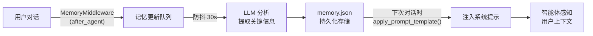

# 第十章：记忆系统

## 学习目标

理解 DeerFlow 的长期记忆机制：记忆如何存储、如何从对话中提取、如何注入到系统提示中。读完本章后，你应该能理解 DeerFlow 如何"记住"用户的偏好和历史上下文。

## 10.1 记忆系统概览

记忆系统让 DeerFlow 具备跨对话的"记忆力"——它能从对话中提取关键信息，持久化存储，并在后续对话中注入到系统提示中。



## 10.2 记忆的存储格式

> 文件：`deer-flow/backend/packages/harness/deerflow/agents/memory/storage.py`

记忆以 JSON 格式存储，分为三大部分：

```json
{
  "version": "1.0",
  "lastUpdated": "2026-03-31T10:00:00Z",
  "user": {
    "workContext": {"summary": "用户是一名后端开发工程师，主要使用 Python", "updatedAt": "..."},
    "personalContext": {"summary": "偏好简洁的代码风格，喜欢类型提示", "updatedAt": "..."},
    "topOfMind": {"summary": "正在学习 DeerFlow 项目的源码", "updatedAt": "..."}
  },
  "history": {
    "recentMonths": {"summary": "最近在研究 AI 智能体框架", "updatedAt": "..."},
    "earlierContext": {"summary": "之前做过 Web 开发项目", "updatedAt": "..."},
    "longTermBackground": {"summary": "", "updatedAt": ""}
  },
  "facts": [
    {
      "id": "fact_a1b2c3d4",
      "content": "用户偏好使用 uv 而不是 pip 管理 Python 依赖",
      "category": "preference",
      "confidence": 0.9,
      "createdAt": "2026-03-31T10:00:00Z",
      "source": "thread-abc123"
    }
  ]
}
```

| 部分 | 内容 | 更新频率 |
|------|------|---------|
| `user.workContext` | 工作相关上下文 | 每次对话后 |
| `user.personalContext` | 个人偏好和风格 | 较少变化 |
| `user.topOfMind` | 当前关注的事情 | 频繁变化 |
| `history.recentMonths` | 近期活动摘要 | 定期更新 |
| `history.earlierContext` | 更早的上下文 | 偶尔更新 |
| `facts` | 具体的事实条目 | 持续积累 |

存储位置：
- 全局记忆：`~/.deer-flow/memory.json`
- 按智能体隔离：`~/.deer-flow/agents/{agent_name}/memory.json`

## 10.3 记忆更新流程

### 触发：MemoryMiddleware

```python
class MemoryMiddleware(AgentMiddleware):
    def after_agent(self, state, config):
        # 将当前对话加入记忆更新队列
        memory_queue.add(
            thread_id=config["configurable"]["thread_id"],
            messages=state["messages"],
            agent_name=self.agent_name,
        )
```

### 防抖队列

> 文件：`deer-flow/backend/packages/harness/deerflow/agents/memory/queue.py`

记忆更新不是每次对话后立即执行，而是通过防抖机制延迟处理：

```
对话 1 结束 → 加入队列 → 启动 30s 计时器
对话 2 结束 → 替换队列中同 thread_id 的条目 → 重置计时器
对话 3 结束 → 替换 → 重置计时器
                                    ↓ 30s 无新对话
                              批量处理队列中所有条目
```

```python
class MemoryUpdateQueue:
    def add(self, thread_id, messages, agent_name=None):
        with self._lock:
            # 替换同一 thread_id 的旧更新（只保留最新的）
            self._queue = [c for c in self._queue if c.thread_id != thread_id]
            self._queue.append(ConversationContext(thread_id, messages, agent_name))
            self._reset_timer()  # 重置防抖计时器

    def _reset_timer(self):
        if self._timer:
            self._timer.cancel()
        self._timer = threading.Timer(
            config.debounce_seconds,  # 默认 30 秒
            self._process_queue,
        )
        self._timer.daemon = True
        self._timer.start()
```

### LLM 分析提取

> 文件：`deer-flow/backend/packages/harness/deerflow/agents/memory/updater.py`

防抖计时器触发后，调用 LLM 分析对话内容：

```python
async def update_memory(conversation: ConversationContext):
    # 1. 加载当前记忆
    current_memory = storage.load(agent_name=conversation.agent_name)

    # 2. 格式化对话内容（去除上传文件标签，截断超长消息）
    formatted = format_conversation(conversation.messages)

    # 3. 调用 LLM 分析
    result = await llm.ainvoke([
        SystemMessage(content=MEMORY_UPDATE_PROMPT),
        HumanMessage(content=f"Current memory:\n{json.dumps(current_memory)}\n\nConversation:\n{formatted}")
    ])

    # 4. 解析 LLM 返回的 JSON
    updates = parse_json(result.content)

    # 5. 应用更新
    apply_updates(current_memory, updates)

    # 6. 保存
    storage.save(current_memory, agent_name=conversation.agent_name)
```

LLM 返回的更新格式：

```json
{
  "user": {
    "workContext": {"summary": "更新后的摘要", "shouldUpdate": true},
    "personalContext": {"summary": "...", "shouldUpdate": false}
  },
  "newFacts": [
    {"content": "用户喜欢用 TypeScript", "category": "preference", "confidence": 0.85}
  ],
  "factsToRemove": ["fact_old123"]
}
```

### Facts 管理

Facts 的管理有严格的规则：

- **置信度阈值**：低于 `fact_confidence_threshold`（默认 0.7）的 fact 不会被存储
- **去重**：按内容规范化后去重，避免重复存储
- **数量上限**：超过 `max_facts`（默认 100）时，按置信度排序，保留高置信度的
- **来源追踪**：每个 fact 记录来源 thread_id

## 10.4 记忆注入

> 文件：`deer-flow/backend/packages/harness/deerflow/agents/memory/prompt.py`

在构建系统提示时，记忆被格式化并注入：

```python
def format_memory_for_injection(memory_data: dict, max_tokens: int = 2000) -> str:
    sections = []

    # 用户上下文
    sections.append("User Context:")
    sections.append(f"- Work: {memory_data['user']['workContext']['summary']}")
    sections.append(f"- Personal: {memory_data['user']['personalContext']['summary']}")
    sections.append(f"- Current Focus: {memory_data['user']['topOfMind']['summary']}")

    # 历史
    sections.append("History:")
    sections.append(f"- Recent: {memory_data['history']['recentMonths']['summary']}")

    # Facts（按置信度排序，逐条添加直到达到 Token 预算）
    sections.append("Facts:")
    for fact in sorted(facts, key=lambda f: f["confidence"], reverse=True):
        line = f"- [{fact['category']} | {fact['confidence']}] {fact['content']}"
        if current_tokens + count_tokens(line) > max_tokens:
            break  # 超出预算，停止添加
        sections.append(line)

    return "\n".join(sections)
```

注入到系统提示的 `{memory_context}` 位置，被 `<memory>` 标签包裹。

## 10.5 配置参数

```yaml
memory:
  enabled: true                    # 是否启用
  storage_path: memory.json        # 存储路径
  debounce_seconds: 30             # 防抖延迟（1-300 秒）
  model_name: null                 # 用于分析的模型（null = 默认模型）
  max_facts: 100                   # 最大 facts 数量（10-500）
  fact_confidence_threshold: 0.7   # 置信度阈值（0.0-1.0）
  injection_enabled: true          # 是否注入到系统提示
  max_injection_tokens: 2000       # 注入的最大 Token 数（100-8000）
```

## 检查点

1. 记忆的三大存储部分（user、history、facts）各自存储什么类型的信息？
2. 防抖机制是如何工作的？为什么需要防抖而不是每次对话后立即更新？
3. Facts 的置信度阈值和数量上限是如何协作管理 facts 集合的？
4. 记忆注入时的 Token 预算管理是如何实现的？
5. 全局记忆和按智能体隔离的记忆有什么区别？
