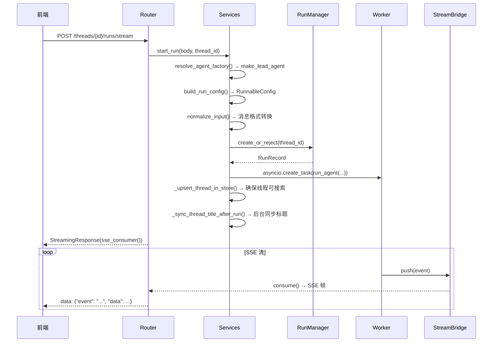

# 第十一章：Gateway API 层

## 学习目标

理解 DeerFlow 的 FastAPI 网关层：路由设计、核心端点、SSE 流式传输、线程管理。读完本章后，你应该能理解前端是如何与后端交互的。

## 11.1 Gateway API 概览

> 文件：`deer-flow/backend/app/gateway/app.py`

Gateway API 是一个 FastAPI 应用，提供 DeerFlow 的所有 HTTP 端点：

```
┌─────────────────────────────────────────────────────────┐
│                  Gateway API 路由地图                     │
├─────────────────────────────────────────────────────────┤
│ 业务 API（/api/ 前缀）                                   │
│  GET    /api/models              模型列表                │
│  GET    /api/mcp/config          MCP 服务器配置          │
│  GET    /api/memory              获取记忆数据            │
│  PUT    /api/memory              更新记忆                │
│  GET    /api/skills              技能列表                │
│  POST   /api/skills/{name}/enable   启用技能             │
│  POST   /api/skills/install      安装技能                │
│  POST   /api/threads/{id}/uploads   上传文件             │
│  GET    /api/threads/{id}/artifacts/{path}  下载工件     │
│  DELETE /api/threads/{id}        删除线程数据            │
│  GET    /api/agents              自定义智能体列表        │
│  POST   /api/threads/{id}/suggestions  生成建议          │
│  POST   /api/channels/{type}/send  IM 频道发送           │
├─────────────────────────────────────────────────────────┤
│ LangGraph 兼容 API（无前缀，兼容 LangGraph Platform）    │
│  POST   /threads/{id}/runs/stream   流式运行（核心）     │
│  POST   /threads/{id}/runs/wait     阻塞运行             │
│  POST   /threads/{id}/runs          后台运行             │
│  GET    /threads/{id}/runs/{rid}/stream  加入现有流      │
│  POST   /threads                     创建线程            │
│  POST   /threads/search              搜索线程            │
│  GET    /threads/{id}/state          获取线程状态        │
│  POST   /runs/stream                 无状态流式运行      │
├─────────────────────────────────────────────────────────┤
│ 系统端点                                                 │
│  GET    /health                      健康检查            │
│  GET    /docs                        Swagger 文档        │
└─────────────────────────────────────────────────────────┘
```

## 11.2 核心流程：流式运行

`POST /threads/{id}/runs/stream` 是最核心的端点——前端发送消息、接收 AI 回复都通过它。

> 文件：`deer-flow/backend/app/gateway/services.py`



### SSE 帧格式

Gateway 的 SSE 输出与 LangGraph Platform 兼容：

```
event: messages/partial
data: {"content": "你好", "type": "ai", ...}

event: messages/complete
data: {"content": "你好，有什么可以帮你的？", "type": "ai", ...}

event: values
data: {"messages": [...], "artifacts": [...], "title": "..."}

event: end
data: null
```

### 断开连接处理

```python
async def sse_consumer(bridge, record, request, run_mgr):
    try:
        async for event in bridge.consume(record.run_id):
            yield format_sse(event)
    except asyncio.CancelledError:
        # 客户端断开连接
        if record.on_disconnect == DisconnectMode.cancel:
            await run_mgr.cancel(record.run_id)  # 取消后台任务
        # DisconnectMode.continue → 任务继续运行，事件被丢弃
```

## 11.3 线程管理

> 文件：`deer-flow/backend/app/gateway/routers/threads.py`

线程管理使用**两层存储架构**：

```
┌──────────────────┐     ┌──────────────────┐
│     Store        │     │  Checkpointer    │
│  (快速元数据)     │     │  (完整状态)       │
│                  │     │                  │
│  thread_id       │     │  messages        │
│  title           │     │  artifacts       │
│  created_at      │     │  sandbox         │
│  updated_at      │     │  todos           │
│  metadata        │     │  checkpoints     │
└──────────────────┘     └──────────────────┘
```

### 线程搜索的三阶段策略

```python
# POST /threads/search
async def search_threads():
    # Phase 1: 从 Store 快速查询（毫秒级）
    store_threads = await store.search(namespace=("threads",))

    # Phase 2: 从 Checkpointer 补充（懒迁移）
    # 发现由 LangGraph Server 直接创建但 Store 中没有的线程
    # 自动写入 Store，下次就能快速查到

    # Phase 3: 过滤 → 排序（按 updated_at 降序）→ 分页
    return paginated_results
```

这种"懒迁移"策略避免了一次性迁移所有历史数据的开销。

## 11.4 文件上传

> 文件：`deer-flow/backend/app/gateway/routers/uploads.py`

```python
# POST /api/threads/{thread_id}/uploads
async def upload_files(thread_id: str, files: list[UploadFile]):
    for file in files:
        # 1. 文件名规范化（防止路径遍历）
        safe_name = sanitize_filename(file.filename)

        # 2. 保存到线程上传目录
        dest = paths.sandbox_uploads_dir(thread_id) / safe_name

        # 3. 可转换文件自动转为 Markdown
        if is_convertible(safe_name):  # PDF, DOCX, PPTX, XLSX
            markdown = markitdown.convert(dest)
            save(dest.with_suffix(".md"), markdown)

        # 4. 返回虚拟路径
        return {
            "virtual_path": f"/mnt/user-data/uploads/{safe_name}",
            "markdown_virtual_path": f"/mnt/user-data/uploads/{safe_name}.md",
        }
```

支持的可转换格式：PDF、PPT、Excel、Word → 自动转为 Markdown，方便 LLM 阅读。

## 11.5 工件访问

> 文件：`deer-flow/backend/app/gateway/routers/artifacts.py`

```python
# GET /api/threads/{thread_id}/artifacts/{path}
async def get_artifact(thread_id: str, path: str):
    # 1. 解析虚拟路径 → 宿主机路径
    actual_path = paths.resolve_virtual_path(thread_id, path)

    # 2. 安全检查（路径遍历防护）
    actual_path.relative_to(base)  # 确保在允许范围内

    # 3. 检测 MIME 类型
    media_type = guess_type(actual_path)

    # 4. 活跃内容强制下载（HTML/JS/SVG 等）
    if is_active_content(media_type):
        return FileResponse(actual_path, media_type="application/octet-stream")

    return FileResponse(actual_path, media_type=media_type)
```

## 11.6 应用生命周期

> 文件：`deer-flow/backend/app/gateway/app.py`

```python
@asynccontextmanager
async def lifespan(app: FastAPI):
    # 启动阶段
    get_app_config()                    # 加载配置
    async with langgraph_runtime(app):  # 初始化运行时组件
        # StreamBridge, Checkpointer, Store, RunManager
        start_channel_service()         # 启动 IM 频道服务
        yield
    # 关闭阶段
    stop_channel_service()              # 停止 IM 频道
    # AsyncExitStack 自动清理运行时组件
```

## 检查点

1. Gateway API 的路由分为哪几类？为什么要同时支持 `/api/` 前缀和无前缀的路由？
2. `POST /threads/{id}/runs/stream` 的完整执行流程是什么？
3. 线程搜索的"三阶段策略"是什么？为什么需要"懒迁移"？
4. 文件上传时，可转换文件（PDF/DOCX 等）会经过什么额外处理？
5. 断开连接时的 `cancel` 和 `continue` 模式有什么区别？
