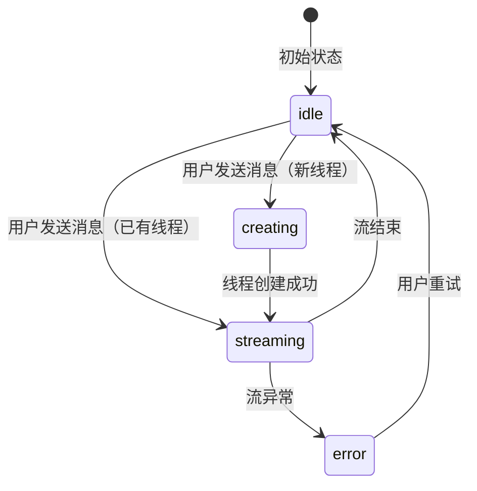

# 第十三章：线程与消息流

## 学习目标

理解前端如何与后端通信：LangGraph SDK 客户端、流式消息处理、TanStack Query 状态管理、消息的分组和渲染逻辑。读完本章后，你应该能理解从"用户点击发送"到"消息显示在屏幕上"的完整前端链路。

## 13.1 API 客户端

> 文件：`deer-flow/frontend/src/core/api/api-client.ts`

前端通过 LangGraph SDK 与后端通信，客户端是一个全局单例：

```typescript
import { Client } from "@langchain/langgraph-sdk";

const client = new Client({
  apiUrl: env.NEXT_PUBLIC_LANGGRAPH_BASE_URL || "/lgs",
});

// 包装 stream 方法，过滤不支持的流模式
export function streamRun(threadId, assistantId, input, config) {
  return client.runs.stream(threadId, assistantId, {
    input,
    config,
    streamMode: sanitizeRunStreamOptions(["values", "messages", "updates"]),
  });
}
```

## 13.2 核心 Hook：useThreadStream

> 文件：`deer-flow/frontend/src/core/threads/hooks.ts`

`useThreadStream` 是前端最核心的 Hook，管理整个消息流的生命周期：



```typescript
function useThreadStream() {
  // 1. 管理流状态
  const [isStreaming, setIsStreaming] = useState(false);

  // 2. 乐观更新：发送消息后立即显示用户消息
  const submit = async (content: string, files?: File[]) => {
    // 乐观添加用户消息到列表
    addOptimisticMessage({ role: "human", content });

    // 如果是新线程，先创建
    if (threadId === "new") {
      const thread = await client.threads.create();
      // 使用原生 History API 更新 URL（避免 React 重新挂载）
      window.history.replaceState(null, "", `/workspace/chats/${thread.thread_id}`);
    }

    // 3. 启动流式请求
    const stream = client.runs.stream(threadId, "lead_agent", {
      input: { messages: [{ role: "human", content }] },
      config: {
        configurable: {
          model_name: selectedModel,
          thinking_enabled: thinkingEnabled,
          is_plan_mode: isPlanMode,
          subagent_enabled: subagentEnabled,
        },
      },
      streamMode: ["values", "messages"],
    });

    // 4. 消费流事件
    for await (const event of stream) {
      switch (event.event) {
        case "values":
          // 更新完整状态（messages, artifacts, todos, title）
          updateThreadState(event.data);
          break;
        case "messages/partial":
          // 增量更新消息内容（流式打字效果）
          updatePartialMessage(event.data);
          break;
        case "messages/complete":
          // 消息完成
          finalizeMessage(event.data);
          break;
      }
    }

    // 5. 刷新 TanStack Query 缓存
    queryClient.invalidateQueries(["threads"]);
  };

  return { submit, isStreaming, stop };
}
```

### 关键设计决策

**为什么用原生 History API 而不是 Next.js Router？**

创建新线程后需要更新 URL（从 `/chats/new` 到 `/chats/{id}`），但使用 Next.js Router 会导致组件重新挂载，中断正在进行的流。原生 `window.history.replaceState` 只更新 URL，不触发重新渲染。

## 13.3 消息分组

> 文件：`deer-flow/frontend/src/core/messages/utils.ts`

后端返回的是扁平的消息列表，但前端需要将它们分组为有意义的"消息组"来渲染：

```typescript
function groupMessages(messages: Message[]): MessageGroup[] {
  // 将扁平消息列表分组为以下类型：
  // - "human"              → 用户消息
  // - "assistant"          → AI 最终回复
  // - "assistant:processing" → AI 正在处理（工具调用中）
  // - "assistant:present-files" → AI 展示文件
  // - "assistant:clarification" → AI 请求澄清
  // - "assistant:subagent"     → 子智能体执行中
}
```

分组逻辑示意：

```
原始消息列表：
  [Human] "帮我搜索 Python 教程"
  [AI]    tool_calls: [web_search(...)]
  [Tool]  web_search 结果: ...
  [AI]    "我找到了以下 Python 教程..."

分组后：
  Group 1: type="human"
    → "帮我搜索 Python 教程"

  Group 2: type="assistant"
    → 工具调用: web_search (折叠显示)
    → "我找到了以下 Python 教程..."
```

### 消息内容提取

```typescript
// 提取文本内容（处理字符串和数组两种格式）
function extractTextFromMessage(message): string

// 提取推理内容（<think> 标签或 reasoning_content 字段）
function extractReasoningContentFromMessage(message): string

// 解析上传文件列表（从 <uploaded_files> 标签）
function parseUploadedFiles(message): UploadedFile[]

// 类型检查
function hasToolCalls(message): boolean
function hasReasoning(message): boolean
function hasPresentFiles(message): boolean
function hasSubagent(message): boolean
```

## 13.4 线程状态类型

> 文件：`deer-flow/frontend/src/core/threads/types.ts`

```typescript
interface AgentThreadState {
  title?: string;              // 自动生成的标题
  messages: Message[];         // 消息列表
  artifacts: string[];         // 工件路径列表
  todos?: TodoItem[];          // 待办事项
}

interface AgentThreadContext {
  thread_id: string;           // 线程 ID
  model_name?: string;         // 使用的模型
  thinking_enabled?: boolean;  // 是否开启思考模式
  is_plan_mode?: boolean;      // 是否开启计划模式
  subagent_enabled?: boolean;  // 是否开启子智能体
  reasoning_effort?: string;   // 推理努力级别
  agent_name?: string;         // 自定义智能体名称
}
```

## 13.5 Token 使用统计

> 文件：`deer-flow/frontend/src/core/messages/usage.ts`

```typescript
function accumulateUsage(messages: Message[]): TokenUsage {
  // 遍历所有 AI 消息，累计 usage_metadata
  return {
    inputTokens: total_input,
    outputTokens: total_output,
    totalTokens: total_input + total_output,
  };
}

function formatTokenCount(count: number): string {
  // 1234 → "1,234"
  // 12345 → "12.3K"
}
```

## 13.6 数据流全景

```
用户输入
  ↓
useThreadStream.submit()
  ↓
乐观更新（立即显示用户消息）
  ↓
client.runs.stream() → SSE 连接
  ↓
┌─ values 事件 ──→ 更新完整线程状态（messages, artifacts, todos, title）
├─ messages/partial ──→ 增量更新 AI 消息（流式打字效果）
├─ messages/complete ──→ 标记消息完成
└─ end ──→ 流结束
  ↓
TanStack Query 缓存更新
  ↓
groupMessages() 消息分组
  ↓
React 组件重新渲染
  ↓
用户看到 AI 回复
```

## 检查点

1. `useThreadStream` Hook 管理了哪些状态？它的生命周期是什么？
2. 为什么创建新线程后使用原生 History API 而不是 Next.js Router？
3. 消息分组有哪些类型？为什么需要分组而不是直接渲染扁平列表？
4. SSE 流中的 `values` 和 `messages/partial` 事件有什么区别？
5. 乐观更新是什么？它解决了什么用户体验问题？
