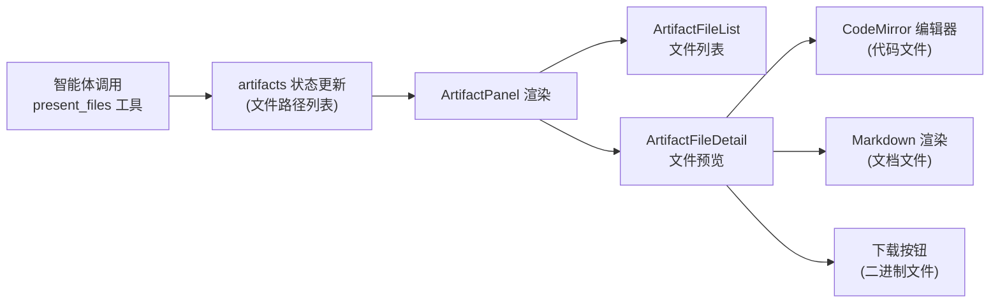

# 第十四章：组件体系与交互

## 学习目标

理解 DeerFlow 前端的组件设计：Shadcn UI 组件库、AI 元素组件、工件系统、国际化和主题。读完本章后，你应该能在前端代码中快速定位和修改任何 UI 组件。

## 14.1 组件分层

```
components/
├── ui/              # 第一层：基础 UI 原语（Shadcn UI + Radix UI）
│   ├── button.tsx   #   按钮、对话框、下拉菜单、侧边栏...
│   ├── dialog.tsx   #   ⚠️ 自动生成，不要手动编辑
│   └── ...
│
├── ai-elements/     # 第二层：AI 交互元素（Vercel AI SDK）
│   ├── message.tsx  #   消息气泡、代码块、工件卡片...
│   ├── code-block.tsx  # ⚠️ 自动生成，不要手动编辑
│   └── ...
│
├── workspace/       # 第三层：业务组件（手动编写）
│   ├── chats/       #   聊天相关（ChatBox、分割面板）
│   ├── messages/    #   消息渲染（MessageList、MessageGroup、MarkdownContent）
│   ├── artifacts/   #   工件展示（文件列表、文件详情）
│   ├── settings/    #   设置页面（外观、记忆、模型选择）
│   ├── agents/      #   智能体管理
│   ├── citations/   #   引用展示
│   ├── input-box.tsx       # 输入框
│   ├── workspace-sidebar.tsx  # 侧边栏
│   ├── workspace-header.tsx   # 头部
│   └── command-palette.tsx    # 命令面板（Cmd+K）
│
└── landing/         # 第四层：落地页组件
    ├── header.tsx
    ├── hero.tsx
    └── sections/    # 各个展示区块
```

## 14.2 聊天页面组件树

核心交互页面 `/workspace/chats/[thread_id]` 的组件结构：

```
ChatPage
├── ThreadTitle                    # 线程标题（可编辑）
├── ChatBox                        # 聊天容器（可分割面板）
│   ├── MessageList                # 消息列表
│   │   └── MessageGroup[]         # 消息组（按类型分组）
│   │       ├── HumanMessage       # 用户消息
│   │       ├── AssistantMessage   # AI 回复
│   │       │   ├── MarkdownContent  # Markdown 渲染
│   │       │   ├── CodeBlock        # 代码块（Shiki 高亮）
│   │       │   ├── ReasoningBlock   # 推理过程（可折叠）
│   │       │   └── ToolCallBlock    # 工具调用（可折叠）
│   │       ├── ClarificationMessage # 澄清请求
│   │       └── SubagentMessage      # 子智能体进度
│   │
│   └── ArtifactPanel              # 工件面板（右侧分割）
│       ├── ArtifactFileList       # 文件列表
│       └── ArtifactFileDetail     # 文件详情（CodeMirror 编辑器）
│
├── InputBox                       # 输入框
│   ├── PromptInput                # 文本输入区
│   ├── FileUploadButton           # 文件上传按钮
│   ├── ModelSelector              # 模型选择器
│   ├── ThinkingToggle             # 思考模式开关
│   └── SendButton / StopButton    # 发送/停止按钮
│
├── TodoList                       # 待办事项（计划模式）
└── TokenUsageIndicator            # Token 使用量指示器
```

## 14.3 工件系统

工件（Artifacts）是智能体生成的文件产物，前端提供了完整的查看和下载体验：



工件通过 `/api/threads/{id}/artifacts/{path}` 端点访问，前端使用 `useArtifactContent` Hook 加载内容。

## 14.4 国际化

> 文件：`deer-flow/frontend/src/core/i18n/`

支持两种语言：

| 语言 | 文件 |
|------|------|
| English (en-US) | `locales/en-US.ts` |
| 中文 (zh-CN) | `locales/zh-CN.ts` |

使用方式：

```typescript
import { useI18n } from "@/core/i18n/hooks";

function MyComponent() {
  const { t } = useI18n();
  return <button>{t("send")}</button>;
}
```

语言偏好保存在 localStorage 中，通过设置页面切换。

## 14.5 主题系统

使用 `next-themes` + CSS 变量实现深色/浅色主题：

> 文件：`deer-flow/frontend/src/styles/globals.css`

```css
:root {
  --background: 0 0% 100%;
  --foreground: 0 0% 3.9%;
  --primary: 0 0% 9%;
  /* ... */
}

.dark {
  --background: 0 0% 3.9%;
  --foreground: 0 0% 98%;
  --primary: 0 0% 98%;
  /* ... */
}
```

Tailwind CSS 4 通过 CSS 变量引用这些主题色，组件中使用 `bg-background`、`text-foreground` 等类名。

## 14.6 关键交互模式

### 命令面板（Cmd+K）

```
Cmd+K → 打开命令面板
  → 搜索线程、切换模型、打开设置
  → 快速导航到任何功能
```

### 分割面板

聊天页面支持左右分割，左侧是消息列表，右侧是工件面板：

```
┌──────────────────┬──────────────────┐
│                  │                  │
│   消息列表        │   工件面板        │
│                  │                  │
│   用户消息        │   文件列表        │
│   AI 回复         │   代码预览        │
│   工具调用        │   Markdown 渲染   │
│                  │                  │
├──────────────────┴──────────────────┤
│              输入框                   │
└─────────────────────────────────────┘
```

### 流式打字效果

AI 回复使用 `streamdown` 库实现流式 Markdown 渲染，消息内容逐字显示，同时正确渲染 Markdown 格式。

## 检查点

1. 前端组件分为哪四层？哪些层是自动生成的不应手动编辑？
2. 聊天页面的核心组件树是什么结构？
3. 工件系统的数据流是什么？从智能体生成到前端展示经过了哪些步骤？
4. 国际化是如何实现的？支持哪些语言？
5. 主题系统使用了什么技术方案？如何在组件中使用主题色？