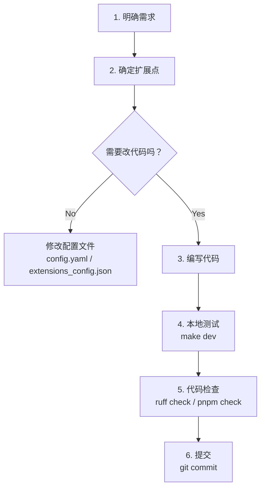

# 第十五章：二次开发指南

## 学习目标

掌握 DeerFlow 的扩展点和二次开发方法：如何添加自定义工具、技能、子智能体、中间件，如何搭建开发环境。读完本章后，你应该具备在 DeerFlow 上进行二次开发的能力。

## 15.1 扩展点总览

DeerFlow 提供了丰富的扩展点，几乎每个核心模块都可以自定义：

```
┌─────────────────────────────────────────────────────────┐
│                  DeerFlow 扩展点地图                      │
├─────────────────────────────────────────────────────────┤
│                                                          │
│  零代码扩展（只改配置）                                    │
│  ├── 添加新模型        → config.yaml models 段           │
│  ├── 切换搜索引擎      → config.yaml tools 段            │
│  ├── 添加 MCP 服务器   → extensions_config.json          │
│  ├── 创建新技能        → skills/custom/xxx/SKILL.md      │
│  └── 配置安全护栏      → config.yaml guardrails 段       │
│                                                          │
│  少量代码扩展                                             │
│  ├── 自定义工具        → Python 函数 + config.yaml       │
│  ├── 自定义中间件      → AgentMiddleware 子类            │
│  ├── 自定义子智能体    → SubagentConfig 注册             │
│  └── 自定义沙箱提供者  → SandboxProvider 子类            │
│                                                          │
│  深度定制                                                 │
│  ├── 自定义智能体      → SOUL.md + config.yaml           │
│  ├── 自定义模型提供者  → BaseChatModel 子类              │
│  └── 前端组件定制      → React 组件修改                   │
│                                                          │
└─────────────────────────────────────────────────────────┘
```

## 15.2 开发环境搭建

### 前置条件

```bash
# 检查环境
python --version   # >= 3.12
node --version     # >= 22
pnpm --version     # >= 10.26.2
uv --version       # 已安装
```

### 快速启动

```bash
git clone https://github.com/bytedance/deer-flow.git
cd deer-flow
make config      # 生成配置文件
# 编辑 config.yaml，配置至少一个模型
# 编辑 .env，设置 API Key
make install     # 安装依赖
make dev         # 启动开发服务器（热重载）
```

### VS Code 工作区

项目提供了 `deer-flow.code-workspace` 文件，打开后可以同时编辑前后端：

```bash
code deer-flow.code-workspace
```

## 15.3 实战：添加自定义工具

### 步骤一：编写工具函数

在 `backend/packages/harness/deerflow/community/` 下创建新模块：

```python
# backend/packages/harness/deerflow/community/my_tools/tools.py
from langchain_core.tools import tool

@tool
def my_custom_tool(query: str) -> str:
    """我的自定义工具，用于执行某个操作。

    Args:
        query: 查询内容
    """
    # 实现你的逻辑
    result = do_something(query)
    return result
```

### 步骤二：在 config.yaml 中注册

```yaml
tools:
  # ... 已有工具 ...
  - name: my_custom_tool
    group: web                    # 所属工具组
    use: deerflow.community.my_tools.tools:my_custom_tool
    # 额外参数会传给工具
```

重启服务后，智能体就能使用这个工具了。

## 15.4 实战：创建自定义技能

### 步骤一：创建技能目录

```bash
mkdir -p skills/custom/my-skill
```

### 步骤二：编写 SKILL.md

```markdown
---
name: my-skill
description: 我的自定义技能，用于执行特定的工作流
---

# My Skill

当用户需要执行 XXX 时，按照以下流程操作：

## 工作流程

1. 分析用户需求
2. 收集必要信息
3. 执行核心操作
4. 生成结构化输出

## 输出格式

使用 Markdown 格式输出，包含以下部分：
- 摘要
- 详细分析
- 建议
```

### 步骤三：启用技能

通过 API 或直接编辑 `extensions_config.json`：

```json
{
  "skills": {
    "my-skill": { "enabled": true }
  }
}
```

## 15.5 实战：添加自定义中间件

### 步骤一：编写中间件类

```python
# backend/packages/harness/deerflow/agents/middlewares/my_middleware.py
from langchain.agents.middleware import AgentMiddleware
from langchain.agents import AgentState

class MyMiddleware(AgentMiddleware[AgentState]):
    def __init__(self, my_param: str = "default"):
        self.my_param = my_param

    def before_agent(self, state, config):
        """在智能体执行前运行"""
        # 例如：注入额外的上下文信息
        return {}  # 返回状态更新

    def after_model(self, state, config, response):
        """在 LLM 返回后运行"""
        # 例如：过滤或修改响应
        return response

    def wrap_tool_call(self, state, config, tool_call, next_fn):
        """包裹工具调用"""
        # 例如：记录工具调用日志
        print(f"Tool called: {tool_call['name']}")
        return next_fn(tool_call)
```

### 步骤二：注入到中间件链

方式一：通过 SDK 工厂（推荐）

```python
from deerflow.agents import create_deerflow_agent, Next
from deerflow.agents.middlewares.memory_middleware import MemoryMiddleware

@Next(MemoryMiddleware)  # 插入到 MemoryMiddleware 之后
class MyMiddleware(AgentMiddleware):
    ...

agent = create_deerflow_agent(
    model=my_model,
    tools=my_tools,
    extra_middleware=[MyMiddleware()],
)
```

方式二：修改 `_build_middlewares` 函数（直接修改源码）

## 15.6 实战：注册自定义子智能体

### 步骤一：定义配置

```python
# backend/packages/harness/deerflow/subagents/builtins/my_agent.py
from deerflow.subagents.config import SubagentConfig

MY_AGENT_CONFIG = SubagentConfig(
    name="my-specialist",
    description="专门处理 XXX 任务的智能体",
    system_prompt="""你是一个 XXX 专家。
    当收到任务时，按照以下步骤执行：
    1. 分析任务
    2. 执行操作
    3. 返回结果
    """,
    tools=["web_search", "read_file"],  # 只允许特定工具
    disallowed_tools=["task"],           # 禁止再委派
    max_turns=30,
    timeout_seconds=600,
)
```

### 步骤二：注册到内置列表

```python
# backend/packages/harness/deerflow/subagents/builtins/__init__.py
from .my_agent import MY_AGENT_CONFIG

BUILTIN_CONFIGS = {
    "general-purpose": GENERAL_PURPOSE_CONFIG,
    "bash": BASH_AGENT_CONFIG,
    "my-specialist": MY_AGENT_CONFIG,  # 添加这行
}
```

注册后，主智能体的系统提示中会自动包含新子智能体的描述。

## 15.7 实战：自定义沙箱提供者

如果需要接入自己的沙箱环境（如 Kubernetes Pod、远程 VM 等）：

```python
# my_sandbox/provider.py
from deerflow.sandbox.sandbox import Sandbox
from deerflow.sandbox.sandbox_provider import SandboxProvider

class MySandbox(Sandbox):
    def execute_command(self, command: str) -> str:
        # 在你的环境中执行命令
        return remote_execute(command)

    def read_file(self, path: str) -> str:
        return remote_read(path)

    def write_file(self, path: str, content: str, append=False) -> None:
        remote_write(path, content, append)

    def list_dir(self, path: str, max_depth=2) -> list[str]:
        return remote_list(path, max_depth)

    def update_file(self, path: str, content: bytes) -> None:
        remote_write_binary(path, content)

class MySandboxProvider(SandboxProvider):
    def acquire(self, thread_id=None) -> str:
        sandbox_id = create_remote_sandbox(thread_id)
        return sandbox_id

    def get(self, sandbox_id: str) -> Sandbox:
        return MySandbox(sandbox_id)

    def release(self, sandbox_id: str) -> None:
        destroy_remote_sandbox(sandbox_id)
```

然后在 `config.yaml` 中配置：

```yaml
sandbox:
  use: my_sandbox.provider:MySandboxProvider
```

## 15.8 实战：添加新模型提供者

如果需要接入 DeerFlow 不支持的 LLM 提供商：

```python
# backend/packages/harness/deerflow/models/my_provider.py
from langchain.chat_models import BaseChatModel

class MyChatModel(BaseChatModel):
    model: str
    api_key: str
    base_url: str

    def _generate(self, messages, stop=None, **kwargs):
        # 调用你的 LLM API
        response = call_my_api(self.base_url, self.api_key, messages)
        return ChatResult(generations=[ChatGeneration(message=response)])

    @property
    def _llm_type(self) -> str:
        return "my-provider"
```

配置：

```yaml
models:
  - name: my-model
    display_name: My Custom Model
    use: deerflow.models.my_provider:MyChatModel
    model: my-model-v1
    api_key: $MY_API_KEY
    base_url: https://api.my-provider.com/v1
```

## 15.9 调试技巧

### 后端调试

```bash
# 使用 debug.py 直接运行（不通过 LangGraph Server）
cd backend
python debug.py

# 启用详细日志
# config.yaml
log_level: debug

# 启用 LangSmith 追踪
# .env
LANGCHAIN_TRACING_V2=true
LANGCHAIN_API_KEY=your-key
LANGCHAIN_PROJECT=deer-flow-debug
```

### 前端调试

```bash
cd frontend
pnpm dev          # Turbopack 开发服务器
pnpm typecheck    # TypeScript 类型检查
pnpm lint         # ESLint 检查
pnpm check        # lint + typecheck
```

### 代码风格

| 语言 | 工具 | 配置 |
|------|------|------|
| Python | ruff | `backend/ruff.toml`（行宽 240，双引号） |
| TypeScript | ESLint + Prettier | `frontend/.eslintrc.js` |

## 15.10 开发流程建议



### 扩展点选择指南

| 需求 | 推荐扩展点 | 难度 |
|------|-----------|------|
| 接入新的 LLM | config.yaml models 段 | ⭐ |
| 换一个搜索引擎 | config.yaml tools 段 | ⭐ |
| 添加 MCP 工具服务器 | extensions_config.json | ⭐ |
| 创建新的工作流模板 | skills/custom/SKILL.md | ⭐⭐ |
| 添加自定义工具 | Python 函数 + config.yaml | ⭐⭐ |
| 添加自定义中间件 | AgentMiddleware 子类 | ⭐⭐⭐ |
| 自定义子智能体 | SubagentConfig 注册 | ⭐⭐⭐ |
| 自定义沙箱环境 | SandboxProvider 子类 | ⭐⭐⭐⭐ |
| 自定义模型提供者 | BaseChatModel 子类 | ⭐⭐⭐⭐ |
| 前端深度定制 | React 组件修改 | ⭐⭐⭐⭐ |

## 检查点

1. DeerFlow 有哪些"零代码扩展"的方式？
2. 添加自定义工具需要哪两个步骤？
3. 自定义中间件可以使用哪些钩子？如何指定它在中间件链中的位置？
4. 创建自定义技能需要什么文件？SKILL.md 的格式是什么？
5. 如果要接入一个全新的 LLM 提供商，需要实现什么接口？
