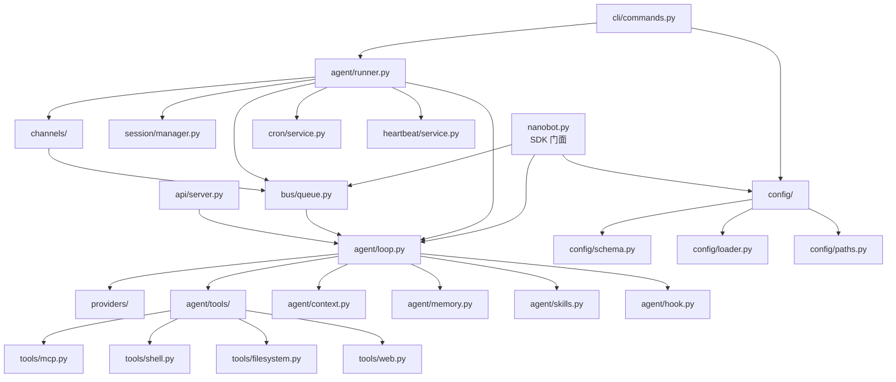
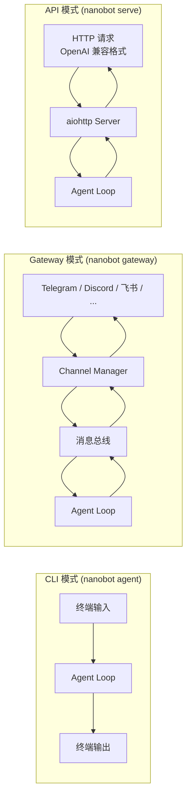

# 项目全景

## 学习目标

搞清楚 nanobot 是什么、为谁而做、用了哪些技术、代码怎么组织、有几种运行方式。读完本章后，应该能在脑中建立起项目的整体画面。

## 项目定位

nanobot 是由香港大学数据科学实验室（HKUDS）开发的**超轻量级个人 AI 助手框架**，灵感来自 [OpenClaw](https://github.com/anthropics/claude-code)（Claude Code 的开源实现），号称用 **99% 更少的代码**实现核心 agent 功能。

三个核心卖点：

| 特性 | 说明 |
|------|------|
| Ultra-Lightweight | 核心 agent 代码极少，易于理解和修改 |
| Research-Ready | 面向研究场景，方便实验和定制 |
| Lightning Fast | 启动快、资源占用低 |

PyPI 包名为 `nanobot-ai`，当前版本 `v0.1.4.post6`，MIT 许可证。

> 文件：`nanobot/__init__.py`

```python
__version__ = "0.1.4.post6"
__logo__ = "🐈"

from nanobot.nanobot import Nanobot, RunResult

__all__ = ["Nanobot", "RunResult"]
```

对外只暴露两个核心类：`Nanobot`（SDK 门面）和 `RunResult`（运行结果）。

## 技术栈

### Python 端（核心）

```
┌─────────────────────────────────────────────────────────┐
│                    nanobot 技术栈                         │
├──────────────┬──────────────────────────────────────────┤
│ 语言/运行时   │ Python >= 3.11                           │
│ 构建系统      │ hatchling                                │
│ LLM 交互     │ openai SDK + anthropic SDK               │
│ 配置/数据模型 │ pydantic + pydantic-settings             │
│ CLI          │ typer + rich + prompt-toolkit + questionary│
│ 异步 HTTP    │ httpx                                     │
│ 定时任务      │ croniter                                  │
│ MCP 协议     │ mcp                                       │
│ 日志         │ loguru                                     │
│ Token 计数   │ tiktoken                                   │
│ 代码质量      │ ruff (lint + format)                      │
│ 测试         │ pytest + pytest-asyncio + pytest-cov       │
└──────────────┴──────────────────────────────────────────┘
```

### Node.js 端（WhatsApp Bridge）

独立的 TypeScript 进程，通过 localhost HTTP 与 Python 主进程通信：

- 运行时：Node.js >= 20
- WhatsApp 协议：`@whiskeysockets/baileys`
- 通信：`ws`（WebSocket）
- 日志：`pino`

### 容器化

- 基础镜像：`ghcr.io/astral-sh/uv:python3.12-bookworm-slim`（使用 uv 作为包管理器）
- Docker Compose 定义了 `gateway` 和 `cli` 两个服务
- Gateway 默认端口 18790，资源限制 1 CPU / 1G 内存

### 可选依赖分组

> 文件：`nanobot/pyproject.toml`

```toml
[project.optional-dependencies]
api = ["aiohttp>=3.11"]           # OpenAI 兼容 API 服务
wecom = ["wecom-aibot-sdk-python"] # 企业微信
weixin = ["qrcode", "pycryptodome"] # 微信
matrix = ["matrix-nio", "mistune", "nh3"] # Matrix 协议
langsmith = ["langsmith>=0.3"]     # 可观测性
dev = ["pytest", "pytest-asyncio", "pytest-cov", "ruff"] # 开发工具
```

## 目录结构

```
nanobot/
├── nanobot/                     # Python 主包
│   ├── __init__.py              # 版本号，导出 Nanobot 和 RunResult
│   ├── __main__.py              # python -m nanobot 入口
│   ├── nanobot.py               # SDK 门面类
│   │
│   ├── agent/                   # 🧠 核心 Agent 逻辑
│   │   ├── loop.py              # Agent 循环（LLM ↔ 工具执行）
│   │   ├── runner.py            # Agent 运行器，生命周期管理
│   │   ├── context.py           # Prompt 构建器
│   │   ├── memory.py            # 持久化记忆
│   │   ├── skills.py            # Skills 加载器
│   │   ├── subagent.py          # 后台子任务执行
│   │   ├── hook.py              # 生命周期钩子
│   │   └── tools/               # 内置工具集
│   │       ├── base.py          # 工具基类
│   │       ├── registry.py      # 工具注册表
│   │       ├── shell.py         # Shell 执行
│   │       ├── filesystem.py    # 文件系统操作
│   │       ├── web.py           # Web 搜索/抓取
│   │       ├── cron.py          # 定时任务工具
│   │       ├── mcp.py           # MCP 协议工具
│   │       ├── message.py       # 消息工具
│   │       └── spawn.py         # 子 Agent 生成
│   │
│   ├── channels/                # 📡 聊天渠道集成
│   │   ├── base.py              # BaseChannel 抽象基类
│   │   ├── registry.py          # 渠道注册（含 entry_points 插件发现）
│   │   ├── manager.py           # 渠道管理器
│   │   ├── telegram.py          # Telegram
│   │   ├── discord.py           # Discord
│   │   ├── whatsapp.py          # WhatsApp
│   │   ├── feishu.py            # 飞书
│   │   ├── dingtalk.py          # 钉钉
│   │   ├── slack.py             # Slack
│   │   ├── email.py             # 邮件
│   │   ├── qq.py                # QQ
│   │   ├── matrix.py            # Matrix
│   │   ├── weixin.py            # 微信
│   │   ├── wecom.py             # 企业微信
│   │   └── mochat.py            # Claw IM
│   │
│   ├── providers/               # 🔌 LLM 提供商
│   │   ├── base.py              # Provider 基类
│   │   ├── registry.py          # ProviderSpec 注册表（20+ 提供商）
│   │   ├── openai_compat_provider.py  # OpenAI 兼容通用 Provider
│   │   ├── anthropic_provider.py      # Anthropic 原生 Provider
│   │   ├── azure_openai_provider.py   # Azure OpenAI
│   │   ├── openai_codex_provider.py   # Codex OAuth
│   │   └── transcription.py          # 语音转写
│   │
│   ├── bus/                     # 📨 消息总线
│   │   ├── events.py            # 事件定义
│   │   └── queue.py             # 消息队列
│   │
│   ├── session/                 # 🔑 会话管理
│   │   └── manager.py           # 会话隔离
│   │
│   ├── config/                  # ⚙️ 配置系统
│   │   ├── schema.py            # Pydantic 配置模型
│   │   ├── loader.py            # 配置加载/保存/迁移
│   │   └── paths.py             # 路径解析
│   │
│   ├── cron/                    # ⏰ 定时任务
│   │   ├── service.py           # Cron 服务
│   │   └── types.py             # Cron 类型定义
│   │
│   ├── heartbeat/               # 💓 心跳/主动唤醒
│   │   └── service.py           # 每 30 分钟检查 HEARTBEAT.md
│   │
│   ├── command/                 # 🎯 命令路由
│   │   ├── router.py            # 命令路由器
│   │   └── builtin.py           # 内置命令
│   │
│   ├── cli/                     # 💻 CLI 命令
│   │   ├── commands.py          # Typer app 定义
│   │   ├── onboard.py           # 初始化向导
│   │   ├── models.py            # CLI 模型
│   │   └── stream.py            # 流式输出
│   │
│   ├── api/                     # 🌐 OpenAI 兼容 API 服务
│   │   └── server.py            # aiohttp 服务器
│   │
│   ├── security/                # 🔒 安全模块
│   │   └── network.py           # 网络安全
│   │
│   ├── utils/                   # 🛠️ 工具函数
│   │   ├── helpers.py           # 通用辅助
│   │   └── evaluator.py         # 表达式求值
│   │
│   ├── skills/                  # 📚 内置技能（Markdown 格式）
│   │   ├── github/SKILL.md
│   │   ├── weather/SKILL.md
│   │   ├── summarize/SKILL.md
│   │   ├── tmux/SKILL.md
│   │   ├── clawhub/SKILL.md
│   │   ├── cron/SKILL.md
│   │   ├── memory/SKILL.md
│   │   └── skill-creator/SKILL.md
│   │
│   └── templates/               # 📄 模板文件
│       ├── SOUL.md              # Agent 人格
│       ├── AGENTS.md            # Agent 配置模板
│       ├── HEARTBEAT.md         # 心跳任务模板
│       ├── TOOLS.md             # 工具说明模板
│       ├── USER.md              # 用户信息模板
│       └── memory/MEMORY.md     # 记忆模板
│
├── bridge/                      # WhatsApp Node.js 桥接
├── tests/                       # 测试套件
├── docs/                        # 文档
├── case/                        # 演示 GIF
├── pyproject.toml               # 项目配置 & 依赖
├── Dockerfile                   # 容器构建
├── docker-compose.yml           # 容器编排
└── core_agent_lines.sh          # 核心代码行数统计
```

## 核心依赖关系

下图展示了 nanobot 各模块之间的依赖关系：



## 三种运行模式

nanobot 提供三种运行方式，适应不同使用场景：



### 1. CLI 模式 (`nanobot agent`)

交互式终端对话，类似 Claude Code 的体验。使用 `prompt-toolkit` 提供输入历史、编辑等功能。适合个人本地使用。

### 2. Gateway 模式 (`nanobot gateway`)

启动一个长驻服务，同时连接多个聊天渠道（Telegram、Discord、飞书、钉钉等）。消息通过事件总线在渠道和 Agent 之间流转。默认端口 18790。

### 3. API 模式 (`nanobot serve`)

启动一个 OpenAI 兼容的 HTTP API 服务器，可以被其他应用通过标准 OpenAI SDK 调用。默认端口 8900。

## 配置体系概览

nanobot 使用 `~/.nanobot/config.json` 作为配置中心，由 Pydantic 模型驱动：

> 文件：`nanobot/config/schema.py`

```python
class Config(BaseSettings):
    """Root configuration for nanobot."""
    agents: AgentsConfig          # Agent 默认参数（模型、token 限制等）
    channels: ChannelsConfig      # 渠道配置（Telegram token、Discord bot 等）
    providers: ProvidersConfig    # LLM 提供商（API key、base URL 等）
    api: ApiConfig                # API 服务配置
    gateway: GatewayConfig        # Gateway 服务配置
    tools: ToolsConfig            # 工具配置（Shell、Web、MCP 等）
```

支持 20+ 个 LLM 提供商，包括 OpenAI、Anthropic、DeepSeek、Groq、智谱、通义千问、Ollama、vLLM 等，通过 `model` 字段的前缀自动匹配对应的 Provider。

配置还支持环境变量覆盖，前缀为 `NANOBOT_`，嵌套用 `__` 分隔。

## SDK 门面

除了 CLI 使用，nanobot 还提供了简洁的 Python SDK：

> 文件：`nanobot/nanobot.py`

```python
bot = Nanobot.from_config()
result = await bot.run("Summarize this repo", hooks=[MyHook()])
print(result.content)
```

`Nanobot.from_config()` 负责加载配置、创建 Provider、初始化消息总线和 Agent Loop，然后通过 `bot.run()` 发送消息并获取结果。这是编程方式集成 nanobot 的入口。

## 测试体系

```
tests/
├── agent/          # 15 个测试文件（loop, context, memory, hook, runner, session 等）
├── channels/       # 12 个测试文件（每个渠道 + 插件系统 + 流式）
├── cli/            # 3 个测试文件
├── config/         # 2 个测试文件
├── cron/           # 2 个测试文件
├── providers/      # 5 个测试文件
├── security/       # 1 个测试文件
├── tools/          # 7 个测试文件
├── test_nanobot_facade.py   # SDK 门面测试
├── test_openai_api.py       # API 兼容性测试
└── test_docker.sh           # Docker 测试脚本
```

CI 在 GitHub Actions 上运行，覆盖 Python 3.11 / 3.12 / 3.13 三个版本。

## 与同类项目的对比

nanobot 的定位可以通过与同类项目对比来理解：

| 维度 | nanobot | Claude Code (OpenClaw) | LangChain Agent |
|------|---------|----------------------|-----------------|
| 代码量 | 极少（核心 ~500 行） | 较大 | 很大 |
| 学习曲线 | 低 | 中 | 高 |
| 多渠道 | 内置 13 个渠道 | 仅 CLI | 需自行集成 |
| LLM 支持 | 20+ Provider | 仅 Anthropic | 多 |
| 扩展方式 | Skills + MCP + 插件 | Skills + MCP | Chain + Tool |
| 适用场景 | 个人助手 / 研究 | 编程助手 | 通用 Agent |

## 快速上手

```bash
# 安装
pip install nanobot-ai

# 初始化配置（交互式向导）
nanobot init

# CLI 模式对话
nanobot agent

# Gateway 模式（连接聊天渠道）
nanobot gateway

# Docker 部署
docker compose up gateway
```

## 检查点

1. nanobot 的三种运行模式分别是什么？各自适用什么场景？
2. nanobot 的配置文件在哪里？配置的根模型包含哪几个顶层字段？
3. 如果要用编程方式调用 nanobot，应该使用哪个类？核心 API 是什么？
4. nanobot 的 `channels/` 和 `providers/` 目录分别负责什么？它们的扩展机制有什么相似之处？
5. 项目的核心 agent 逻辑集中在哪个目录？该目录下最关键的文件是哪个？
