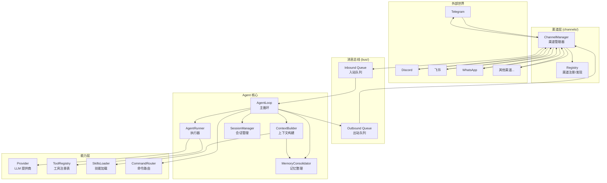
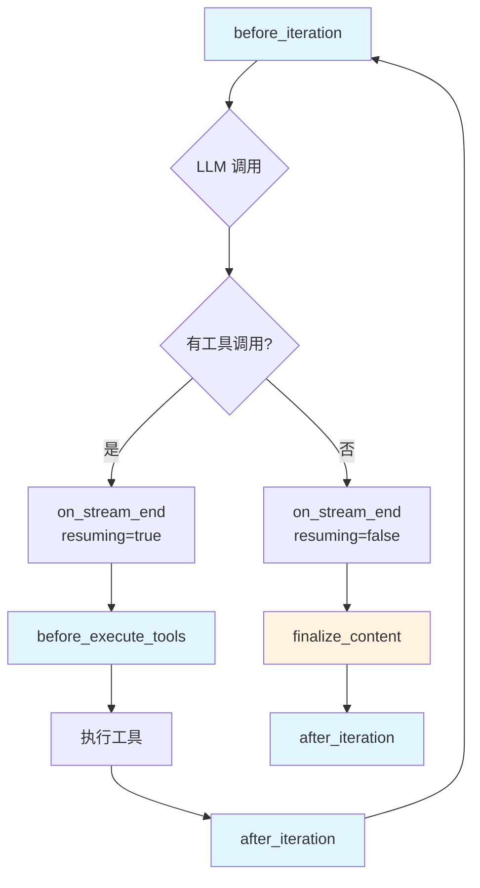
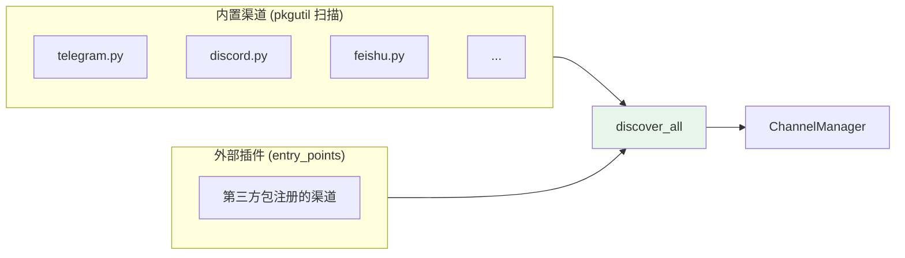
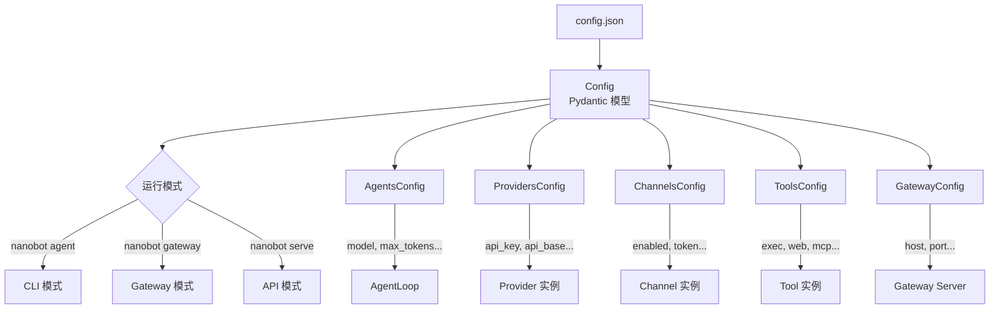

# 架构拆解

## 学习目标

理解 nanobot 的整体架构设计：消息如何在各模块之间流转、核心抽象有哪些、配置体系如何驱动运行时行为。读完本章后，应该能画出完整的消息流图，并理解每个模块在架构中的角色。

## 架构总览

nanobot 采用**消息总线（Message Bus）**作为核心架构模式，将聊天渠道和 Agent 核心完全解耦。整体架构可以用一句话概括：

> 渠道收消息 → 总线传递 → Agent 处理 → 总线传递 → 渠道发消息



## 消息总线：架构的心脏

消息总线是整个架构中最简洁也最关键的组件——只有两个 `asyncio.Queue`：

> 文件：`nanobot/bus/queue.py`

```python
class MessageBus:
    def __init__(self):
        self.inbound: asyncio.Queue[InboundMessage] = asyncio.Queue()
        self.outbound: asyncio.Queue[OutboundMessage] = asyncio.Queue()
```

所有通信都通过这两个队列完成：
- **Inbound Queue**：渠道 → Agent（用户发来的消息）
- **Outbound Queue**：Agent → 渠道（要发出去的回复）

### 消息数据结构

> 文件：`nanobot/bus/events.py`

```python
@dataclass
class InboundMessage:
    channel: str          # 来源渠道名（telegram, discord, slack...）
    sender_id: str        # 发送者 ID
    chat_id: str          # 聊天/频道 ID
    content: str          # 消息文本
    timestamp: datetime   # 时间戳
    media: list[str]      # 媒体文件路径列表
    metadata: dict        # 渠道特定的元数据

    @property
    def session_key(self) -> str:
        return self.session_key_override or f"{self.channel}:{self.chat_id}"

@dataclass
class OutboundMessage:
    channel: str          # 目标渠道
    chat_id: str          # 目标聊天
    content: str          # 回复文本
    reply_to: str | None  # 回复的消息 ID
    media: list[str]      # 附带的媒体文件
    metadata: dict        # 元数据（含流式控制标记）
```

`session_key` 的设计很巧妙——默认用 `channel:chat_id` 组合，保证不同渠道、不同聊天的会话天然隔离。

## 完整消息流

以 Gateway 模式下一条 Telegram 消息为例，追踪完整的处理链路：

```mermaid
sequenceDiagram
    participant User as 用户
    participant TG as TelegramChannel
    participant Bus as MessageBus
    participant Loop as AgentLoop
    participant Runner as AgentRunner
    participant LLM as LLM Provider
    participant Tools as 工具集
    participant Session as SessionManager
    participant CM as ChannelManager

    User->>TG: 发送消息
    TG->>TG: is_allowed() 权限检查
    TG->>Bus: publish_inbound(InboundMessage)

    Bus->>Loop: consume_inbound()
    Loop->>Loop: 检查是否为优先命令（/stop 等）
    Loop->>Loop: _dispatch() 创建异步任务

    Loop->>Session: get_or_create(session_key)
    Session-->>Loop: 返回会话（含历史消息）

    Loop->>Loop: 检查斜杠命令（/clear, /status 等）
    Loop->>Loop: ContextBuilder.build_messages()
    Note over Loop: 组装 system prompt + 历史 + 当前消息

    Loop->>Runner: run(AgentRunSpec)

    loop Agent 迭代循环
        Runner->>LLM: chat_with_retry(messages, tools)
        LLM-->>Runner: LLMResponse

        alt 有工具调用
            Runner->>Tools: execute(tool_name, args)
            Tools-->>Runner: 工具结果
            Runner->>Runner: 将结果追加到 messages
            Note over Runner: 继续下一轮迭代
        else 纯文本回复
            Runner-->>Loop: AgentRunResult
        end
    end

    Loop->>Session: 保存本轮对话
    Loop->>Bus: publish_outbound(OutboundMessage)

    Bus->>CM: consume_outbound()
    CM->>CM: _send_with_retry() 带重试
    CM->>TG: send(OutboundMessage)
    TG->>User: 发送回复
```

## 六大核心抽象

nanobot 的架构围绕六个核心抽象展开：

### 1. AgentLoop — 主循环

> 文件：`nanobot/agent/loop.py`

AgentLoop 是整个系统的中枢，负责：
- 从总线消费消息
- 管理会话和上下文
- 调度 AgentRunner 执行 LLM 交互
- 处理斜杠命令
- 管理 MCP 连接
- 控制并发（每 session 串行，跨 session 并行）

```python
class AgentLoop:
    def __init__(self, bus, provider, workspace, ...):
        self.bus = bus                    # 消息总线
        self.provider = provider          # LLM 提供商
        self.context = ContextBuilder()   # 上下文构建器
        self.sessions = SessionManager()  # 会话管理
        self.tools = ToolRegistry()       # 工具注册表
        self.runner = AgentRunner()       # Agent 执行器
        self.subagents = SubagentManager()# 子 Agent 管理
        self.commands = CommandRouter()   # 命令路由
        self.memory_consolidator = MemoryConsolidator()  # 记忆整理
```

并发控制的设计值得注意：

```python
# 每个 session 一把锁 → 同一会话内串行处理
lock = self._session_locks.setdefault(msg.session_key, asyncio.Lock())
# 全局并发门控 → 限制同时处理的请求数（默认 3）
gate = self._concurrency_gate or nullcontext()
async with lock, gate:
    await self._process_message(msg)
```

### 2. AgentRunner — 执行器

> 文件：`nanobot/agent/runner.py`

AgentRunner 是一个纯粹的「LLM + 工具」迭代循环，不关心消息总线、会话、渠道等上层概念：

```python
class AgentRunner:
    async def run(self, spec: AgentRunSpec) -> AgentRunResult:
        for iteration in range(spec.max_iterations):
            # 1. 调用 LLM
            response = await self.provider.chat_with_retry(messages, tools)

            if response.has_tool_calls:
                # 2. 执行工具（支持并发）
                results = await self._execute_tools(spec, response.tool_calls)
                # 3. 将结果追加到消息列表，继续迭代
                continue

            # 4. 没有工具调用 → 返回最终结果
            return AgentRunResult(final_content=clean, ...)
```

这个分层很清晰：AgentLoop 处理「产品层」逻辑（会话、渠道、命令），AgentRunner 只处理「引擎层」逻辑（LLM 调用 + 工具执行）。

### 3. ContextBuilder — 上下文构建器

> 文件：`nanobot/agent/context.py`

负责组装发给 LLM 的完整消息列表：

```python
def build_messages(self, history, current_message, ...) -> list[dict]:
    return [
        {"role": "system", "content": self.build_system_prompt()},  # 系统提示
        *history,                                                     # 历史对话
        {"role": "user", "content": merged},                         # 当前消息
    ]
```

System Prompt 的组装顺序：

```
┌─────────────────────────────────┐
│ 1. Identity（身份 + 运行时信息）  │
├─────────────────────────────────┤
│ 2. Bootstrap Files              │
│    AGENTS.md / SOUL.md /        │
│    USER.md / TOOLS.md           │
├─────────────────────────────────┤
│ 3. Memory（持久化记忆）          │
├─────────────────────────────────┤
│ 4. Always-on Skills（常驻技能）  │
├─────────────────────────────────┤
│ 5. Skills Summary（技能目录）    │
└─────────────────────────────────┘
```

用户消息前还会注入一段运行时上下文（当前时间、渠道、聊天 ID），标记为 `[Runtime Context — metadata only, not instructions]`，防止被当作指令执行。

### 4. SessionManager — 会话管理

> 文件：`nanobot/session/manager.py`

会话以 JSONL 格式持久化到磁盘，每个 session_key 对应一个文件：

```
~/.nanobot/workspace/sessions/
├── telegram_12345.jsonl
├── discord_67890.jsonl
└── cli_direct.jsonl
```

关键设计：
- **Append-only**：消息只追加不修改，对 LLM 缓存友好
- **Legal boundary**：`get_history()` 会确保返回的历史不会以孤立的 tool result 开头（某些 Provider 会拒绝这种格式）
- **记忆整理**：`last_consolidated` 标记已整理到 MEMORY.md 的消息位置，避免重复整理

```python
def get_history(self, max_messages=500) -> list[dict]:
    unconsolidated = self.messages[self.last_consolidated:]
    sliced = unconsolidated[-max_messages:]
    # 确保从 user 消息开始
    # 确保没有孤立的 tool result
    start = self._find_legal_start(sliced)
    return sliced[start:]
```

### 5. 生命周期钩子（Hook）

> 文件：`nanobot/agent/hook.py`

AgentHook 定义了 Agent 执行过程中的六个扩展点：



| 钩子 | 时机 | 用途 |
|------|------|------|
| `before_iteration` | 每轮迭代开始前 | 日志、监控 |
| `on_stream` | 流式输出每个 delta | 实时推送给用户 |
| `on_stream_end` | 流式结束 | 区分「还有工具调用」和「最终回复」 |
| `before_execute_tools` | 工具执行前 | 进度提示、日志 |
| `after_iteration` | 每轮迭代结束后 | 监控、统计 |
| `finalize_content` | 最终内容后处理 | 去除 `<think>` 标签等 |

`CompositeHook` 实现了扇出模式，支持多个钩子组合，且异步方法有错误隔离——单个钩子出错不会影响其他钩子。

### 6. CommandRouter — 命令路由

> 文件：`nanobot/command/router.py`

处理斜杠命令（如 `/clear`、`/status`、`/stop`），分为两类：
- **优先命令**（priority）：在消息进入 Agent 处理前就拦截，如 `/stop`
- **普通命令**：在 `_process_message` 内部处理，如 `/clear`、`/status`

## 渠道层设计

### 渠道注册与发现

> 文件：`nanobot/channels/registry.py`

nanobot 用两种机制发现渠道：



1. **pkgutil 扫描**：自动发现 `nanobot/channels/` 包下所有模块（排除 base、manager、registry）
2. **entry_points 插件**：第三方包通过 `nanobot.channels` entry point 注册

内置渠道优先级高于外部插件，同名时外部插件被忽略。

### BaseChannel 抽象

> 文件：`nanobot/channels/base.py`

每个渠道需要实现三个核心方法：

```python
class BaseChannel(ABC):
    @abstractmethod
    async def start(self) -> None: ...    # 启动并监听消息

    @abstractmethod
    async def stop(self) -> None: ...     # 停止并清理资源

    @abstractmethod
    async def send(self, msg: OutboundMessage) -> None: ...  # 发送消息
```

还有几个可选能力：
- `send_delta()`：流式输出支持（需配合 `supports_streaming` 属性）
- `login()`：交互式登录（如 WhatsApp 扫码）
- `is_allowed()`：基于 `allow_from` 列表的权限控制
- `transcribe_audio()`：语音转文字（通过 Groq Whisper）

### ChannelManager 的职责

> 文件：`nanobot/channels/manager.py`

ChannelManager 做三件事：

1. **初始化**：根据配置启用渠道，注入消息总线
2. **出站分发**：持续消费 Outbound Queue，路由到对应渠道
3. **重试与合并**：发送失败时指数退避重试（1s → 2s → 4s），流式 delta 消息自动合并减少 API 调用

流式消息合并是个有意思的优化：

```python
def _coalesce_stream_deltas(self, first_msg):
    """当 LLM 生成速度 > 渠道发送速度时，合并队列中连续的 delta"""
    combined_content = first_msg.content
    while True:
        next_msg = self.bus.outbound.get_nowait()  # 非阻塞取
        if same_target and is_delta:
            combined_content += next_msg.content    # 合并
        else:
            break  # 遇到非 delta 消息，停止合并
    return merged_message
```

## 配置驱动的运行时

nanobot 的配置体系是「声明式」的——你在 `config.json` 里声明想要什么，框架自动组装运行时：



### Provider 自动匹配

配置中的 `model` 字段决定使用哪个 Provider，匹配逻辑在 `Config._match_provider()` 中：

```
匹配优先级：
1. 强制指定 provider（config.agents.defaults.provider != "auto"）
2. 模型名前缀匹配（如 "anthropic/claude-3" → anthropic provider）
3. 关键词匹配（如模型名含 "deepseek" → deepseek provider）
4. 本地 Provider 回退（如 Ollama，通过 api_base 中的端口号检测）
5. 网关 Provider 回退（第一个有 api_key 的 provider）
```

### 环境变量覆盖

```python
class Config(BaseSettings):
    model_config = ConfigDict(env_prefix="NANOBOT_", env_nested_delimiter="__")
```

任何配置项都可以通过环境变量覆盖，例如：
- `NANOBOT_AGENTS__DEFAULTS__MODEL=deepseek/deepseek-chat`
- `NANOBOT_PROVIDERS__DEEPSEEK__API_KEY=sk-xxx`

## 模块依赖层次

从依赖方向看，nanobot 的模块形成清晰的分层：

```
┌─────────────────────────────────────────────┐
│            CLI / Gateway / API              │  ← 入口层
├─────────────────────────────────────────────┤
│              AgentLoop                      │  ← 编排层
├──────────┬──────────┬───────────┬───────────┤
│ Runner   │ Context  │ Session   │ Command   │  ← 核心层
├──────────┼──────────┼───────────┼───────────┤
│ Provider │ Tools    │ Skills    │ Memory    │  ← 能力层
├──────────┴──────────┴───────────┴───────────┤
│         Bus / Events / Config               │  ← 基础设施层
└─────────────────────────────────────────────┘
```

依赖规则：
- 上层可以依赖下层，反之不行
- 同层之间尽量不互相依赖
- Bus 和 Config 是最底层，被所有模块依赖
- AgentLoop 是唯一的「编排层」，负责把所有模块串起来

## 检查点

1. 消息总线（MessageBus）包含哪两个队列？它们分别承载什么方向的消息？
2. AgentLoop 和 AgentRunner 的职责边界是什么？为什么要做这个分层？
3. ContextBuilder 组装 System Prompt 时，按什么顺序拼接哪些内容？
4. SessionManager 的 `get_history()` 为什么要做 "legal boundary" 检查？
5. 渠道管理器的 `_coalesce_stream_deltas` 解决了什么问题？它的触发条件是什么？
