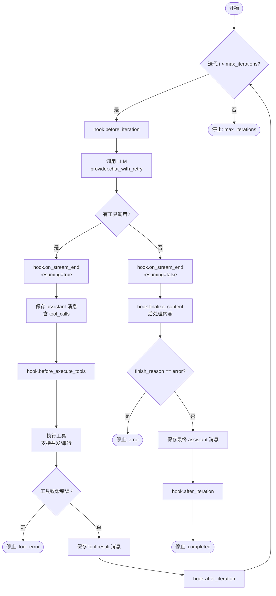
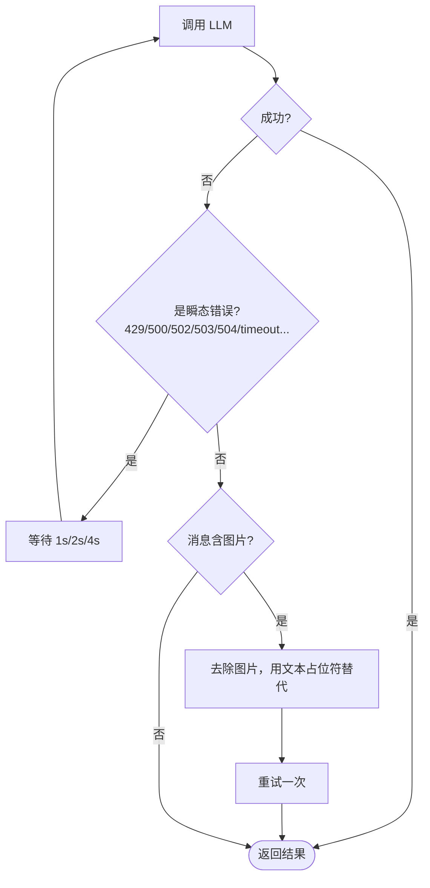
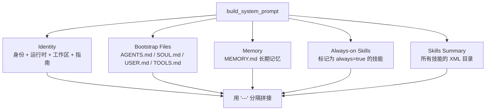
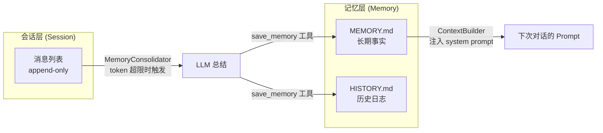
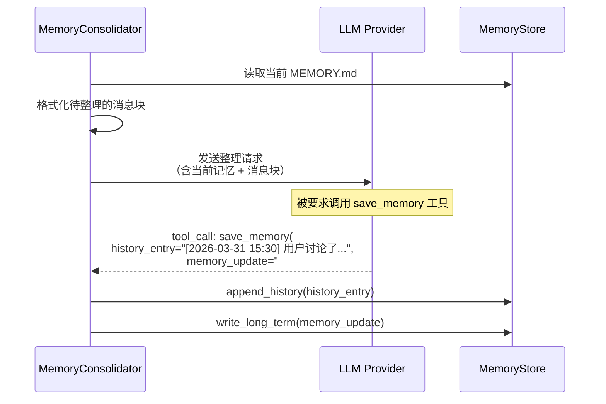
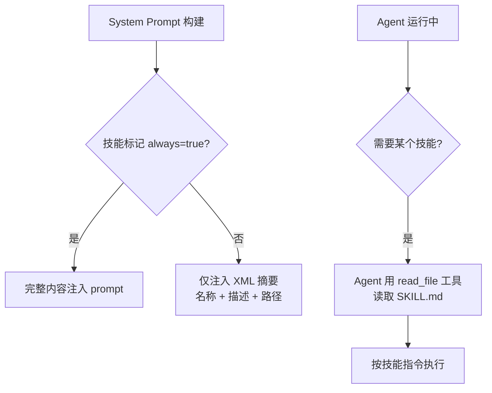
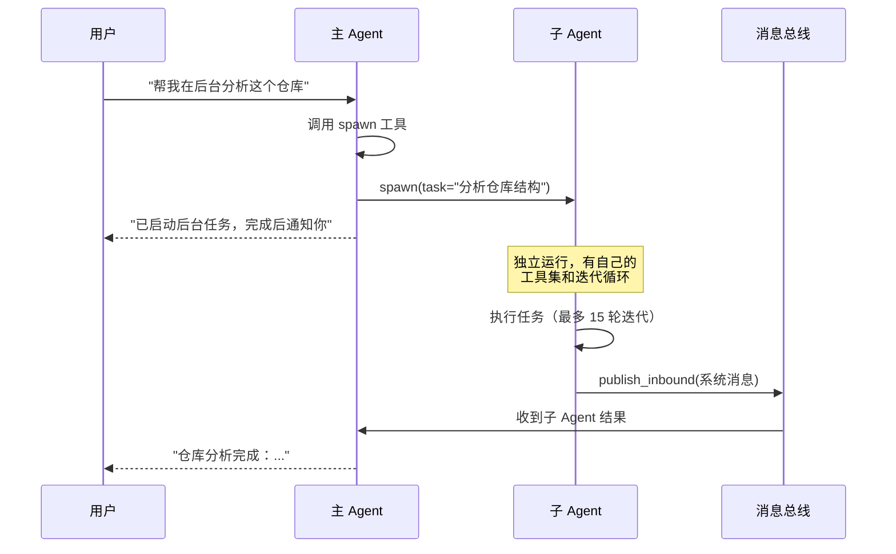
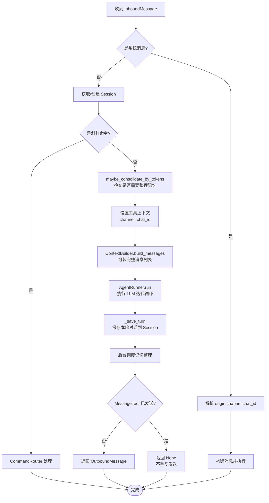

# Agent 核心

## 学习目标

深入理解 nanobot 的 Agent 引擎：AgentRunner 如何驱动 LLM 与工具的迭代循环、ContextBuilder 如何组装 prompt、记忆系统如何实现长期持久化、子 Agent 如何在后台执行任务。读完本章后，应该能完整描述一条消息从进入 Agent 到产出回复的每一步细节。

## AgentRunner：迭代引擎

AgentRunner 是 nanobot 最核心的组件——一个纯粹的「LLM + 工具」迭代循环，不关心会话、渠道、命令等上层概念。

> 文件：`nanobot/agent/runner.py`

### 执行规格（AgentRunSpec）

每次执行由一个 `AgentRunSpec` 描述：

```python
@dataclass(slots=True)
class AgentRunSpec:
    initial_messages: list[dict]   # 初始消息列表（system + history + user）
    tools: ToolRegistry            # 可用工具集
    model: str                     # 模型标识
    max_iterations: int            # 最大迭代次数
    temperature: float | None      # 温度（可选覆盖）
    max_tokens: int | None         # 最大 token（可选覆盖）
    reasoning_effort: str | None   # 推理力度（low/medium/high）
    hook: AgentHook | None         # 生命周期钩子
    error_message: str | None      # 错误时的兜底消息
    concurrent_tools: bool = False # 是否并发执行工具
    fail_on_tool_error: bool = False # 工具出错是否终止
```

### 核心循环



关键代码简化版：

```python
class AgentRunner:
    async def run(self, spec: AgentRunSpec) -> AgentRunResult:
        messages = list(spec.initial_messages)

        for iteration in range(spec.max_iterations):
            # 1. 调用 LLM（支持流式和非流式）
            if hook.wants_streaming():
                response = await self.provider.chat_stream_with_retry(
                    messages=messages, tools=spec.tools.get_definitions(), ...
                )
            else:
                response = await self.provider.chat_with_retry(...)

            # 2. 有工具调用 → 执行工具，追加结果，继续迭代
            if response.has_tool_calls:
                messages.append(build_assistant_message(response.content, tool_calls=...))
                results = await self._execute_tools(spec, response.tool_calls)
                for tool_call, result in zip(response.tool_calls, results):
                    messages.append({"role": "tool", "tool_call_id": ..., "content": result})
                continue

            # 3. 无工具调用 → 最终回复，退出循环
            clean = hook.finalize_content(context, response.content)
            return AgentRunResult(final_content=clean, ...)

        # 4. 达到最大迭代次数
        return AgentRunResult(stop_reason="max_iterations", ...)
```

### 工具执行策略

```python
async def _execute_tools(self, spec, tool_calls):
    if spec.concurrent_tools:
        # 并发执行所有工具调用
        results = await asyncio.gather(*(
            self._run_tool(spec, tc) for tc in tool_calls
        ))
    else:
        # 串行执行
        results = [await self._run_tool(spec, tc) for tc in tool_calls]
```

主 Agent 使用 `concurrent_tools=True`（并发），子 Agent 使用 `fail_on_tool_error=True`（出错即停）。

### 执行结果（AgentRunResult）

```python
@dataclass(slots=True)
class AgentRunResult:
    final_content: str | None       # 最终回复文本
    messages: list[dict]            # 完整消息列表（含所有迭代）
    tools_used: list[str]           # 使用过的工具名列表
    usage: dict[str, int]           # token 用量
    stop_reason: str                # completed / max_iterations / error / tool_error
    error: str | None               # 错误信息
    tool_events: list[dict[str, str]]  # 工具执行事件日志
```

## LLM Provider 抽象

AgentRunner 通过 `LLMProvider` 抽象与 LLM 交互，不直接依赖任何具体的 API。

> 文件：`nanobot/providers/base.py`

### 核心数据结构

```python
@dataclass
class ToolCallRequest:
    """LLM 返回的工具调用请求"""
    id: str                    # 调用 ID
    name: str                  # 工具名
    arguments: dict[str, Any]  # 参数

@dataclass
class LLMResponse:
    """LLM 响应的统一封装"""
    content: str | None                    # 文本内容
    tool_calls: list[ToolCallRequest]      # 工具调用列表
    finish_reason: str                     # stop / error
    usage: dict[str, int]                  # token 用量
    reasoning_content: str | None          # DeepSeek-R1 等的推理内容
    thinking_blocks: list[dict] | None     # Anthropic extended thinking
```

`LLMResponse` 同时支持 OpenAI 风格的 `reasoning_content` 和 Anthropic 风格的 `thinking_blocks`，做到了多 Provider 兼容。

### Provider 基类

```python
class LLMProvider(ABC):
    _CHAT_RETRY_DELAYS = (1, 2, 4)  # 重试延迟：1s, 2s, 4s

    @abstractmethod
    async def chat(self, messages, tools, model, ...) -> LLMResponse: ...

    @abstractmethod
    def get_default_model(self) -> str: ...
```

子类只需实现 `chat()` 和 `get_default_model()` 两个方法。基类提供了丰富的通用能力：

```
┌─────────────────────────────────────────────────┐
│              LLMProvider 基类能力                 │
├─────────────────────────────────────────────────┤
│ chat_with_retry()       带重试的非流式调用        │
│ chat_stream_with_retry() 带重试的流式调用         │
│ _safe_chat()            异常兜底                  │
│ _is_transient_error()   瞬态错误检测              │
│ _strip_image_content()  图片降级（出错时去图重试） │
│ _sanitize_empty_content() 空内容清洗              │
│ _sanitize_request_messages() 消息字段过滤         │
└─────────────────────────────────────────────────┘
```

### 重试与降级策略



`GenerationSettings` 是一个不可变的数据类，挂在 Provider 实例上作为默认参数：

```python
@dataclass(frozen=True)
class GenerationSettings:
    temperature: float = 0.7
    max_tokens: int = 4096
    reasoning_effort: str | None = None  # low / medium / high
```

使用 `_SENTINEL` 哨兵对象区分「未传参」和「显式传 None」，让调用方可以选择性覆盖默认值。

## ContextBuilder：Prompt 组装

> 文件：`nanobot/agent/context.py`

ContextBuilder 负责把所有上下文信息组装成 LLM 能理解的消息列表。

### System Prompt 组装



Identity 部分包含了丰富的运行时信息：

```python
def _get_identity(self) -> str:
    return f"""# nanobot 🐈
You are nanobot, a helpful AI assistant.

## Runtime
{runtime}  # 如 "macOS arm64, Python 3.12.0"

## Workspace
Your workspace is at: {workspace_path}
- Long-term memory: {workspace_path}/memory/MEMORY.md
- History log: {workspace_path}/memory/HISTORY.md
- Custom skills: {workspace_path}/skills/{{skill-name}}/SKILL.md

## Platform Policy
{platform_policy}  # Windows 或 POSIX 特定指南

## nanobot Guidelines
- State intent before tool calls...
- Before modifying a file, read it first...
..."""
```

### Bootstrap Files（引导文件）

工作区下的四个可选文件，用户可以自定义 Agent 的行为：

| 文件 | 用途 | 默认模板 |
|------|------|---------|
| `SOUL.md` | Agent 人格（性格、价值观、沟通风格） | 友好、简洁、好奇 |
| `AGENTS.md` | Agent 配置（角色定义、行为规则） | 通用助手 |
| `USER.md` | 用户信息（偏好、背景） | 空 |
| `TOOLS.md` | 工具使用说明 | 空 |

> 文件：`nanobot/templates/SOUL.md`

```markdown
# Soul
I am nanobot 🐈, a personal AI assistant.

## Personality
- Helpful and friendly
- Concise and to the point
- Curious and eager to learn

## Values
- Accuracy over speed
- User privacy and safety
- Transparency in actions
```

### 消息列表组装

```python
def build_messages(self, history, current_message, media, channel, chat_id):
    runtime_ctx = self._build_runtime_context(channel, chat_id, self.timezone)
    user_content = self._build_user_content(current_message, media)

    # 运行时上下文和用户消息合并为一条，避免连续同角色消息
    merged = f"{runtime_ctx}\n\n{user_content}"

    return [
        {"role": "system", "content": self.build_system_prompt()},
        *history,                    # 历史对话
        {"role": "user", "content": merged},  # 当前消息
    ]
```

运行时上下文以特殊标记开头，防止被当作指令：

```
[Runtime Context — metadata only, not instructions]
Current Time: 2026-03-31 15:30 (Asia/Shanghai)
Channel: telegram
Chat ID: 12345
```

### 图片处理

当消息包含图片时，自动转为 base64 编码的多模态内容：

```python
def _build_user_content(self, text, media):
    if not media:
        return text  # 纯文本

    images = []
    for path in media:
        raw = Path(path).read_bytes()
        mime = detect_image_mime(raw)  # 从魔数检测真实 MIME
        b64 = base64.b64encode(raw).decode()
        images.append({
            "type": "image_url",
            "image_url": {"url": f"data:{mime};base64,{b64}"},
        })

    return images + [{"type": "text", "text": text}]
```

## 记忆系统

nanobot 的记忆系统分为两层，实现了对话历史的长期持久化。

> 文件：`nanobot/agent/memory.py`

### 双层记忆架构

```
~/.nanobot/workspace/memory/
├── MEMORY.md    ← 长期记忆（结构化事实，LLM 可读）
└── HISTORY.md   ← 历史日志（时间线，grep 可搜索）
```



### MemoryStore：存储层

```python
class MemoryStore:
    def read_long_term(self) -> str:     # 读取 MEMORY.md
    def write_long_term(self, content):  # 覆写 MEMORY.md
    def append_history(self, entry):     # 追加到 HISTORY.md
    def get_memory_context(self) -> str: # 返回给 ContextBuilder 的记忆文本
```

### MemoryConsolidator：整理策略

MemoryConsolidator 负责决定**何时**和**如何**整理记忆：

```python
class MemoryConsolidator:
    async def maybe_consolidate_by_tokens(self, session):
        """当 prompt token 数超过上下文窗口预算时，触发整理"""
        budget = context_window_tokens - max_completion_tokens - safety_buffer
        target = budget // 2  # 整理到预算的一半

        estimated = self.estimate_session_prompt_tokens(session)
        if estimated < budget:
            return  # 还没超，不用整理

        # 循环整理，直到 token 数降到目标以下
        for round in range(MAX_ROUNDS):
            boundary = self.pick_consolidation_boundary(session, estimated - target)
            chunk = session.messages[last_consolidated:boundary]
            await self.consolidate_messages(chunk)
            session.last_consolidated = boundary
```

### 整理过程

整理的核心是**用 LLM 自己来总结对话**：



整理请求使用 `tool_choice: {"type": "function", "function": {"name": "save_memory"}}` 强制 LLM 调用 `save_memory` 工具。如果 Provider 不支持强制 tool_choice，会降级为 `"auto"`。

### 容错机制

```
整理失败 → 重试（最多 3 次）→ 降级为原始归档（raw archive）
```

连续失败 3 次后，直接把原始消息 dump 到 HISTORY.md，确保不丢数据：

```python
def _raw_archive(self, messages):
    """降级：不经 LLM 总结，直接写入原始消息"""
    ts = datetime.now().strftime("%Y-%m-%d %H:%M")
    self.append_history(f"[{ts}] [RAW] {len(messages)} messages\n{formatted}")
```

## 技能系统

> 文件：`nanobot/agent/skills.py`

技能（Skills）是 Markdown 格式的指令文件，教 Agent 如何完成特定任务。

### 技能发现

```
技能来源（优先级从高到低）：
1. 工作区技能：~/.nanobot/workspace/skills/<name>/SKILL.md
2. 内置技能：nanobot/skills/<name>/SKILL.md
```

同名时工作区技能覆盖内置技能。

### 内置技能列表

```
nanobot/skills/
├── github/SKILL.md        # GitHub 操作
├── weather/SKILL.md       # 天气查询
├── summarize/SKILL.md     # 内容总结
├── tmux/SKILL.md          # tmux 会话管理
├── clawhub/SKILL.md       # ClawhHub 集成
├── cron/SKILL.md          # 定时任务管理
├── memory/SKILL.md        # 记忆管理
└── skill-creator/SKILL.md # 创建新技能
```

### 渐进式加载

技能不是全部塞进 system prompt，而是采用**渐进式加载**：



XML 摘要格式：

```xml
<skills>
  <skill available="true">
    <name>github</name>
    <description>GitHub operations</description>
    <location>/path/to/skills/github/SKILL.md</location>
  </skill>
  <skill available="false">
    <name>tmux</name>
    <description>tmux session management</description>
    <location>/path/to/skills/tmux/SKILL.md</location>
    <requires>CLI: tmux</requires>
  </skill>
</skills>
```

### 需求检查

技能可以声明依赖，不满足时标记为 `available="false"`：

```python
def _check_requirements(self, skill_meta):
    requires = skill_meta.get("requires", {})
    for b in requires.get("bins", []):     # 检查命令行工具
        if not shutil.which(b): return False
    for env in requires.get("env", []):    # 检查环境变量
        if not os.environ.get(env): return False
    return True
```

## 子 Agent（Subagent）

> 文件：`nanobot/agent/subagent.py`

子 Agent 允许主 Agent 在后台异步执行耗时任务，不阻塞当前对话。

### 工作流程



### 子 Agent vs 主 Agent 的差异

| 特性 | 主 Agent | 子 Agent |
|------|---------|---------|
| 最大迭代次数 | 40 | 15 |
| 工具集 | 完整（含 message、spawn、cron） | 精简（无 message、spawn、cron） |
| 并发工具 | 是 | 否（串行） |
| 工具出错 | 继续执行 | 立即终止 |
| 会话管理 | 有 | 无 |
| MCP 工具 | 有 | 无 |

子 Agent 没有 `message` 工具（不能直接给用户发消息）和 `spawn` 工具（不能再生子 Agent），避免了递归生成的风险。

### 结果通知

子 Agent 完成后，通过消息总线注入一条 `channel="system"` 的消息，触发主 Agent 生成用户友好的总结：

```python
async def _announce_result(self, task_id, label, task, result, origin, status):
    msg = InboundMessage(
        channel="system",
        sender_id="subagent",
        chat_id=f"{origin['channel']}:{origin['chat_id']}",
        content=f"""[Subagent '{label}' completed]
Task: {task}
Result: {result}
Summarize this naturally for the user. Keep it brief.""",
    )
    await self.bus.publish_inbound(msg)
```

## 生命周期钩子的实际应用

> 文件：`nanobot/agent/loop.py` 中的 `_LoopHook`

在第二章我们介绍了 Hook 的抽象接口，这里看它在 AgentLoop 中的实际应用：

```python
class _LoopHook(AgentHook):
    """AgentLoop 的核心钩子实现"""

    async def on_stream(self, context, delta):
        # 实时去除 <think> 标签，只推送干净的增量文本
        prev_clean = strip_think(self._stream_buf)
        self._stream_buf += delta
        new_clean = strip_think(self._stream_buf)
        incremental = new_clean[len(prev_clean):]
        if incremental and self._on_stream:
            await self._on_stream(incremental)

    async def before_execute_tools(self, context):
        # 向用户推送进度提示，如 'web_search("nanobot")'
        tool_hint = self._loop._tool_hint(context.tool_calls)
        await self._on_progress(tool_hint, tool_hint=True)

    def finalize_content(self, context, content):
        # 去除 <think>...</think> 标签
        return self._loop._strip_think(content)
```

`_LoopHookChain` 将核心钩子和用户自定义钩子串联起来，核心钩子先执行，用户钩子后执行且有错误隔离。

## AgentLoop 中的消息处理全流程

把前面所有组件串起来，看 `_process_message` 的完整流程：



其中 `_save_turn` 在保存时会做几个清洗操作：
- 截断过长的工具结果（超过 16000 字符）
- 将 base64 图片替换为文本占位符 `[image: path]`
- 去除运行时上下文标记

## 检查点

1. AgentRunner 的迭代循环有哪几种退出条件？分别对应什么 `stop_reason`？
2. LLMProvider 的重试策略是怎样的？遇到非瞬态错误且消息含图片时会怎么处理？
3. ContextBuilder 的 System Prompt 由哪几部分组成？Bootstrap Files 包括哪些？
4. 记忆整理（consolidation）在什么条件下触发？整理失败时的降级策略是什么？
5. 子 Agent 和主 Agent 在工具集和执行策略上有哪些关键差异？为什么这样设计？
