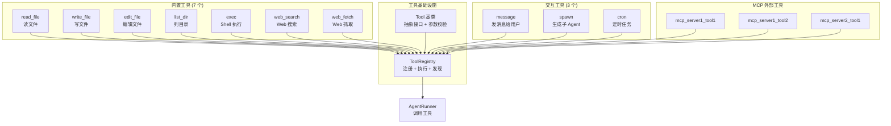
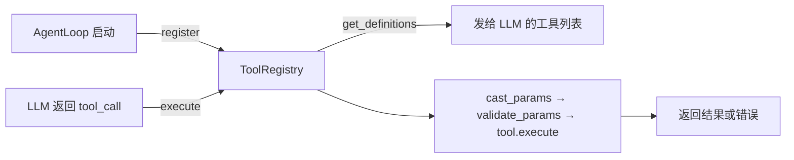
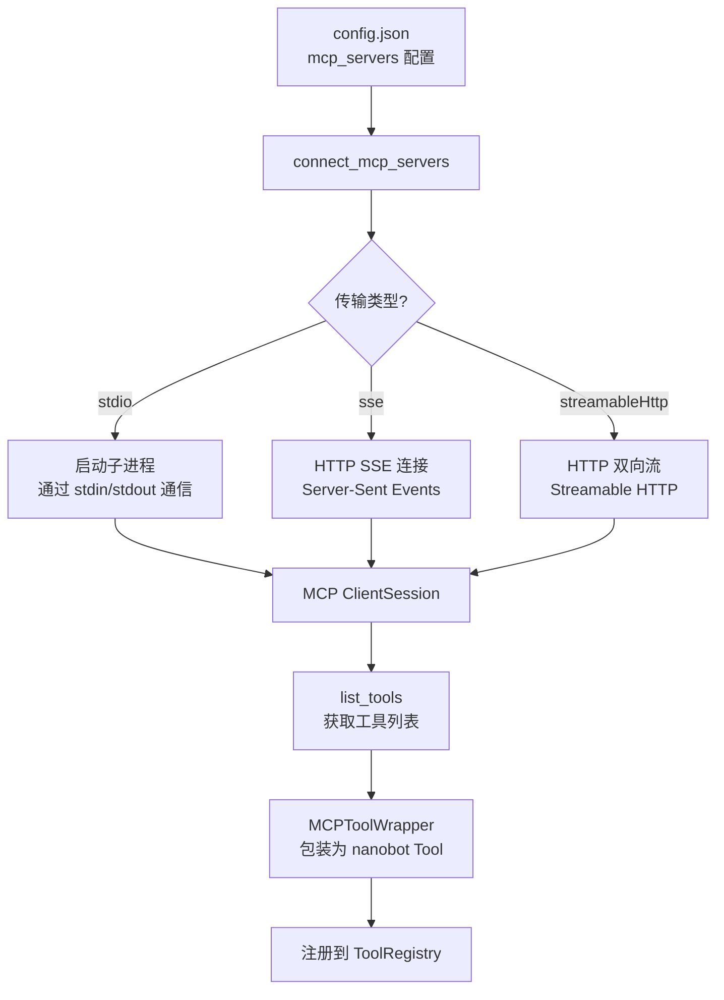
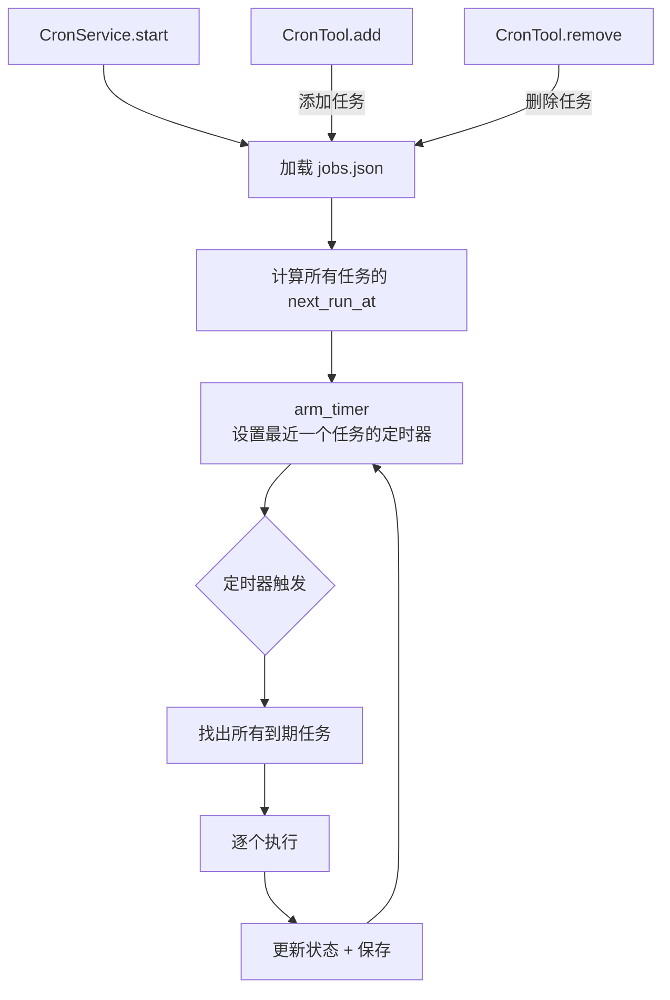

# 工具与技能

## 学习目标

深入理解 nanobot 的工具体系和技能系统：工具基类如何设计、内置工具各自做什么、MCP 协议如何集成外部工具、技能系统如何扩展 Agent 能力、定时任务如何调度。读完本章后，应该能自己实现一个自定义工具并理解 MCP 工具的接入流程。

## 工具体系架构



## Tool 基类

> 文件：`nanobot/agent/tools/base.py`

所有工具继承自 `Tool` 抽象基类，需要实现四个成员：

```python
class Tool(ABC):
    @property
    @abstractmethod
    def name(self) -> str: ...          # 工具名（LLM 调用时使用）

    @property
    @abstractmethod
    def description(self) -> str: ...   # 工具描述（LLM 理解用途）

    @property
    @abstractmethod
    def parameters(self) -> dict: ...   # JSON Schema 参数定义

    @abstractmethod
    async def execute(self, **kwargs) -> Any: ...  # 执行逻辑
```

基类还提供了两个重要的通用能力：

### 参数类型转换（cast_params）

LLM 有时会把数字传成字符串（如 `"42"` 而非 `42`），`cast_params` 根据 JSON Schema 自动修正：

```python
def cast_params(self, params: dict) -> dict:
    # "42" → 42（当 schema 声明 type: integer）
    # "true" → True（当 schema 声明 type: boolean）
    # 递归处理嵌套的 object 和 array
```

### 参数校验（validate_params）

执行前校验参数是否符合 JSON Schema，支持：
- 类型检查（string / integer / number / boolean / array / object）
- 必填字段（required）
- 枚举值（enum）
- 数值范围（minimum / maximum）
- 字符串长度（minLength / maxLength）
- 可空类型（`"type": ["string", "null"]`）
- 递归校验嵌套结构

### 转换为 OpenAI 格式

```python
def to_schema(self) -> dict:
    return {
        "type": "function",
        "function": {
            "name": self.name,
            "description": self.description,
            "parameters": self.parameters,
        },
    }
```

## ToolRegistry：注册与执行

> 文件：`nanobot/agent/tools/registry.py`

ToolRegistry 是一个简单的字典式注册表，核心流程：



执行时的错误处理很贴心——所有错误消息末尾都追加提示：

```python
_HINT = "\n\n[Analyze the error above and try a different approach.]"
```

这引导 LLM 在工具出错时主动分析原因并换一种方式重试，而不是盲目重复。

## 内置工具详解

### 文件系统工具（4 个）

> 文件：`nanobot/agent/tools/filesystem.py`

所有文件系统工具共享 `_FsTool` 基类，统一处理路径解析和目录限制：

```python
class _FsTool(Tool):
    def _resolve(self, path: str) -> Path:
        # 1. 相对路径 → 基于 workspace 解析
        # 2. restrict_to_workspace 时检查路径是否在允许范围内
        # 3. 额外允许读取内置技能目录
```

| 工具 | 功能 | 关键特性 |
|------|------|---------|
| `read_file` | 读取文件内容 | 带行号输出、分页（offset/limit）、图片自动转 base64 多模态内容、最大 128K 字符 |
| `write_file` | 写入文件 | 自动创建父目录 |
| `edit_file` | 编辑文件（查找替换） | 模糊匹配（忽略空白差异）、CRLF 兼容、未找到时显示最相似片段的 diff |
| `list_dir` | 列出目录内容 | 支持递归、自动忽略噪音目录（.git, node_modules, \_\_pycache\_\_ 等）、默认最多 200 条 |

`edit_file` 的模糊匹配值得细看：

```python
def _find_match(content, old_text):
    # 第一步：精确匹配
    if old_text in content:
        return old_text, count

    # 第二步：逐行 strip 后滑动窗口匹配
    stripped_old = [l.strip() for l in old_text.splitlines()]
    for i in range(len(content_lines) - len(stripped_old) + 1):
        window = content_lines[i : i + len(stripped_old)]
        if [l.strip() for l in window] == stripped_old:
            return "\n".join(window), count  # 返回原始缩进的文本
```

这意味着 LLM 即使缩进不完全正确，编辑也能成功——非常实用的容错设计。

### Shell 执行工具

> 文件：`nanobot/agent/tools/shell.py`

```python
class ExecTool(Tool):
    name = "exec"
    # 默认超时 60s，最大 600s
    # 输出最大 10000 字符（头尾截断保留两端）
```

安全防护是这个工具的重点：

```
┌─────────────────────────────────────────────────┐
│              ExecTool 安全防护层                   │
├─────────────────────────────────────────────────┤
│ 1. 危险命令拦截（deny_patterns）                  │
│    rm -rf, del /f, format, dd, fork bomb 等      │
│                                                   │
│ 2. 内网 URL 检测                                  │
│    阻止访问 127.0.0.1, 10.x, 192.168.x 等       │
│                                                   │
│ 3. 路径遍历检测（restrict_to_workspace 模式）     │
│    阻止 ../ 和工作区外的绝对路径                   │
│                                                   │
│ 4. 超时保护                                       │
│    超时后 kill 进程，等待 5s 回收                  │
│                                                   │
│ 5. 输出截断                                       │
│    超过 10000 字符时保留头尾各一半                  │
└─────────────────────────────────────────────────┘
```

deny_patterns 使用正则匹配，默认拦截的危险模式：

```python
deny_patterns = [
    r"\brm\s+-[rf]{1,2}\b",          # rm -r, rm -rf
    r"\bdel\s+/[fq]\b",              # Windows del /f
    r"\brmdir\s+/s\b",               # Windows rmdir /s
    r"(?:^|[;&|]\s*)format\b",       # format 命令
    r"\b(mkfs|diskpart)\b",          # 磁盘操作
    r"\bdd\s+if=",                   # dd
    r">\s*/dev/sd",                  # 写入磁盘设备
    r"\b(shutdown|reboot|poweroff)\b", # 系统电源
    r":\(\)\s*\{.*\};\s*:",          # fork bomb
]
```

### Web 工具（2 个）

> 文件：`nanobot/agent/tools/web.py`

| 工具 | 功能 | 支持的搜索引擎 |
|------|------|---------------|
| `web_search` | Web 搜索 | Brave、Tavily、DuckDuckGo、SearXNG、Jina |
| `web_fetch` | 抓取网页内容 | 支持代理、HTML 转 Markdown、内网 URL 拦截 |

### 消息工具

> 文件：`nanobot/agent/tools/message.py`

```python
class MessageTool(Tool):
    name = "message"
    # 向指定渠道/聊天发送消息，支持文件附件（media 参数）
    # _sent_in_turn 标记：如果本轮已通过 message 工具发送，
    # AgentLoop 就不再重复发送最终回复
```

`_sent_in_turn` 是个精巧的设计——避免 Agent 用 `message` 工具主动发消息后，AgentLoop 又把最终回复再发一遍。

### Spawn 工具

> 文件：`nanobot/agent/tools/spawn.py`

```python
class SpawnTool(Tool):
    name = "spawn"
    # 委托给 SubagentManager.spawn()
    # 自动注入 origin_channel 和 origin_chat_id
    # 子 Agent 完成后通过消息总线通知主 Agent
```

## MCP 协议集成

> 文件：`nanobot/agent/tools/mcp.py`

MCP（Model Context Protocol）是 Anthropic 提出的标准协议，让 Agent 能连接外部工具服务器。nanobot 的 MCP 集成支持三种传输方式：



### MCPToolWrapper

每个 MCP 工具被包装为一个标准的 nanobot Tool：

```python
class MCPToolWrapper(Tool):
    def __init__(self, session, server_name, tool_def, tool_timeout=30):
        self._name = f"mcp_{server_name}_{tool_def.name}"  # 命名规则
        self._parameters = _normalize_schema_for_openai(raw_schema)

    async def execute(self, **kwargs):
        result = await asyncio.wait_for(
            self._session.call_tool(self._original_name, arguments=kwargs),
            timeout=self._tool_timeout,  # 默认 30s 超时
        )
```

命名规则：`mcp_{服务器名}_{工具名}`，如 `mcp_github_create_issue`。

### Schema 标准化

MCP 工具的 JSON Schema 可能包含 OpenAI 不支持的格式（如 `oneOf` 可空联合类型），`_normalize_schema_for_openai` 负责转换：

```python
# 输入：{"type": ["string", "null"]}
# 输出：{"type": "string", "nullable": true}

# 输入：{"oneOf": [{"type": "string"}, {"type": "null"}]}
# 输出：{"type": "string", "nullable": true}
```

### 工具过滤

配置中的 `enabled_tools` 控制哪些 MCP 工具被注册：

```json
{
  "tools": {
    "mcp_servers": {
      "github": {
        "command": "npx",
        "args": ["-y", "@modelcontextprotocol/server-github"],
        "enabled_tools": ["create_issue", "list_issues"]
      }
    }
  }
}
```

`["*"]` 表示注册所有工具，`[]` 表示不注册任何工具。

### 连接时机

MCP 连接是**懒加载**的——第一条消息到来时才连接，而非启动时：

```python
# AgentLoop.run() 和 process_direct() 中
await self._connect_mcp()  # 首次调用时连接，之后跳过
```

连接失败不会阻塞启动，下次消息到来时会重试。

## 定时任务系统

### CronTool

> 文件：`nanobot/agent/tools/cron.py`

定时任务工具支持三种调度方式：

| 调度方式 | 参数 | 示例 |
|---------|------|------|
| 固定间隔 | `every_seconds` | 每 300 秒执行一次 |
| Cron 表达式 | `cron_expr` + `tz` | `"0 9 * * *"` 每天早 9 点 |
| 一次性定时 | `at` | `"2026-04-01T10:30:00"` |

操作接口：

```python
# 添加任务
cron(action="add", message="检查系统状态并报告", cron_expr="0 9 * * *", tz="Asia/Shanghai")

# 列出任务
cron(action="list")

# 删除任务
cron(action="remove", job_id="abc123")
```

安全限制：在 cron 回调内部不能创建新的 cron 任务（防止无限递归）。

### CronService

> 文件：`nanobot/cron/service.py`

CronService 是定时任务的运行时引擎：



关键设计：
- **持久化**：任务存储在 `jobs.json`，重启后恢复
- **外部修改检测**：通过文件 mtime 检测外部修改，自动重新加载
- **运行历史**：每个任务保留最近 20 条执行记录
- **一次性任务**：`delete_after_run=True` 的任务执行后自动删除

### 任务执行流程

当定时任务触发时，CronService 通过回调通知 AgentLoop，AgentLoop 将任务消息注入消息总线：

```python
# AgentLoop 中注册的回调
async def _on_cron_job(job: CronJob):
    msg = InboundMessage(
        channel="system",
        sender_id="cron",
        chat_id=f"{job.payload.channel}:{job.payload.to}",
        content=job.payload.message,
    )
    await bus.publish_inbound(msg)
```

## 技能系统深入

第三章介绍了技能的加载机制，这里补充技能的内容格式和几个典型技能。

### 技能文件格式

每个技能是一个目录，包含 `SKILL.md` 和可选的脚本文件：

```
skills/<name>/
├── SKILL.md        # 技能定义（Markdown + YAML frontmatter）
└── scripts/        # 可选的辅助脚本
    └── *.sh / *.py
```

Frontmatter 格式：

```yaml
---
description: "技能描述"
metadata: '{"nanobot": {"requires": {"bins": ["git"], "env": ["GITHUB_TOKEN"]}, "always": false}}'
---
```

### 典型技能示例

**memory 技能**——教 Agent 如何管理长期记忆：

```markdown
# Memory Management

Read and update your long-term memory files:
- memory/MEMORY.md: Important facts, preferences, project context
- memory/HISTORY.md: Chronological log of past interactions

When you learn something important about the user or project,
update MEMORY.md. Always read it at the start of a new session.
```

**cron 技能**——教 Agent 如何使用定时任务：

```markdown
# Cron Scheduling

Use the `cron` tool to schedule reminders and recurring tasks.
- action: "add" with cron_expr for recurring, at for one-time
- action: "list" to see all scheduled jobs
- action: "remove" with job_id to cancel
```

**skill-creator 技能**——教 Agent 如何创建新技能（元技能）：

```markdown
# Skill Creator

Create new skills in the workspace/skills/ directory.
Each skill needs a SKILL.md with YAML frontmatter and markdown body.
```

### 技能 vs 工具的区别

```
┌──────────────┬─────────────────────┬─────────────────────┐
│              │ 工具 (Tool)          │ 技能 (Skill)         │
├──────────────┼─────────────────────┼─────────────────────┤
│ 本质         │ 可执行的函数         │ Markdown 指令文档    │
│ 调用方式     │ LLM function call   │ 注入 prompt 或按需读取│
│ 实现语言     │ Python              │ Markdown + 可选脚本  │
│ 注册位置     │ ToolRegistry        │ SkillsLoader        │
│ 扩展方式     │ 继承 Tool 基类      │ 创建 SKILL.md 文件   │
│ 运行时行为   │ 执行代码返回结果     │ 指导 LLM 的行为方式  │
│ 典型用途     │ 读文件、执行命令     │ 教 Agent 做特定任务  │
└──────────────┴─────────────────────┴─────────────────────┘
```

简单说：工具是 Agent 的「手」，技能是 Agent 的「知识」。

## 工具注册全流程

回顾 AgentLoop 初始化时的工具注册顺序：

```python
def _register_default_tools(self):
    # 1. 文件系统工具（4 个）
    self.tools.register(ReadFileTool(workspace=..., allowed_dir=...))
    self.tools.register(WriteFileTool(...))
    self.tools.register(EditFileTool(...))
    self.tools.register(ListDirTool(...))

    # 2. Shell 执行（如果启用）
    if self.exec_config.enable:
        self.tools.register(ExecTool(...))

    # 3. Web 工具（2 个）
    self.tools.register(WebSearchTool(...))
    self.tools.register(WebFetchTool(...))

    # 4. 交互工具
    self.tools.register(MessageTool(send_callback=self.bus.publish_outbound))
    self.tools.register(SpawnTool(manager=self.subagents))

    # 5. 定时任务（如果有 CronService）
    if self.cron_service:
        self.tools.register(CronTool(...))

# 6. MCP 工具（懒加载，首次消息时连接）
await self._connect_mcp()
```

## 检查点

1. Tool 基类的 `cast_params` 解决了什么问题？举一个 LLM 传参类型不匹配的例子。
2. `edit_file` 的模糊匹配机制是怎样的？为什么需要这个能力？
3. ExecTool 有哪些安全防护措施？`deny_patterns` 拦截了哪些类型的命令？
4. MCP 工具的命名规则是什么？为什么需要 `_normalize_schema_for_openai`？
5. 工具和技能的本质区别是什么？各自适合什么场景？
