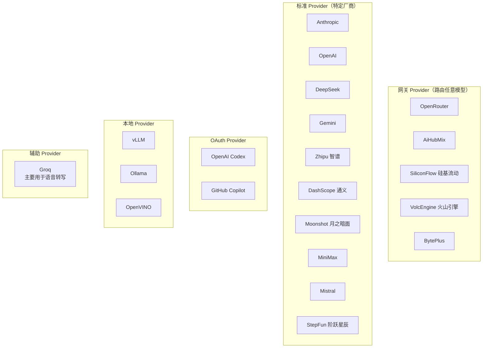
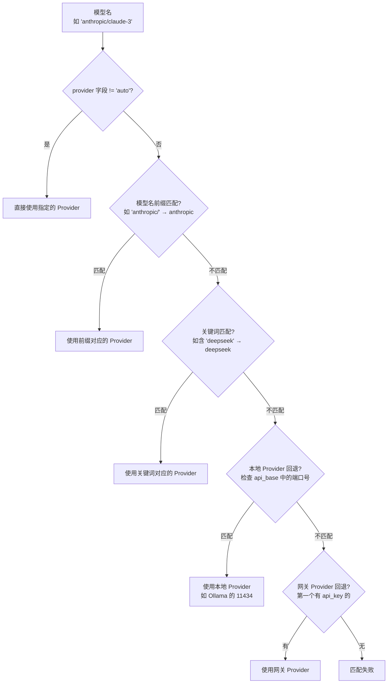
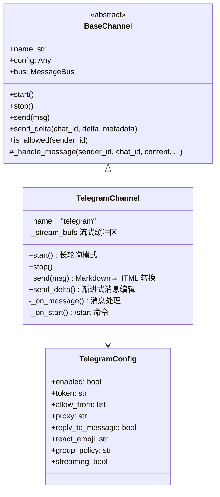
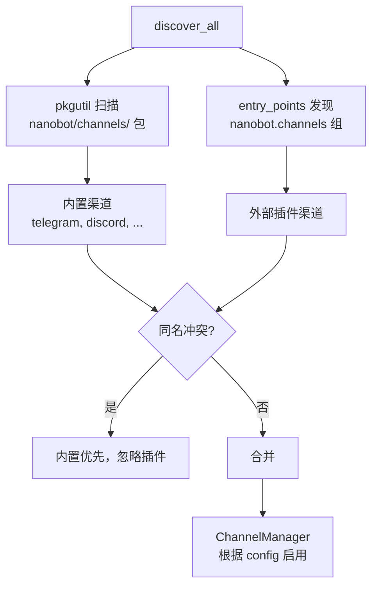

# 渠道与 Provider

## 学习目标

理解 nanobot 的两大对外连接体系：渠道（Channels）负责连接聊天平台，Provider 负责连接 LLM 服务。两者的扩展机制有相似之处，都采用注册表模式。读完本章后，应该能自己添加一个新的渠道或 Provider。

## Provider 体系

### Provider 注册表

> 文件：`nanobot/providers/registry.py`

nanobot 用一个静态元组 `PROVIDERS` 作为 Provider 注册表，每个条目是一个 `ProviderSpec`：

```python
@dataclass(frozen=True)
class ProviderSpec:
    name: str                    # 配置字段名，如 "deepseek"
    keywords: tuple[str, ...]    # 模型名关键词，用于自动匹配
    env_key: str                 # 环境变量名，如 "DEEPSEEK_API_KEY"
    display_name: str            # 显示名称
    backend: str                 # 实现后端："openai_compat" | "anthropic" | "azure_openai" | "openai_codex"
    is_gateway: bool             # 是否为网关（可路由任意模型）
    is_local: bool               # 是否为本地部署
    is_oauth: bool               # 是否为 OAuth 认证
    default_api_base: str        # 默认 API 地址
    strip_model_prefix: bool     # 是否去除模型名前缀
    supports_prompt_caching: bool # 是否支持 prompt 缓存
    model_overrides: tuple       # 特定模型的参数覆盖
```

### 注册表中的 Provider 分类



共 **22 个** Provider，覆盖了主流的 LLM 服务。

### 四种后端实现

虽然有 22 个 Provider，但实际只有 4 种后端实现：

| 后端 | 文件 | 适用范围 |
|------|------|---------|
| `openai_compat` | `openai_compat_provider.py` | 绝大多数 Provider（OpenAI 兼容协议） |
| `anthropic` | `anthropic_provider.py` | Anthropic（原生 SDK） |
| `azure_openai` | `azure_openai_provider.py` | Azure OpenAI |
| `openai_codex` | `openai_codex_provider.py` | OpenAI Codex（OAuth） |

### OpenAI 兼容 Provider（核心实现）

> 文件：`nanobot/providers/openai_compat_provider.py`

这是最重要的 Provider 实现，绝大多数 LLM 服务都走这条路径：

```python
class OpenAICompatProvider(LLMProvider):
    def __init__(self, api_key, api_base, default_model, extra_headers, spec):
        # 根据 spec 设置环境变量
        self._setup_env(api_key, api_base)

        # 创建 AsyncOpenAI 客户端
        self._client = AsyncOpenAI(
            api_key=api_key or "no-key",
            base_url=effective_base,
            default_headers=default_headers,
        )
```

关键能力：

```
┌──────────────────────────────────────────────────┐
│         OpenAICompatProvider 能力                  │
├──────────────────────────────────────────────────┤
│ Prompt 缓存    支持 cache_control 标记注入         │
│                （Anthropic via OpenRouter 等）      │
│                                                    │
│ 模型前缀处理   strip_model_prefix 去除 "provider/" │
│                                                    │
│ 模型参数覆盖   model_overrides 针对特定模型调参     │
│                （如 Kimi K2.5 强制 temperature≥1）  │
│                                                    │
│ Tool Call ID   标准化为 9 字符字母数字              │
│                （兼容 Mistral 等严格校验的 Provider）│
│                                                    │
│ 流式输出       chat_stream 逐 chunk 回调           │
│                                                    │
│ 响应解析       兼容各种非标准响应格式               │
│                （dict/object、多 choice、嵌套内容）  │
└──────────────────────────────────────────────────┘
```

### Anthropic Provider

> 文件：`nanobot/providers/anthropic_provider.py`

使用 Anthropic 原生 SDK，支持独有特性：

- **Extended Thinking**：`thinking_blocks` 字段，支持 `reasoning_effort` 参数
- **Prompt Caching**：原生 `cache_control` 支持
- **多模态**：图片内容块的原生格式转换
- **Tool Use**：Anthropic 格式的工具调用和结果

### Provider 自动匹配流程

> 文件：`nanobot/config/schema.py` 中的 `Config._match_provider()`



这个匹配链的设计很实用——用户只需设置 `model` 字段，框架自动找到正确的 Provider。

### 添加新 Provider 只需两步

注册表文件顶部的注释说得很清楚：

```python
"""
Adding a new provider:
  1. Add a ProviderSpec to PROVIDERS below.
  2. Add a field to ProvidersConfig in config/schema.py.
  Done.
"""
```

大多数新 Provider 都是 OpenAI 兼容的，只需要一个 `ProviderSpec` 条目。

## 渠道体系

### 内置渠道一览

nanobot 内置了 **13 个**聊天渠道：

| 渠道 | 文件 | 协议/SDK |
|------|------|---------|
| Telegram | `telegram.py` | python-telegram-bot（长轮询） |
| Discord | `discord.py` | discord.py |
| WhatsApp | `whatsapp.py` | Node.js Bridge（Baileys） |
| 飞书 | `feishu.py` | HTTP Webhook |
| 钉钉 | `dingtalk.py` | HTTP Webhook |
| Slack | `slack.py` | Slack SDK |
| Email | `email.py` | IMAP/SMTP |
| QQ | `qq.py` | HTTP API |
| Matrix | `matrix.py` | matrix-nio |
| 微信 | `weixin.py` | 微信公众号 API |
| 企业微信 | `wecom.py` | 企业微信 SDK |
| Claw IM | `mochat.py` | HTTP API |

### 渠道实现模式

以 Telegram 为例，看一个完整渠道的实现结构：

> 文件：`nanobot/channels/telegram.py`



### Telegram 渠道的关键特性

**Markdown → Telegram HTML 转换**：Telegram 不支持标准 Markdown，需要转换为 Telegram 特有的 HTML 子集：

```python
def _markdown_to_telegram_html(text):
    # **bold** → <b>bold</b>
    # _italic_ → <i>italic</i>
    # ~~strike~~ → <s>strike</s>
    # `code` → <code>code</code>
    # ```code block``` → <pre><code>...</code></pre>
    # | table | → 等宽文本对齐
    # [link](url) → <a href="url">link</a>
```

**流式输出**：通过渐进式消息编辑实现，首次发送新消息，后续编辑同一条消息：

```python
async def send_delta(self, chat_id, delta, metadata):
    buf = self._stream_bufs.get(chat_id)
    buf.text += delta

    if buf.message_id is None:
        # 首次：发送新消息
        sent = await bot.send_message(chat_id, buf.text)
        buf.message_id = sent.message_id
    elif (now - buf.last_edit) >= 0.6:  # 限频：最少 0.6s 间隔
        # 后续：编辑已有消息
        await bot.edit_message_text(chat_id, buf.message_id, buf.text)
```

**群组策略**：`group_policy` 控制群聊中的触发方式：
- `"open"`：所有消息都响应
- `"mention"`：只响应 @bot 或回复 bot 的消息

### 渠道发现机制

> 文件：`nanobot/channels/registry.py`



内置渠道通过 `pkgutil.iter_modules` 自动发现，无需手动注册。外部插件通过 Python 的 `entry_points` 机制注册：

```toml
# 第三方包的 pyproject.toml
[project.entry-points."nanobot.channels"]
my_channel = "my_package.channel:MyChannel"
```

### 渠道配置模式

所有渠道配置都存储在 `config.json` 的 `channels` 字段下：

```json
{
  "channels": {
    "sendProgress": true,
    "sendToolHints": false,
    "sendMaxRetries": 3,
    "telegram": {
      "enabled": true,
      "token": "BOT_TOKEN",
      "allowFrom": ["12345", "*"],
      "streaming": true,
      "groupPolicy": "mention"
    },
    "discord": {
      "enabled": true,
      "token": "BOT_TOKEN",
      "allowFrom": ["*"]
    }
  }
}
```

`ChannelsConfig` 使用 `extra="allow"` 模式，允许任意渠道名作为字段，每个渠道自行解析自己的配置。

### 流式输出协议

渠道的流式输出通过 metadata 标记控制：

```
┌─────────────────────────────────────────────────────┐
│                 流式消息协议                          │
├──────────────┬──────────────────────────────────────┤
│ _wants_stream │ 渠道 → Agent：请求流式输出           │
│ _stream_delta │ Agent → 渠道：一个文本增量块         │
│ _stream_end   │ Agent → 渠道：当前段结束             │
│ _resuming     │ true=还有工具调用，false=最终回复     │
│ _stream_id    │ 流标识符，用于区分不同的流式段        │
│ _streamed     │ 标记最终消息已通过流式发送            │
└──────────────┴──────────────────────────────────────┘
```

```mermaid
sequenceDiagram
    participant CH as 渠道
    participant BUS as 消息总线
    participant LOOP as AgentLoop

    CH->>BUS: InboundMessage<br/>metadata: {_wants_stream: true}
    BUS->>LOOP: 消费消息

    loop LLM 生成中
        LOOP->>BUS: OutboundMessage<br/>{_stream_delta: true, content: "Hello"}
        BUS->>CH: send_delta("Hello")
        LOOP->>BUS: OutboundMessage<br/>{_stream_delta: true, content: " world"}
        BUS->>CH: send_delta(" world")
    end

    LOOP->>BUS: OutboundMessage<br/>{_stream_end: true, _resuming: false}
    BUS->>CH: send_delta(end)
```

## 渠道与 Provider 的设计对比

两者的扩展模式非常相似：

```
┌──────────────┬──────────────────────┬──────────────────────┐
│              │ 渠道 (Channel)        │ Provider             │
├──────────────┼──────────────────────┼──────────────────────┤
│ 基类         │ BaseChannel (ABC)     │ LLMProvider (ABC)    │
│ 注册表       │ registry.py (动态发现) │ registry.py (静态元组)│
│ 管理器       │ ChannelManager        │ Config._match_provider│
│ 配置位置     │ config.channels.*     │ config.providers.*   │
│ 扩展方式     │ 继承 + entry_points   │ 继承 + ProviderSpec  │
│ 必须实现     │ start/stop/send       │ chat/get_default_model│
│ 可选能力     │ send_delta/login      │ chat_stream          │
│ 实例数       │ 13 内置 + 插件        │ 22 注册 + 4 后端     │
└──────────────┴──────────────────────┴──────────────────────┘
```

核心区别：渠道用**动态发现**（pkgutil + entry_points），Provider 用**静态注册**（硬编码元组）。这是因为渠道需要支持第三方插件，而 Provider 的变化相对可控。

## 语音转写

> 文件：`nanobot/providers/transcription.py`

BaseChannel 内置了语音转写能力，通过 Groq 的 Whisper API 实现：

```python
class GroqTranscriptionProvider:
    async def transcribe(self, file_path) -> str:
        # 使用 Groq 的 whisper-large-v3-turbo 模型
        # 支持 mp3, mp4, mpeg, mpga, m4a, wav, webm 格式
        # 最大 25MB
```

当 Telegram/Discord 等渠道收到语音消息时，自动下载并转写为文本，然后作为消息内容发送给 Agent。

## 检查点

1. ProviderSpec 中的 `keywords` 和 `is_gateway` 分别在 Provider 匹配中起什么作用？
2. OpenAICompatProvider 为什么要把 Tool Call ID 标准化为 9 字符？
3. 渠道的两种发现机制是什么？它们的优先级关系如何？
4. Telegram 渠道的流式输出是如何实现的？为什么需要限频（0.6s 间隔）？
5. 如果要添加一个新的 OpenAI 兼容 LLM Provider，需要修改哪些文件？具体改什么？
